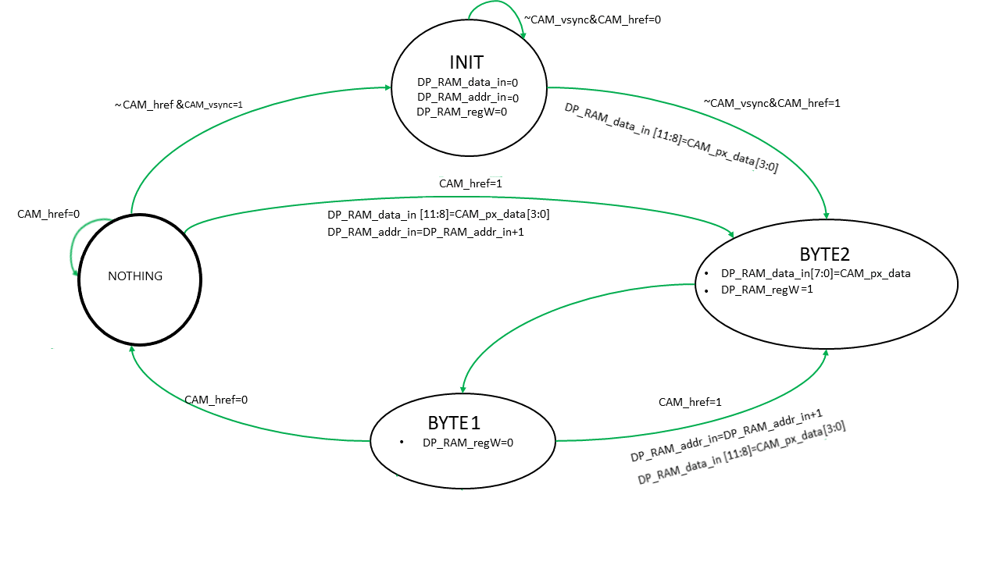

# ELECTRÓNICA DIGITAL 1 2020 -2 UNIVERSIDAD NACIONAL DE COLOMBIA
# TRABAJO 02- diseño y prueba del HDL para la cámara OV7670

## Abstract

1. ¿A qué hace referencia?

Lo propio se hace para los módulos PLL y XCLK

## Introducción

2.  Millones de píxeles o 640x480

## Módulos

### cam_read

3. ¿Cómo se permite hacer esto?

 se permite hacer un escalamiento del formato CIF hasta 40x30 [1,pág 1] 

#### Diagrama Funcional

4. Falta

#### Máquina de estados 

5. COmpletar

* De INIT a BYTE2
* De BYTE1 a BYTE2
* Estado NOTHING
* De NOTHING a BYTE2

Mirar el pdf que envié.

#### Diagrama estructural

6. Falta

### Módulo `clk24_25_nexys4.v` y señales de control (`Xclk/Reset/PWDN`)

7. Completar el procedimiento

Lo realicé pero no me salió.

8. ¿Por qué no fue instanciada la salida LOCKED?

Nótese que la salida *LOCKED* no fue instanceada.
#### Asignación de las señales de control 

 9. ¿Qué es down mode?

* CAM_xclk: Frecuencia de la cámara
* CAM_pwdn: Power down mode.
* CAM_reset: Retorno a un punto conocido por la cámara.

### Módulo Buffer RAM

### VGA_Driver

## Implementación de los módulos

### Modificación del archivo test_cam.v para señales de entrada y salida de la cámara.

### Análisis de Módulo `test_cam.v`

#### Señales de de entrada y salida

##### Conexiones internas, señales de control y registros

10. Por favor revisar este [link](https://github.com/unal-edigital1-2020-1/wp2-simulacion-captura-grupo-03/blob/5a2318d5a8d3c89765e41458ab66481bb68a5e5f/src/project_1.srcs/sources_1/new/test_cam.v) que es donde de encuentra el test_cam que nos dieron originalmente y tratar de seguir esta estructura:

- Cómo estaba.
- Qué se modificó y cuál fue el motivo
- Cómo quedó finalmente.

