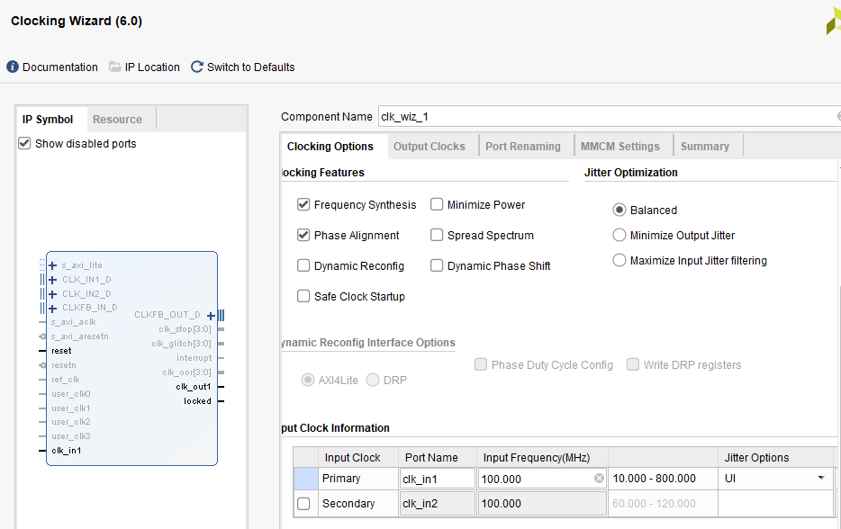
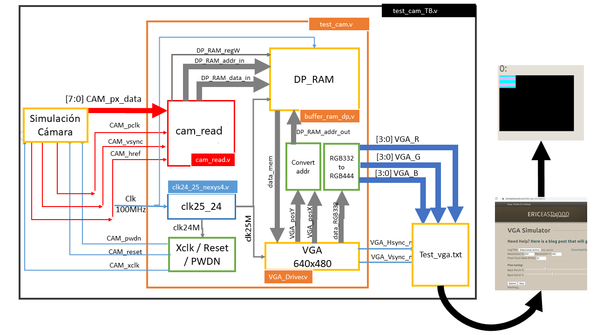
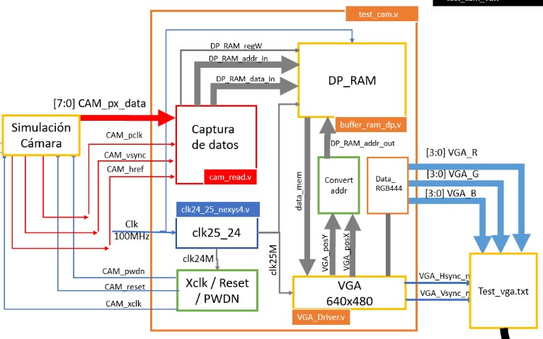

# ELECTRÓNICA DIGITAL 1 2020 -2 UNIVERSIDAD NACIONAL DE COLOMBIA
# TRABAJO 02- diseño y prueba del HDL para la cámara OV7670

## Integrantes 

Andrés Felipe Beltrán

Johan Leonardo Castellanos

Nikolái Alexander Cáceres
 
Esteban Ladino Fajardo

<span style="color:red">Consideraciones</span>
- Recuerde, esta documentación debe ser tal que, cualquier compañero de futuros semestres comprenda sus anotaciones y la relación con los módulos diseñados.

## Abstract

El presente trabajo describe el desarrollo de un sistema controlado por una matriz de puertas lógicas programable en campo​​ (FPGA) cuyas entradas son los datos proporcionados por la camara digital (OV7670) y cuyas salidas son los diferentes datos requeridos por una pantalla estándar analógica de computadora (VGA) para la visualizacion de una imagen, sea esta producto de los estimulos captados por la camara o del sistema mismo. En primer lugar, se desarrolla el modulo de captura de datos, por medio del cual, se adquiere la informacion enviada por la cámara OV7670. Lo propio se hace para los módulos PLL y XCLK. Se continua mostrando el proceso de diseño que se realiza  para  elaborar la memoria RAM y el módulo VGA para finalmente presentar el ensamble total del sistema en conjunto con sus respectivas simulaciones. La FPGA utilizada es la NEXYS 4 mientras que el lenguaje de descripcion de hardware utilizado (HDL) es verilog, el cual es programado a traves de la plataforma de Xilinx Vivado.

## Introducción

El sensor de una cámara digital está formado por millones de celdas fotosensibles llamadas pixeles, los cuales, mediante un fotodiodo dependiendo de la cantidad de luz apreciada envian electricidad. Además, estos incluyen otros componentes electronicos que permitenleer la información de cada píxel cada vez que se captura una foto.[1]


*Figura 1. Comportamiento sensor de camara digital.*

Las celdas sólo detectan la intensidad de la luz, es decir, número de fotones a lo largo de un determinado tiempo, mientras que unos filtros tipo Bayer descomponen la luz en tres componentes: rojo, verde y azul de forma que unas celdas reciben sólo la luz correspondiente a la componente roja, otras sólo la componente azul y otras sólo la componente verde. En los sensores Foveon la distribución es diferente, pero el principio de funcionamiento es el mismo.

Cada fotodiodo (elemento fotosensible de la celda) funciona como un panel solar: recibe fotones que, al interactuar con los átomos del material, generan electrones. Es decir, convierten luz en electricidad.

El módulo de cámara OV7670 está basado en el sensor OV7670 de omnivision.[2] Es un dispositivo CMOS de bajo voltaje que proporciona imágenes de 8 bits y que cuenta, en primer lugar, con una matriz de imágenes capaz de operar a una velocidad de hasta 30 cuadros por segundo (fps) y, en segundo lugar, con diferentes circuitos destinados al procesamiento de la imagen capturada, como lo son el de control
de exposición automática (AEC), control del balance de blancos (AWB), cancelación de ruido, saturación, gamma, etc..[3] Existe también, la posibilidad de trabajar a distintas resoluciones (VGA, QVGA,
CIF, QCIF) y diferentes espacios de color (RGB555, RGB565 y YUV). Todos estos parámetros pueden configurarse a través del bus SCCB (Serial Camera Control Bus).[4]

El presente trabajo describe el desarrollo de un sistema controlado por una matriz de puertas lógicas programable en campo​​ (FPGA) cuyas entradas son los datos proporcionados por la camara digital (OV7670) y cuyas salidas son los diferentes datos requeridos por una pantalla estándar analógica de computadora (VGA) para la visualizacion de una imagen, sea esta producto de los estimulos captados por la camara o del sistema mismo tal y como es posible apreciar en Figura 2.


*Figura 2. Esquema general*

Como se logra observar en el esquema general, el diseño del sistema se aborda mediante la construccion de módulos mas pequeños con funcionalidades concretas, haciendo uso, claro esta, de la programación estructural en que se basa el lenguaje de descripcion de hardware (HDL) utiliizado, Verilog. Una vez desarrollados estos por completo, se procede con la interconeccion de los mismos para finalmente presentar los resultados del presente trabajo a traves de varias simulaciones.


## Módulos

### cam_read


*Figura 3.Módulo de captura de datos*

Se van a describir las entradas y salidas del bloque de la Figura 3.

* Href: Está sincronizado con PCLK ( Pixel  Clock Output)[1,pág 4] de tal manera que el t<sub>PHL</sub> (tiempo de propagación de alto a bajo) coincide con el instante justo antes de cambiar de su estado low tal como se muestra en la Figura 4. Además, pasados un definido número de tPCLK ( Pixel Clock Output)[1, pág 4] el cambio de su estado High ocurre en otro  tPHL del PCLK. Row data hace referencia datos de una fila según el formato elegido.


*Figura 4. Sincronización de PCLK, HREF, D[7:0] y distribución de pixeles.*

* Datos [7:0]: En la Figura 4 se muestra que cuando HREF está en HIGH se generan los datos de una fila de la matriz según el tamaño predefinido para la imagen. En el caso del formato RGB 444, cada pixel tiene 2 bytes donde cada uno está compuesto por un vector de D[7:0] y se generan por cada negedge del PCLK. Los cuatro bits menos significativos del primer byte pertenecen al color rojo, en el segundo byte los cuatro bits más significativos son del color verde y los restantes del color azul. Finalmente, se infiere de la Figura 5 que los datos D[i] ingresan de manera paralela y por tanto se deben declarar siete entradas.


*Figura 5. Diagrama de pines en la vista superior [1, pág 1].*

* Vsync: Vsync (Vertical sync output)[1, pág 4] cuando está en LOW permite capturar los datos hasta que todas las filas que conforman las fotos son llenadas y cada vez que pasa de estado LOW a HIGH se comienza a tomar una nueva foto como se observa en la Figura 6. En nuestro caso elegimos un formato 160x120, ya que dentro de las funcionalidades de la cámara, se permite hacer un escalamiento del formato CIF hasta 40x30 [1,pág 1].  


*Figura 6. VGA(640x480) Frame Timing [1, pág 7].*

Con el tamaño de Imagen de QQVGA (160x120, 160 columnas y 120 filas) HREF se comporta como se indica en la Figura 7. Entonces, por cada cuatro periodos de HREF VGA se genera un  periodo de HREF QQVGA, lo que produce una reducción en la cuarta parte del número de filas como se ilustra en la Figura 6, pasando así de 480 a 120 columnas. De la misma manera, si HREF solo está activo uno de cada cuatro periodos se reduce el número de columnas de 640 a 160 como se indica en la Figura 4, dando así el resultado esperado que es el formato 160x120.      


*Figura 7. QQVGA frame timing [1, pág 7].*


Analizando los tiempos que se presentan en la Figura Figura 5 se tiene:
  - tp=2*t<sub>PCLK</sub>(pixel clock output period) [1, pág 7]
  - t<sub>LINE</sub>  => 640 tp + 144 tp= 784 tp= 1 568 t<sub>PCLK</sub>
  - 480xt<sub>LINE</sub> = 62720 +12544= 752 640 t<sub>PCLK</sub>
  - 510xt<sub>LINE</sub> (Periodo de la VSYNC) =>  (3+17+480+10)xt<sub>LINE</sub>= 799 680 t<sub>PCLK</sub>  

* Addr: Dirección donde se va a guardar el pixel de AW (Address Width ) bits.

* datos: El pixel extraído de la cámara de DW (Data Width) bits.

* Write:  Habilita la escritura en el Buffer.


***RECUEDE: Es necesario documentar el módulo diseñado con los respectivos diagramas funcionales y estructurales y registrar la información en README.md***


### Módulo `clk24_25_nexys4.v` y señales de control (`Xclk/Reset/PWDN`)

Se genero el modulo clk24_25_nexys4.v con ayuda de la ip clock wizard v6 disponible para vivado teniendo en cuenta los paramatros del proyecto, como apoyo se consulto la documentación del fabricante del Clock Wizard v6 [5]


Se asigna el valor del reloj primario de acuerdo a la FPGA que trabajaremos, en este caso 100 MHz. 



Luego se asignan los valores del reloj para cada unade las salidas 24 MHz y 25 MHz.


* Se cambió el módulo `clk_32MHZ_to_25M_24M.v` por `clk24_25_nexys4.v`, su la caja negra queda como:


En verilog se programa de la siguiente manera:

```verilog 
module clk24_25_nexys4
 (// Clock in ports
  input         CLK_IN1, // 100MHz
  // Clock out ports
  output        CLK_OUT1, // 25MHz
  output        CLK_OUT2, // 24MHz
  // Status and control signals
  input         RESET,
  output        LOCKED
 );
```

* Se instanción en el módulo `test_cam.v` como se muestra a continuación:

```verilog
clk24_25_nexys4 clk25_24(
  .CLK_IN1(clk),				//Reloj de la FPGA.
  .CLK_OUT1(clk25M),			//Reloj de la VGA.
  .CLK_OUT2(clk24M),			//Reloj de la cámara.
  .RESET(rst)					//Reset.
 );
```

Nótese que la salida *LOCKED* no fue instanceada.
#### Asignación de las señales de control 

Las señales de control son:
* CAM_xclk: Frecuencia de la cámara
* CAM_pwdn: Power down mode.
* CAM_reset: Retorno a un punto conocido por la cámara.


En el módulo TOP `test_cam.v` se instancea como:

```verilog
111 assign CAM_xclk = clk24M;	
112 assign CAM_pwdn = 0;			 
113 assign CAM_reset = 0;			
```


### Módulo Buffer RAM

Para poder almacenar la información adquirida por la cámara , y teniendo en cuanta que la cámara usada no tiene memoria FIFO, se debe diseñar e implementar una memoria RAM  de doble puerto tal y como se observa en la figura 13.


*Figura 13. Módulo Buffer*

El tamaño máximo de buffer de memoria que se puede crear esta limitado por la capacidad máxima de la FPGA a usar, por lo cual, se procede a analizar el datasheet de la FPGA Nexys 4 DDR del cual se obtienen las siguientes características:


*Figura 14. Espacio Nexys 4[1]*

Tal y como se puede apreciar, la FPGA Nexys 4 DDR tiene la capacidad de almacenamiento de 4 860 Kb lo que equivale a 607,5 KB. 

Vale la pena aclarar que, tal y como se nos indica por el profesor, se busca tanto el formato como la resolución se ajuste de una mejor manera al 50% del tamaño de la memoria calculada en el inciso anterior, es decir, 2 488 320 bits. A continuación, se muestra la tabla de la Figura 15 que relaciona cada uno de los formatos y resoluciones con el porcentaje de la cantidad de memoria, a usar, que estos requieren.


*Figura 15. Memoría utlizada según las resoluciones y el formato*

Se elige en pricipio un formato RGB 444, ya que la pantalla a usar se encuentra configurada para este. Sucesivamente y teniendo en cuenta la tabla presentada anteriormente, lo que se hace es elegir el tamaño de imagen que menos memoria consume, es decir, el tamaño 160 x 120 pixeles.

Estos 160 x 120 pixeles, lo que equivale a 19200 pixeles, mediante una representacion binaria son representados por _2^n_ , donde _n_ corresponde al número de bit necesarios. Es posible hallar _n_ de la siguiente manera:

log_2(pixeles)=n ; log_2(19200)= 14.22

=n)

=%2014.22)

Entonces, se requiere de 15 bits como mínimo para representar con éxito la matriz de datos que provee la cámara, con los cuales es posible representar $2^n$ datos, lo que equivale a 32768 datos. En el programa diseñado este _n_ hace referencia al parámetro AW (address width)  y representa la cantidad de bits de la dirección. Además, como cada uno de nuestros datos (píxeles) requiere 12 bits esto corresponde al parámetro DW (Data Width) utilizado en el código de programación. Por tanto, la memoria a diseñar debe tener la capacidad de almacenar _AW*DW_  bits (393 216 bits), lo que representa un _15.8%_ de la memoria que se permite usar en la FPGA.

#### Simulación (TestBench):

En primer lugar se debe aclarar que el archivo **image.men** se encarga de suministrar los datos de entrada del archivo **buffer_ram_dp.v** (memoria Ram diseñada). Como se explica en el inciso 2 se sabe que, por un lado, para el formato RGB444 cada pixel (dato) requiere de 12 bits y que por otra parte, se deben representar 32 768 pixeles. Además, teniendo en cuenta que en el archivo **buffer_ram_dp.v** la lectura del archivo **image.men** se hace de manera hexadecimal (con la instruccion **$readmemh(imageFILE, ram)**), se modifica el archivo **image.men** de la siguiente manera:

Se agregan 32 768 lineas de datos, donde cada dato se representa por tres números hexadecimales consecutivos, cada uno de estos representando 4 bits. Por ejemplo, la primer linea del archivo contiene el siguiente dato: **f00** donde f representa que los cuatro bits del color "Red" estan en 1, es decir el número hexadecimal f en binario (1111); de la misma manera el 0 indica que los cuatro bits del color "Green" se encuentran en 0 y de manera similar con el color "Blue". Despues, se activa el Green (0f0) y todos los demás se desabilitan; finalmente se activa el Blue (00f). Se continua esta frecuencia por nueve filas y el resto se deja en _f00_.

El archivo **TB_ram** es modificado en primer lugar para que el flanco de subida del reloj (ckl) coincida con el flanco de subida del registro de escritura, de lectura y de asignación de direcciones lo que permite una sincronizacion adecuada para cada una de las operaciones a ejecutar. Esto se implemeta en el código de la Figura 16 y se puede evidenciar en la simulación.


*Figura 16. Parte 1 de la prueba del módulo Buffer.*

El registro de escritura **regwrite** es puesto en 1 luego de un delay de 10 ns, con esto se inicializan los registros y permite que se comience a escribir en el registro ram del archivo **buffer_ram_dp.v**. Lo sucede en paralelo  es que existe un delay de 2 seguntos para cada uno de los incrementos del ciclo for, en este además mediante el registro **cont** se están generando las direcciones de memoria de escritura, lo que corresponde a un delay de 20 ns que sumados a los 10 ns iniciales da como resultado 30 ns. Luego, el registro **regread** tarda 40 ns en cambiar su estado de 0 a 1 incluyendo el delay de la linea 78 de 10 ns razón por la cual _data_out_ se inicializa hasta ese valor. Esto se puede notar en la Figura 5. 


*Figura 17. Simulación del Buffer.*

En la simulacion de la Figura 17, una vez **regwrite** esta en 1 en **data_in** se van guardando los datos del archivo imagen.men,  en este caso solo se están escribiendo 10 datos comenzando por la dirreción 0 y se están cargador mediante la instrucción **$readmemh(file,inputData)** como se observa en la Figura 6. Pasados 20 ns, **regwrite** pasa a ser 0 y **regread** cambia su estado a 1 después de 10 ns, lo que da lugar a que se cargen las dirreciones de los datos de salida mediante representada por **addr_out** mediante el registro **cont** ubicado en el for de la linea 80 según el código de la Figura 4 y por consiguiente, se cargan los datos **data_out** ubicados en el módulo **buffer_ram_dp.v**. La instrucción **always #1 clk=~clk** genera el reloj.
 


*Figura 18. Parte 2 de la prueba del módulo Buffer.*

Los resustados en general fueron satisfactorios, lo que genera mas incertidumbre fue encontrar la dirección relativa para colocar el archivo **imagen.men** por lo que se opta por colocar la dirección absoluta.


### VGA_Driver


## Implementación de los módulos


### Modificación del archivo test_cam.v para señales de entrada y salida de la cámara.

Las señales amarillas de la Figura 1, se sustituyen por las señales rojas de la Figura 19:



*Figura 19. Diagrama de simulación*

Durante la simulación fue necesario agregar las señales de salida para comprobar el correcto funcionamiento de los distintos módulos intanciados, estas son:

```verilog 
	output wire [11:0] data_mem,
	output wire [14:0]  DP_RAM_addr_in,
	output wire [11:0] DP_RAM_data_in,
	output reg [14:0] DP_RAM_addr_out,
``` 
* `data_mem` es el pixel de 12 bits que el módulo `buffer_ram_dp` le transfiere al módulo `VGA_Driver.v` en la ubicación `DP_RAM_addr_out`.
* Las señales `DP_RAM_data_in` y `DP_RAM_addr_in` son salidas del módulo `cam_read.v` que llevan los datos y las posiciones que utiliza el módulo `buffer_ram_dp.v` para almacenar temporalmente las capturas de datos.

Se sustituyó:
```verilog
	input CAM_PCLK,				// Sennal PCLK de la camara
	input CAM_HREF,				// Sennal HREF de la camara
	input CAM_VSYNC,				// Sennal VSYNC de la camara
``` 
Por:

```verilog
	input wire CAM_pclk,		// Sennal PCLK de la camara. 
	input wire CAM_href,		// Sennal HREF de la camara. 
	input wire CAM_vsync,		// Sennal VSYNC de la camara.
```

Para que fueran coherentes las entradas con la Figura 7.

Por otra parte, las entradas de los datos de la cámara,

```verilog
	input CAM_D0,					// Bit 0 de los datos del pixel
	input CAM_D1,					// Bit 1 de los datos del pixel
	input CAM_D2,					// Bit 2 de los datos del pixel
	input CAM_D3,					// Bit 3 de los datos del pixel
	input CAM_D4,					// Bit 4 de los datos del pixel
	input CAM_D5,					// Bit 5 de los datos del pixel
	input CAM_D6,					// Bit 6 de los datos del pixel
	input CAM_D7 					// Bit 7 de los datos del pixel
``` 

Fueron sustituidos por:

```verilog
input wire [7:0] CAM_px_data// Datos de entrada simulados
```
Ya que al simular se proporcionaba un bus de 8 bits.

### Instanciamiento módulo cam_read.v

Se instancea el módulo `cam_read.v` en el módulo `test_cam.v` como se indica a continuación:

```verilog
cam_read #(AW,DW) cam_read
(
	// Entradas 
		.CAM_px_data(CAM_px_data), // Bytes simulados de la cámara
		.CAM_pclk(CAM_pclk), // Reloj de captura de datos, con frecuencia de 25 MHz
		.CAM_vsync(CAM_vsync), // VSYNC que especifica la cámara
		.CAM_href(CAM_href), // HREF que especifica la cámara
		.rst(rst), // reset general

	//Salidas
		.DP_RAM_regW(DP_RAM_regW), // habilita la escritura de datos en el módulo buffer_ram_dp.v
		.DP_RAM_addr_in(DP_RAM_addr_in), // Dirrección a guardar la información en buffer_ram_dp.v
		.DP_RAM_data_in(DP_RAM_data_in) // Dato que se desea guardar en buffer_ram_dp.v en la dirección antes mencionada.
	);
```

### Análisis de Módulo `test_cam.v`

En el modulo test_cam podemos observar que es un modulo que se compone del conjunto de modulos:



* cam_read.v
* clk24_25_nexys4.v
* VGA_Driver.v (incluye el Módulo de convert addr)
* buffer_ram_dp.v

Como este módulo se compone de un conjunto de modulos, las señales de entrada y salida de este módulo son las conexiones de los modulos internos (conjunto de modulos que componen el modulo `test_cam.v`) y los externos ya sean las simulaciones de la camara y la pantalla VGA o los componentes en fisico (la camara y la pantalla).

#### Señales de de entrada y salida

* Señales de entrada 

```verilog 
module test_cam
(
//Entradas del módulo test_cam.v
    input wire clk,           	//Clk 100 MHz (Nexys4DDR).
    input wire rst,	 	// Reset button. Botón externo que reinicia los valores de los registros.
	input wire CAM_pclk,		// Sennal PCLK de la camara. 
	input wire CAM_href,		// Sennal HREF de la camara. 
	input wire CAM_vsync,		// Sennal VSYNC de la camara.
	input wire [7:0] CAM_px_data// Datos de entrada simulados 

```

* Señales de salida

```verilog
//Salidas que se pueden observar en el modulo Data_RGB444(este modulo es un modulo de transformacion de datos dependiendo de los valores RGB de la camara a los valores RGB444 de la pantalla VGA)
    output wire [3:0] VGA_R,  // 4-bit VGA red output(salida del color rojo).
    output wire [3:0] VGA_G,  // 4-bit VGA green output(salida del color verde).
    output wire [3:0] VGA_B,  // 4-bit VGA blue output(salida del color azul).
//En el modulo VGA_driver.v
    output wire VGA_Hsync_n,  // Horizontal sync output.
    output wire VGA_Vsync_n,  // Vertical sync output.
```

##### Conexiones internas, señales de control y registros

```verilog
	output wire [11:0] data_mem,		//Conexión de buffer_ram_dp.v a VGA_Driver.v
	output reg  [14:0] DP_RAM_addr_out,	//Registro con las direcciones de los datos asociados a un pixel(valor del color RGB444)
```

* Conexiones de salida del módulo cam_read.v a buffer_ram_dp.v

```verilog
    
	output wire [14:0] DP_RAM_addr_in,     //Señal que envia los datos de la dirección donde se encuentra el pixel RGB444
	output wire [11:0] DP_RAM_data_in,	//Señal con el valor de color del pixel RGB444 en la dirección de memoria 	
	output wire DP_RAM_regW,	//Señal de control la cual indica cuando un pixel esta completo.
```
* Entradas y Salidas de la camara (ya sea física o del módulo de simulación de la cámara)

```verilog
	output wire CAM_xclk,		// System  clock input de la camara.
	output wire CAM_pwdn,		// Power down mode.
	output wire CAM_reset,		// Clear all registers of cam.
	input wire CAM_pclk,		// Señal PCLK de la camara. 
	input wire CAM_href,		// Señal HREF de la camara. 
	input wire CAM_vsync,		// Señal VSYNC de la camara.
	input wire [7:0] CAM_px_data	// Datos de salida de la camara (ya sean simulados o valores enviados por la captura de imagen de la camara.
	);
```
* Registros y señales internos del Módulo `test_cam.v`

```verilog
//Tamaño de la imagen seleccionado por su bajo requisito de memoria 
parameter CAM_SCREEN_X = 160; 		// 640 / 4. 
parameter CAM_SCREEN_Y = 120;    	// 480 / 4.

localparam AW=15; //Se determina de acuerdo al tamaño de la resolución Log(2)(160*120)=15
localparam DW=12; //Se determina de acuerdo al tamaño del dato del formato de color RGB444 = 12 bites.
// conexiondes del clk24_25_nexys4.v
wire clk100M;           // Reloj de un puerto de la Nexys 4 DDR entrada.
wire clk25M;// Para guardar el dato del reloj de la Pantalla (VGA 680X240 y DP_RAM).
wire clk24M;		// Para guardar el dato del reloj de la camara.
// Conexion dual por ram
localparam imaSiz= CAM_SCREEN_X*CAM_SCREEN_Y;// Posición n+1 del tamañp del arreglo de pixeles de acuerdo al formato.
wire [AW-1: 0] DP_RAM_addr_in;		// Conexión  Direccion entrada.
wire [DW-1: 0] DP_RAM_data_in;      	// Conexion Dato entrada.
wire DP_RAM_regW;			// Enable escritura de dato en memoria .
reg  [AW-1: 0] DP_RAM_addr_out;		//Registro de la dirección de memoria.

// Conexion VGA Driver
wire [DW-1:0] data_mem;	    		// Salida de dp_ram al driver VGA
wire [DW-1:0] data_RGB444;  		// salida del driver VGA a la pantalla
wire [9:0] VGA_posX;			// Determinar la posición en X del pixel en la pantalla 
wire [9:0] VGA_posY;			// Determinar la posición de Y del pixel en la pantalla

/* ****************************************************************************
Asignación de la información de la salida del driver a la pantalla
del regisro data_RGB444
**************************************************************************** */
assign VGA_R = data_RGB444[11:8]; 	//los 4 bites más significativos corresponden al color ROJO (RED) 
assign VGA_G = data_RGB444[7:4];  	//los 4 bites siguientes son del color VERDE (GREEN)
assign VGA_B = data_RGB444[3:0]; 	//los 4 bites menos significativos son del color AZUL(BLUE)
/* ****************************************************************************
Asignacion de las seales de control xclk pwdn y reset de la camara
**************************************************************************** */
assign CAM_xclk = clk24M;		// Asignación reloj cámara.
assign CAM_pwdn = 0;			// Power down mode.
assign CAM_reset = 0;			// Reset cámara.
```
* instanciamiento de modulos 
```verilog
/* ****************************************************************************
   Se uso "IP Catalog >FPGA Features and Desing > Clocking > Clocking Wizard"  y general el ip con Clocking Wizard
  el bloque genera un reloj de 25Mhz usado para el VGA  y un reloj de 24 MHz
  utilizado para la camara , a partir de una frecuencia de 100 Mhz que corresponde a la Nexys 4
**************************************************************************** */
clk24_25_nexys4 clk25_24(
  .CLK_IN1(clk),				//Reloj de la FPGA.
  .CLK_OUT1(clk25M),				//Reloj de la VGA.
  .CLK_OUT2(clk24M),				//Reloj de la cámara.
  .RESET(rst)					//Reset.
 );
/* ****************************************************************************
Modulo de captura de datos /captura_de_datos_downsampler = cam_read
**************************************************************************** */
cam_read #(AW,DW) cam_read
(
	// Inputs 
		.CAM_px_data(CAM_px_data),
		.CAM_pclk(CAM_pclk),
		.CAM_vsync(CAM_vsync),
		.CAM_href(CAM_href),
		.rst(rst),
	//outputs
		.DP_RAM_regW(DP_RAM_regW), //enable
		.DP_RAM_addr_in(DP_RAM_addr_in),
		.DP_RAM_data_in(DP_RAM_data_in)
	);
/* ****************************************************************************
buffer_ram_dp buffer memoria dual port y reloj de lectura y escritura separados
Se debe configurar AW  segn los calculos realizados en el Wp01
se recomiendia dejar DW a 8, con el fin de optimizar recursos  y hacer RGB 332
**************************************************************************** */
buffer_ram_dp DP_RAM(
		// Entradas.
	.clk_w(CAM_pclk),	//Frecuencia de toma de datos de cada pixel.
	.addr_in(DP_RAM_addr_in),// Direccion entrada dada por el capturador.
	.data_in(DP_RAM_data_in),		// Datos que entran de la cámara.
	.regwrite(DP_RAM_regW), 		// Enable.
	.clk_r(clk25M), 				// Reloj VGA.
	.addr_out(DP_RAM_addr_out),// Direccion salida dada por VGA.
		// Salida.
	.data_out(data_mem)			// Datos enviados a la VGA.
	//.reset(rst)                   //(Sin usar)
);
/* ****************************************************************************
VGA_Driver640x480
**************************************************************************** */
VGA_Driver VGA_640x480
(
	.rst(rst),
	.clk(clk25M), 				// 25MHz  para 60 hz de 160x120
	.pixelIn(data_mem),	// Entrada del valor de color  pixel RGB 444.
	.pixelOut(data_RGB444),		// Salida del datos a la VGA. (Pixeles). 
	.Hsync_n(VGA_Hsync_n),	// Sennal de sincronizacion en horizontal negada para la VGA.
	.Vsync_n(VGA_Vsync_n),	// Sennal de sincronizacion en vertical negada  para la VGA.
	.posX(VGA_posX), // Posicion en horizontal del pixel siguiente.
	.posY(VGA_posY) 			// posicinn en vertical  del pixel siguiente.
);
```
* Actualizacion del pixel
```verilog
/* ****************************************************************************
Logica para actualizar el pixel acorde con la buffer de memoria y el pixel de
VGA si la imagen de la camara es menor que el display VGA, los pixeles
adicionales seran iguales al color del ultimo pixel de memoria
**************************************************************************** */
always @ (VGA_posX, VGA_posY) begin
		if ((VGA_posX>CAM_SCREEN_X-1)|(VGA_posY>CAM_SCREEN_Y-1))
	//Posición n+1(160*120), en buffer_ram_dp.v se le asignó el color negro.
			DP_RAM_addr_out = imaSiz;
		else
			DP_RAM_addr_out = VGA_posX + VGA_posY * CAM_SCREEN_X;// Calcula posicion.
end
endmodule
```


## Simulación

Con la modificación que se le hizo al módulo `test_cam_TB.v` y `VGA_Driver.v` solo es necesario simular aproximadamente 17 ms para generar una imagen. La siguiente fórmula explica el tiempo de simulación.


### Imagen 1. Verde 
Lineas de codigo usadas para simular color en el Módulo `test_cam_TB.v`:
```verilog
 //registros de simulacion del color
    	reg cont=0;
    	parameter[3:0]R=4'b0000; //rojo del pixel RRRR
    	parameter[3:0]G=4'b1111; //verde del pixel GGGG
    	parameter[3:0]B=4'b0000; //azul del pixel BBBB
    	reg [11:0]colorRGB444= {R[3:0],G[3:0],B[3:0]}; //color RRRR GGGG BBBB,first byte= XXXX RRRR, second byte= GGGG BBBB
	//asignacion del color
	always @(posedge pclk) begin
	cont=cont+1;
	if (cont ==0)begin//first Byte
	CAM_px_data[3:0]=colorRGB444[11:8];
	end
	if(cont == 1)begin//second Byte
	CAM_px_data = colorRGB444[7:0];
	end
	end
```
Duración de la simulación 17ms y resultado en [vga-simulator](https://ericeastwood.com/lab/vga-simulator/):


### Imagen 2. Verde y Rosado
Lineas de codigo para intercalar el color según la linea en donde se encuentre el pixel
```verilog
 always @(posedge pclk) begin
	if (row_cnt<15)begin //para tener media seccion al principio se cuentan 15 posiciones verticales
	colorRGB444=12'b111100001111; //color rosa
	end
	else if (row_cnt<45)begin //cuando se superan las 15 lineas pero esta por debajo de las 45 (una seccion de 30 depues de la media de 15)
	colorRGB444=12'b000011110000;//color verde
	end
	else if (row_cnt<75)begin//cuando se superan las 45 lineas pero esta por debajo de las 75
	colorRGB444=12'b111100001111;//color rosa
	end
	else if (row_cnt<105)begin//cuando se superan las 75 lineas pero esta por debajo de las 105 
	colorRGB444=12'b000011110000;//color verde
	end
	else if (row_cnt<120)begin//cuando se superan las 105 lineas pero esta por debajo de las 120 (media seccion de 15 depues de las 105 lineas)
	colorRGB444=12'b111100001111;//color rosa
	end
	end
```

Lineas de codigo usadas para simular color en el Módulo `test_cam_TB.v`:
```verilog
 //registros de simulacion del color
    	reg cont=0;
    	parameter[3:0]R=4'b0000; //rojo del pixel RRRR
    	parameter[3:0]G=4'b1111; //verde del pixel GGGG
    	parameter[3:0]B=4'b0000; //azul del pixel BBBB
    	reg [11:0]colorRGB444= {R[3:0],G[3:0],B[3:0]}; //color RRRR GGGG BBBB,first byte= XXXX RRRR, second byte= GGGG BBBB
	//asignacion del color
	always @(posedge pclk) begin
	cont=cont+1;
	if (cont ==0)begin//first Byte
	CAM_px_data[3:0]=colorRGB444[11:8];
	end
	if(cont == 1)begin//second Byte
	CAM_px_data = colorRGB444[7:0];
	end
	end
```

Duración de la simulación 17ms y resultado en [vga-simulator](https://ericeastwood.com/lab/vga-simulator/).


Para verificar que la combinación de `R=4'hf` y `B=4'hf` fuera una especie de rosado se recurre a este [link](https://htmlcolorcodes.com/es/).


### Imagen 3. Color Azul

Las líneas de código que se utilizan en el`test_cam_TB.v` son:

```verilog
 reg cont=0;   
    initial forever  begin
		@(negedge pclk) begin
        if(cont==0) begin 
        CAM_px_data=8'h0;
        end
        else begin
        CAM_px_data=8'h0f;
        end
        cont=cont+1;
        end
	end
```
Al simular 17 ms y usar [vga-simulator](https://ericeastwood.com/lab/vga-simulator/) se tiene:


La adquisición de datos del módulo `cam_read.v` se describe a continuación:

* De Reset activo `rst=1` a `INIT`

Cuando reset es desactivado, se pasa al funcionamiento de la máquina de estados. El cursor de la siguiente Figura lo ilustra.


* En el estado **INIT**, se debe cumplir:

```verilog
            DP_RAM_data_in<=0;
            DP_RAM_addr_in<=0;
            DP_RAM_regW<=0;
```
Debe permanecer en este estado si `rst=0` y no se cumple `if(~CAM_vsync&CAM_href)`, lo que se verifica en la siguiente Figura de simulación:


A los *52.04* us `CAM_href` cambia de 0 a 1 lo que significa que el estado actual es **INIT**. Como se observa `DP_RAM_data_in`, `DP_RAM_addr_in` y `DP_RAM_regW` permanecen en 0.

* De **INIT** a estado **BYTE2**

En la siguiente Figura, se Ilustra el paso de estado **INIT** a estado **BYTE2** ya que `CAM_vsync=0` y `CAM_href=1` . EL registro `DP_RAM_regW` está en cero, ya que solo se tiene el color rojo del pixel. Dado que `CAM_px_data=8'h0`, la componete roja es `4'h0`. Además, `DP_RAM_data_in` y `DP_RAM_addr_in` permanecen en cero tal como se espera.    


|Estado actual| Estado Siguiente|
|:----|:----|
|INIT|BYTE2|

* En estado **BYTE2**

`CAM_vsync=0` y `CAM_href=1` permiten pasar al estado **BYTE2** donde se completa el GB del pixel. `CAM_px_data=8'h0f`, lo que implica que `G=4'h0` y `B=4'hf`. Esto, da como resultado que `DP_RAM_regW=1` indicando que el pixel ya está completo, que en la posición `DP_RAM_addr_in=0` se guarde el dato `DP_RAM_data_in=12'h00f` que corresponde a un pixel azul. En Figura que se muestra a continuación se aprecia lo descrito.


|Estado actual| Estado Siguiente|
|:----|:----|
|BYTE2|BYTE1|


Para capturar un dato de `CAM_px_data` se nos recomendo realizarlo en cada posedge de `pclk` ya que en un negedge no se sabía si el dato que se iba a registrar era el anterior o el siguiente, según se observa en el datasheet de la cámara Figura 3. En el cambio de `DP_RAM_data_in=0` a `DP_RAM_data_in=8'h00f` se espera que cuando se escriba en `buffer_ram_dp.v` no se tenga la misma ambiguedad de `CAM_px_data`. Además, no se observa de qué manera se pude hacer para que `CAM_px_data=0f` se pueda asignar antes del posedge.   

* Estado **BYTE1**

En el estado `BYTE1` se eligen los 4 bits menos significativos de `CAM_px_data` correspondientes al color rojo, que en este caso es *4'h0*. Además, con `DP_RAM_regW=0` se inabilita la escritura en `buffer_ram_dp.v`. También, se optó por aumentar `DP_RAM_addr_in` para que en el estado `BYTE2` se disminuya la probabilidad de asignar `DP_RAM_data_in` en la dirección anterior. Justo antes de esta simulación se aumentaba la dirección en el estado `BYTE2`; sin embargo, se observo que cuando se habilitaba la escritura en el `buffer_ram_dp.v`, el aumento de dirección estaba en un punto intermedio. La simulación mostraba que `DP_RAM_data_in` alcanzaba a aumentar cuando estaba en la mitad del valor anterior y el valor siguiente, este último era el que se necesitaba, en este caso se corregió una posible falla de implementación a diferencia de `DP_RAM_addr_in`.


|Estado actual| Estado Siguiente|
|:----|:----|
|BYTE1|BYTE2|


* Estado **BYTE2** por segunda vez

`CAM_vsync` y `CAM_href` habilitan la adquisición de datos, en el posedge de `pclk` se toma el valor de `CAM_px_data=8'h0f` y se habilita la escritura en `buffer_ram_dp.v`. El valor que toma `DP_ram_addr_in` es 1 (uno más que en el caso anterior donde estuvo presente este estado) y `DP_RAM_data_in` toma el valor de `12'h00f`. En los siguientes posedges permanece entre los estados `BYTE1` y `BYTE2` realizando las operaciones descritas con anterioridad, hasta que `CAM_href=0`. En la siguiente Figura se puede observar lo que se ha vendido explicando y se evidencia la concordancia de valores que cada salida del módulo `cam_read` debe tomar.


|Estado actual| Estado Siguiente|
|:----|:----|
|BYTE2|BYTE1|


* Estado **NOTHING**

En la posición del cursor se nota:

|Estado actual| Estado Siguiente|
|:----|:----|
|BYTE1|NOTHING|

Según la Figura que continúa.


El estado `NOTHING` comprende el intervalo que se encuentra comprendido entre los cursores amarillos. Se resalta que la posición `DP_RAM_addr_in` permanece en 159 antes que el estado siguiente sea `BYTE2`, esta posición corresponte a la última de la primera fila de la matriz 160X120 (160 columnas y 120 filas). Dado que las direcciones se empiezan a  asignar desde 0, cuando se llega a 159 hay 160 posiciones (número de posiciones=final-inicio+1). 


Nótese que cuando `pclk` llega al posedge donde `href` vuelve a ser 1, el estado actual es `NOTHING` y el siguiente es `BYTE2`. En el este cambio de estado se hacen las asignaciones del estado `BYTE1`; es decir, `DP_RAM_regW` es 0, `DP_RAM_addr_in` aumenta y pasa a la primera posición de la segunda fila vertical (`DP_RAM_addr_in=160`) y `DP_RAM_data_in` permanence igual. En el estado `BYTE2`, vuelve al estado `BYTE1` y continua en estos dos estados hasta que `CAM_href=0`. 

* De estado **NOTHING** a **INIT**

El estado actual que muestra el cursor de la Figura que continua es **NOTHING** y dado que `CAM_vsync` es 1, el estado siguiente es **INIT**. `DP_RAM_regW=0` tal como debería ser, `DP_RAM_addr_in` llega hasta la posición *19199* que sería la ultíma posición de una matriz de 160*120 si empezamos a asignar direcciones desde la posición cero y `DP_RAM_data_in=8'h00f`, pero no está habilitado para ser escrito.


* Estado **INIT**

En este  `pclk` el estado actual y siguiente es **INIT** y se observa que:

```verilog
CAM_vsync=1;
CAM_href=1;
DP_RAM_redW=0;
DP_RAM_addr_in=0; // se reinicializa
DP_RAM_data_in=0; // se reinicializa

```

Tal como se nota en la siguiente Figura.


A continuación, se muestra una Figura de aproximadamente la duración de estado **INIT** (No es exacta porque los tiempos pertencene al cambio de `CAM_href` de 0 a 1). Se verifica en la simulación que `DP_RAM_regW` permanece en cero y que  `DP_RAM_addr_in` junto con `DP_RAM_data_in` permanecen la mayor parte del tiempo como cero.


* De **INIT** a **BYTE2**

El estado actual es **INIT** y el estado siguente es **BYTE2**. En la siguiente Figura se observa:


* Comentarios 

Se verificó en cada estado que el valor que tomaran las señales de salida fueran las indicadas. Además, sirvió para asesorarnos del correcto funcionamiente de la máquina de estados y mejorar el aumento de la dirección `DP_RAM_addr_in` colocándolo en el estado `BYTE1`.

En color Azul se genera entre el intérvalo de tiempo comprendido por los cursores amarillos.


***


3. Una vez terminada la simulaciòn revisar dentro del directorio `HW` que contenga el fichero ***test_vga.txt***
4. ingresar a la web [vga-simulator](https://ericeastwood.com/lab/vga-simulator/)  y cargar el archivo ***test_vga.txt***, dejar los datos de configuraciòn tal cual como aparecen.
5. ejecutar `submit`.
6. Compruebe que el resultado en la web es la siguiente imagen


***Nota:*** Observe que en esta instancia usted no ha modificado el hardware del proyecto, por lo tanto, lo que observa en la pantalla VGA simulada, es la imagen almacenada en memoria por defecto.

7. Una vez tenga listo el anterior entorno de trabajo, debe proceder a  modificar el fichero  ***cam_read.v***. Solamnte en este módulo debe trabajar  y describir el funcionamiento de la adquiciòn de los datos de la cámara.


8. Al terminar de decribir la adquisión de la cámara repita los paso 2 a 6.  Si el resultado es el que se observa en la siguiente imagen, indica que el módulo cam_read es adecuado y por lo tanto, se dara por terminado este paquete de trabajo, de lo contrario  vuelva al punto 7.


la imagen muestra que se adquirió una foto de color rojo.

***RECUEDE: Es necesario documentar la simulación y registrar la información en README.md, lo puede hacer con ayuda de imágenes o videos***


### Implementación

Al culminar los hitos anteriores deben:

1. Crear el archivo UCF.
2. Realizar el test de la pantalla. Programar la FPGA con el bitstream del proyecto y no conectar la cámara. ¿Qué espera visualizar?, ¿Es correcto este resultado ?
3. Configure la cámara en test por medio del bus I2C con ayuda de Arduino. ¿Es correcto el resultado? ¿Cada cuánto se refresca el buffer de memoria ?
4. ¿Qué falta implementar para tener el control de la toma de fotos ?

***RECUEDE: Es necesario documentar la implementación y registrar la información en README.md, lo puede hacer con ayuda de imágenes o videos***


Referencias

[1]Dischner. Z. Cómo funciona el sensor de una cámara digital. Available [Online] https://quecamarareflex.com/como-funciona-el-sensor-de-una-camara-digital/

[2] GeekFactory. Cámara OV7670. Available [Online] https://www.geekfactory.mx/tienda/sensores/camara-ov7670/

[3] OmniVision. OV7670/OV7171 CMOS VGA. Available [Online] https://datasheetspdf.com/pdf-file/555220/OmniVisionTechnologies/OV7670/1

[4] Carrasco. S. Sistema hardware de adquisición de vídeo basado en el
sensor de imagen OV7670. Available [Online] https://repositorio.upct.es/bitstream/handle/10317/4371/tfg413.pdf?sequence=1

[5] Recuperado de http://web.mit.edu/6.111/www/f2016/tools/OV7670_2006.pdf

[6] Recuperado de https://www.xilinx.com/support/documentation/ip_documentation/clk_wiz/v6_0/pg065-clk-wiz.pdf
