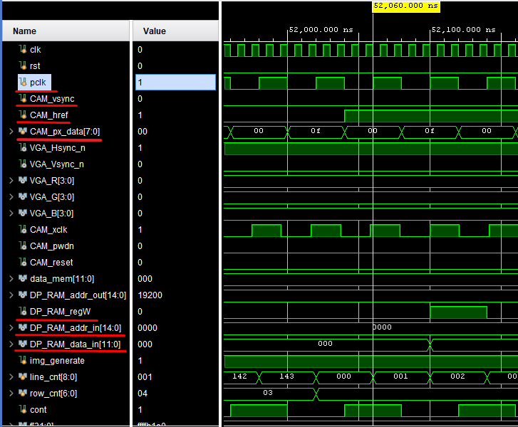
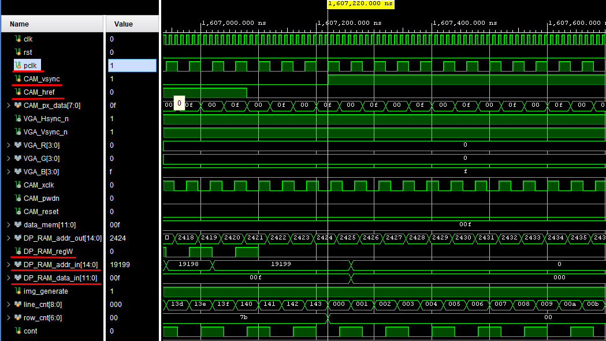
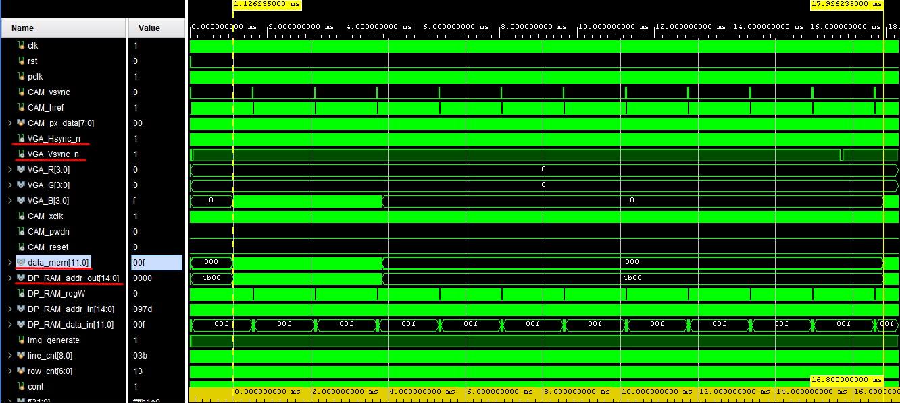
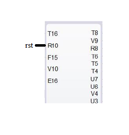

# ELECTRÓNICA DIGITAL 1 2020 -2 UNIVERSIDAD NACIONAL DE COLOMBIA
# TRABAJO 02- diseño y prueba del HDL para la cámara OV7670

## Integrantes 

Andrés Felipe Beltrán

Johan Leonardo Castellanos

Nikolái Alexander Cáceres
 
Esteban Ladino Fajardo

<span style="color:red">Consideraciones</span>
- Recuerde, esta documentación debe ser tal que, cualquier compañero de futuros semestres comprenda sus anotaciones y la relación con los módulos diseñados.

## Abstract

El presente trabajo describe el desarrollo de un sistema controlado por una matriz de puertas lógicas programable en campo​​ (FPGA) cuyas entradas son los datos proporcionados por la cámara digital (OV7670) y cuyas salidas son los diferentes datos requeridos por una pantalla estándar analógica de computadora (VGA) para la visualización de una imagen, sea esta producto de los estímulos captados por la cámara o del sistema mismo. En primer lugar, se desarrolla el módulo de captura de datos, por medio del cual, se adquiere la información enviada por la cámara OV7670. Se procede de la misma manera con los módulos PLL y XCLK. Posteriormente se muestra el proceso de diseño que se realiza  para  elaborar la memoria RAM y el módulo VGA para finalmente presentar el ensamble total del sistema en conjunto con sus respectivas simulaciones. La FPGA utilizada es la NEXYS 4 mientras que el lenguaje de descripción de hardware utilizado (HDL) es verilog, el cual es programado a través de la plataforma de Xilinx Vivado.

## Introducción

El sensor de una cámara digital está formado por celdas fotosensibles llamadas píxeles, los cuales, mediante un fotodiodo dependiendo de la cantidad de luz apreciada envían electricidad. Además, estos incluyen otros componentes electrónicos que permiten leer la información de cada píxel cada vez que se captura una foto.[1]


*Figura 1. Comportamiento sensor de cámara digital.*

Las celdas solo detectan la intensidad de la luz, es decir, número de fotones a lo largo de un determinado tiempo, mientras que unos filtros tipo Bayer descomponen la luz en tres componentes: rojo, verde y azul de forma que unas celdas reciben solo la luz correspondiente a la componente roja, otras solo la componente azul y otras solo la componente verde. En los sensores Foveon la distribución es diferente, pero el principio de funcionamiento es el mismo.

Cada fotodiodo (elemento fotosensible de la celda) funciona como un panel solar: recibe fotones que, al interactuar con los átomos del material, generan electrones. Es decir, convierten luz en electricidad.

El módulo de cámara OV7670 está basado en el sensor OV7670 de omnivision.[2] Es un dispositivo CMOS de baja tensión que proporciona imágenes de 8 bits y que cuenta, en primer lugar, con una matriz de imágenes capaz de operar a una velocidad de hasta 30 cuadros por segundo (fps) y, en segundo lugar, con diferentes circuitos destinados al procesamiento de la imagen capturada, como lo son el de control
de exposición automática (AEC), control del balance de blancos (AWB), cancelación de ruido, saturación, gamma, etc..[3] Existe también, la posibilidad de trabajar a distintas resoluciones (VGA, QVGA,
CIF, QCIF) y diferentes formatos de color (RGB555, RGB565 y YUV). Todos estos parámetros pueden configurarse a través del bus SCCB (Serial Camera Control Bus).[4]

Como se logra observar en el esquema general de la Figura 2, el diseño del sistema se aborda mediante la construcción de módulos mas pequeños con funcionalidades concretas, haciendo uso, de la programación estructural en que se basa el lenguaje de descripción de hardware (HDL) utilizado, Verilog. Una vez desarrollados estos por completo, se procede con la interconexión de los mismos para finalmente presentar los resultados mediante simulaciones.


*Figura 2. Esquema general.*


## Módulos

### cam_read


*Figura 3. Módulo de captura de datos.*

Se van a describir las entradas y salidas del módulo de la Figura 3.

* Href: Está sincronizado con PCLK ( píxel  Clock Output)[5,pág 4] de tal manera que el t<sub>PHL</sub> (tiempo de propagación de alto a bajo) de PCLK coincide con el instante justo antes de que HREF cambie de su estado como lo muestra la Figura 4. Además, pasados un definido número de t<sub>PCLK</sub> ( píxel Clock Output)[5, pág 4] el cambio de su estado High ocurre en otro  tPHL del PCLK. Row data hace referencia datos de una fila según el formato elegido.


*Figura 4. Sincronización de PCLK, HREF, D[7:0] y distribución de píxeles.*

* Datos [7:0]: En la Figura 4 se muestra que cuando HREF está en HIGH se generan los datos de una fila de la matriz según el tamaño predefinido para la imagen. En el caso del formato RGB 444, cada píxel tiene 2 bytes donde cada uno está compuesto por un vector de D[7:0] y son estables es cada posedge del PCLK. Los cuatro bits menos significativos del primer byte pertenecen al color rojo, en el segundo byte los cuatro bits más significativos son del color verde y los restantes del color azul. Finalmente, se infiere de la Figura 5 que los datos D[i] ingresan de manera paralela y por tanto se deben declarar ocho entradas en la implementación. 


*Figura 5. Diagrama de pines en la vista superior [1, pág 1].*

* Vsync: Vsync (Vertical sync output)[5, pág 4] cuando está en LOW permite capturar los datos hasta que todas las filas que conforman la imagen se han llenado y cada vez que pasa de estado LOW a HIGH  se comienza a tomar una nueva foto como se observa en la Figura 6. En nuestro caso elegimos un formato 160x120, ya que dentro de las funcionalidades de la cámara, se permite hacer un escalamiento del formato CIF hasta 40x30 [5,pág 1].  


*Figura 6. VGA(640x480) Frame Timing [1, pág 7].*

Con el tamaño de Imagen de QQVGA (160x120, 160 columnas y 120 filas) HREF se comporta como se indica en la Figura 7. Entonces, por cada cuatro periodos de HREF VGA se genera un  periodo de HREF QQVGA, lo que produce una reducción en la cuarta parte del número de filas que se ilustra en la Figura 6, pasando así de 480 a 120 filas. De la misma manera, si HREF solo está activo uno de cada cuatro periodos se reduce el número de columnas de 640 a 160 si se observa la Figura 4, dando así el resultado del formato 160x120.      


*Figura 7. QQVGA frame timing [5, pág 7].*


Analizando los tiempos que se presentan en la Figura 6 se tiene:
  - tp=2*t<sub>PCLK</sub> (píxel clock output period) [1, pág 7]
  - t<sub>LINE</sub>  => 640 tp + 144 tp= 784 tp= 1 568 t<sub>PCLK</sub>
  - 480xt<sub>LINE</sub> = 62720 +12544= 752 640 t<sub>PCLK</sub>
  - 510xt<sub>LINE</sub> (Periodo de la VSYNC) =>  (3+17+480+10)xt<sub>LINE</sub>= 799 680 t<sub>PCLK</sub>  

Finalmente, se presentan las señales de salida hacia el Buffer de Memoria.

* Addr: Dirección donde se va a guardar el píxel de tamaño AW bits.

* datos: El píxel extraído de la cámara de tamaño DW bits.

* Write:  Habilita la escritura en el Buffer.


#### Diagrama Funcional

En la Figura 8. se describe la funcionalidad principal del módulo cam_read.v. Inicialmente se listan las diferentes entradas y salidas del módulo y posteriormente se le asigna el valor de 0 tanto a las salidas ya descritas Addr, datos y Write como al contador (cont).


*Figura 8. Diagrama funcional.*

Sucesivamente, cada vez que exista un flanco de subidad del reloj pclk ,correspondiente a la cámara, es decir, un posedge, se revisa si el reset (rst) se encuentra activado o no. En el caso de que el reset se encuentre activo, se le asigna el valor de 0 a las salidas y al contador, indicando entonces, que se empieza de nuevo el proceso de enviar la captura de una nueva imagen. Este procedimiento no se podra llevar acabo hasta que exista un posedge como puede observarse en el diagrama.

En el caso de que el reset no se encuentre activo, se verifica que la entrada href sea igual a 1 y que la entrada vsync sea igual a 0. Si una de estas dos condiciones no se cumple, se vuelve a esperar la ocurrencia de un flanco de subida con el objetivo de realizar el mismo procedimiento descrito anteriormente. La sincronizacion de estas dos condiciones es vital a la hora de enviar los datos que corresponden a cada una de las filas de píxeles captadas por la cámara.

En el caso de que ambas condiciones hallan sido satisfechas, se prosigue a evaluar si el contador es igual a 0. De ser así, se verifica que la dirección de memoria Addr sea igual a ImaSize, la dirección del ultimo píxel de la imagen capturada. Una nueva imagen debe empezar a capturarse una vez se capture toda la matriz de píxeles enviada por la cámara tal y como se aprecia en la Figura 8. Si aun no se ha llegado a la dirección del último píxel de la cámara, se debe cargar el dato correspondiente al byte 1, es decir, entre el bit(9) y el bit(12) de la salida data_in, se deben cargar los primeros 4 bit enviados por la cámara a través de px_data, los cuales corresponden al color rojo del píxel como tal y como se aprecia en la Figura 4. Debe también aumentar el contador y la dirección de memoria Addr en 1 y hacerse 0 el regW. 

Si el contador no era 0, se debe cargar en la variable de salida datos, la informacion del color verde y azul del píxel, es decir, entre el bit(1) y el bit(8) de la salida data_in, se cargan todos los bits de px_data. Es necesario tambien, aumentar tanto el contador como la direccion de salida en 1. 

En el caso de que href y vsync no se encuentren sincronizadas, se debe volver a verificar la existencia de un nuevo posedge. 


#### Máquina de estados 


*Figura 9. Máquina de estados finitos.*


La máquina de estados finitos consta de 4 estados INIT, BYTE2, BYTE1 y NOTHING. cuyas señales de control son en esencia CAM_href y CAM_vsync.

Primero se inicializan las salidas que van a la memoria RAM la dirección en memoria DP_RAM_data_in, los datos a que van a la RAM (buffer_ram_dp), DP_RAM_addr_in y la señal de control de escritura (DP_RAM_regW).

En el estado INIT que es el estado por defecto. Si las señales de control CAM_vsync y CAM_href son 0 y 1 respectivamente, pasara del estado INIT al estado BYTE2 y asignara 4 bits menos significativos de CAM_px_data al espacio de los 4 bits más significativos que se escribirán en memoria, este es DP_RAM_data_in.
En caso de que las señales de control no sean 0 y 1, asignara/iniciara las salidas a la RAM con valores conocidos 0.


Para el estado BYTE1, primero desactiva la escritura en memoria, luego si CAM_href es 1 evalúa si el recorrido de las posiciónes en memoria ya llego a la última posición en memoria, de ser así devuelve DP_RAM_addr_in al inicio del recorrido. Si aún no se ha terminado el recorrido en memoria, salta a la siguiente dirección en memoria, luego asigna los 4 bits menos significativos de los datos de la cámara a los 4 bits más significativos de la data que sale a la RAM y pasa al estado BYTE2

En el estado BYTE2 se asignan los bytes faltantes de la cámara a la otra parte de los datos que entra a la RAM, recordando que para el primer byte solo la mitad en posiciones menos significativas tiene la información de la cámara del color rojo siendo la otra mitad ceros y que el segundo byte va la información completa de la cámara del color verde y azul.

El estado NOTHING se pasa al estado BYTE2 si CAM_href es igual a 1, se hace el paso a la siguiente posición de memoria y se asigna la información que va al primer byte de los datos que entran a la RAM. Si la señal CAM_href es 0 y si la señal CAM_vsync es 1, cambia al estado INIT. Si no se cumple ninguno de los casos mencionados para las señales de control, se permanece en el estado NOTHING sin hacer nada (de ahí el nombre). 


#### Diagrama estructural


*Figura 10. Diagrama estructural.*


*Figura 11. Diagrama datapath.*


*Figura 12. Diagrama estructural ASM.*


Al módulo de la lectura de datos entran las señales de control y de sincronización además de la entrada de datos de la cámara, la entrada  CAM_px_data son los datos que proporciona la cámara, la señal CAM_pclk es la señal correspondiente al reloj de la cámara y la señal reset asigna valores conocidos para inicializar nuestra máquina de estados y como salida solo se entregan la salida que indica la dirección en memoria y los datos que van en dicha posición de memoria y el control de escritura que le dice al modula de la RAM cuando se pueden escribir esos datos en la memoria, para que puedan ser luego leídos por el driver de la pantalla. Y eventual mente la retroalimentación de la maquina de estados, que permite que se haga la captura de los datos de la cámara y se indique donde se almacenara 


### Módulo `clk24_25_nexys4.v` y señales de control (`Xclk/Reset/PWDN`)


En principio se estaba utilizando el módulo `clk24_25_nexys4_0` proporcionado de manera generosa por el profesor Nestor de Laboratorio. Luego, se genero el módulo clk24_25_nexys4.v con ayuda de la ip clock wizard v6 disponible para vivado teniendo en cuenta los parámetros del proyecto, como apoyo se consulto la documentación del fabricante del Clock Wizard v6 [6] y el trabajo del grupo 5 del semestre anterior que está en este [link](https://github.com/unal-edigital1-2019-2/work04-proyectofinal-grupo-05-1/blob/master/docs/README.md).

 En la parte izquierda del flujo de navegación se elige *IP Catalog*


*Figura 13. Project Manager.*

 
 Posteriormente, se busca *FPGA Features and Design>Clocking>Clocking Wizard*


*Figura 14. FPGA Features and Design.*


Se asigna el valor del reloj primario de acuerdo a la FPGA que trabajaremos, en este caso 100 MHz y por preferencia se le pone el nombre de *clk100M* 


*Figura 15. Input clock information.*

Se cambia en Source a *Global buffer*.


*Figura 16. Global buffer.*


En la siguiente pestaña **Output Clocks**, se elige que una de las salidas tenga una frecuencia de 24 MHz con el nombre de *clk24M* y la otra tenga una frecuencia de 25 MHz con el nombre de *clk25M*


*Figura 17. Output Clocks.*

En port **Port Renaming** no se hace nada.


*Figura 18. Port Renaming.*

En *MMCM Setting* tampoco se modifica.


*Figura 19. MMCM.*

En Summary se deja Igual. 


*Figura 20. Summary.*


Se guarda en la dirección que aparece en el recuadro.


*Figura 21. Directory.*


Se genera.


*Figura 22. Generate output products.*

Luego nos dirigimos a la dirección a donde se a ha guardado y los archivos *clk24_25_nexys4* y *clk24_25_nexys4_clk_wiz.v* son el PLL.


*Figura 23. PLL sources.*

Se borra la carpeta donde se generaron esos archivos y se remueve del proyecto.


*Figura 24. Remove file from project.*

* La caja negra de `clk24_25_nexys4.v` queda como:


*Figura 25. Diagrama estructural módulo clk24_25_nexys4.v.*

En verilog sus entradas y salidas se representan como:

```verilog 
module clk24_25_nexys4 
 (
  // Clock out ports
  output        clk24M,
  output        clk25M,
  // Status and control signals
  input         reset,
  output        locked,
 // Clock in ports
  input         clk100M
 );
 ```

Un aspecto interesante es el comportamiento que muestra clk25M en clk24_25_nexys4_0, este se ilustra en la siguiente Figura 26.


*Figura 26. Comportamiento clk25M.*

clk25M dura en 0 por un tiempo de 475 ns, mientras que con el módulo clk24_25_nexys4 dura 1225 ns con esa misma característica.


*Figura 27. Comportamiento clk24_25_nexys4.*

Se cree que esto se puede dar porque ambos módulos presentan 'Jitters' y errores de fase distintos tal como lo indican las tablas que se proporcionan al generarlos con *Clocking Wizard* 

En el módulo  clk24_25_nexys4_0

```verilog

//----------------------------------------------------------------------------
// "Output    Output      Phase     Duty      Pk-to-Pk        Phase"
// "Clock    Freq (MHz) (degrees) Cycle (%) Jitter (ps)  Error (ps)"
//----------------------------------------------------------------------------
// CLK_OUT1____25.000______0.000______50.0______154.057_____87.180
// CLK_OUT2____24.000______0.000______50.0______155.487_____87.180
//
//----------------------------------------------------------------------------
// "Input Clock   Freq (MHz)    Input Jitter (UI)"
//----------------------------------------------------------------------------
// __primary_________100.000____________0.010

```
En el módulo clk24_25_nexys4 (El final del proyecto)

```verilog
//----------------------------------------------------------------------------
//  Output     Output      Phase    Duty Cycle   Pk-to-Pk     Phase
//   Clock     Freq (MHz)  (degrees)    (%)     Jitter (ps)  Error (ps)
//----------------------------------------------------------------------------
// __clk24M__24.00000______0.000______50.0______175.595_____99.281
// __clk25M__25.00000______0.000______50.0______174.188_____99.281
//
//----------------------------------------------------------------------------
// Input Clock   Freq (MHz)    Input Jitter (UI)
//----------------------------------------------------------------------------
// __primary_________100.000____________0.010
```


#### Asignación de las señales de control 

Las señales de control son:
* CAM_xclk: Frecuencia de la cámara 24 MHz.
* CAM_pwdn: Power down mode.
* CAM_reset: Retorno a un punto conocido por la cámara.


*Figura 28. Señales de control módulo xclk/reset/PWDN.*


En el módulo TOP `test_cam.v` se instancia como:

```verilog
111 assign CAM_xclk = clk24M;   
112 assign CAM_pwdn = 0;             
113 assign CAM_reset = 0;           
```

### Módulo Buffer RAM (Tomado de **wp01-ram-grupo-03**)

Para poder almacenar la información adquirida por la cámara , y teniendo en cuanta que la cámara usada no tiene memoria FIFO, se debe diseñar e implementar una memoria RAM  de doble puerto tal y como se observa en la figura 29.


*Figura 29. Módulo Buffer.*

El tamaño máximo de buffer de memoria que se puede crear esta limitado por la capacidad máxima de la FPGA a usar; entonces, se procede a analizar el datasheet de la FPGA Nexys 4 DDR del cual se obtienen las siguientes características:


*Figura 30. Espacio Nexys 4[1].*

Tal y como se puede apreciar, la FPGA Nexys 4 DDR tiene la capacidad de almacenamiento de 4 860 Kb lo que equivale a 607,5 KB. 

Vale la pena aclarar que, tal y como se nos indica por el profesor, se busca que tanto el formato como la resolución se ajuste de una mejor manera al 50% del tamaño de la memoria calculada en el inciso anterior, es decir, 2 488 320 bits. A continuación, se muestra la tabla de la Figura 31 que relaciona cada uno de los formatos y resoluciones con el porcentaje de la cantidad de memoria a usar que estos requieren.


*Figura 31. Memoría utilizada según las resoluciones y el formato.*

Se elige en principio un formato RGB 444, ya que la pantalla a usar se encuentra configurada para este. Sucesivamente y teniendo en cuenta la tabla presentada anteriormente, lo que se hace es elegir el tamaño de imagen que menos memoria consume, es decir, el tamaño 160 x 120 píxeles.

Estos 160 x 120 píxeles, lo que equivale a 19200 píxeles, mediante una representacion binaria son representados por _2^n_ , donde _n_ corresponde al número de bit necesarios. Es posible hallar _n_ de la siguiente manera:

=n)

=%2014.22)

Entonces, se requiere de 15 bits como mínimo para representar con éxito la matriz de datos que provee la cámara, con los cuales es posible representar $2^n$ datos, lo que equivale a 32768 datos. En el programa diseñado con este _n_ hace referencia al parámetro AW (address width)  y representa la cantidad de bits de la dirección. Además, como cada uno de nuestros datos (píxeles) requiere 12 bits esto corresponde al parámetro DW (Data Width) utilizado en el código de programación. Por tanto, la memoria a diseñar debe tener la capacidad de almacenar _AW*DW_  bits (393 216 bits), lo que representa un _15.8%_ de la memoria que se permite usar en la FPGA.

En el momento de codificar lo dicho anteriormente, se parte por crear el módulo buffer_ram_dp con los siguientes parámetros, entradas y salidas:

```verilog
module buffer_ram_dp#(
    parameter AW = 15,       // Cantidad de bits  de la direccion.
    parameter DW = 12,       // Cantidad de Bits de los datos.
    // Absolute address in Esteban's computer
    parameter imageFILE = "D:/UNAL/semester6/digitali/proyecto/wp2-simulacion-captura-grupo-03/src/sources/imagen.men")
    (
    input clk_w,             // Frecuencia de toma de datos de cada píxel.
    input [AW-1: 0] addr_in, // Direccion entrada dada por el capturador.
    input [DW-1: 0] data_in, // Datos que entran de la cámara.
    input regwrite,          // Enable.

    input clk_r,                    // Reloj 25MHz VGA.
    input [AW-1: 0] addr_out,       // Direccion de salida dada por VGA.
    output reg [DW-1: 0] data_out   // Datos enviados a la VGA.

    //input reset                   // De momento no se esta usando.

    );
    // Calcular el numero de posiciónes totales de memoria.
localparam NPOS = 2 ** AW;          // Memoria.
localparam imaSiz=160*120;
```
Sucesivamente, se crea el registro ram de la cantidad de bits usada por los datos * la cantidad direcciones. Ahora bien, teniendo en cuenta el flanco de subida del reloj clk_w y en un segundo caso cualquier cambio (*), se desarrollan las siguientes instrucciones:

```verilog
reg [DW-1: 0] ram [0: NPOS-1];
// Escritura  de la memoria port 1.
always @(posedge clk_w) begin
       if (regwrite == 1)
// Escribe los datos de entrada en la dirección que addr_in se lo indique.
             ram[addr_in] <= data_in;
end

// Lectura  de la memoria port 2.
always @(*) begin
// Se leen los datos de las direcciones addr_out y se sacan en data_out.
        data_out <= ram[addr_out];
end

initial begin
// Lee en hexadecimal (readmemb lee en binario) dentro de ram [1, pág 217].
    $readmemh(imageFILE, ram);
    // En la posición n+1 (160*120) se guarda el color negro
    ram[imaSiz] = 12'h0;
end
endmodule

/*
always @(posedge clk_w) begin
    if (reset) begin
        $readmemh(imageFILE, ram);
    end
end
*/
```

Se realiza una simulación para comprobar que la memoria RAM funcione correctamente, tal y como se muestra a continuacion:

* Simulación (TestBench):

En primer lugar se debe aclarar que el archivo **imagen.men** se encarga de suministrar los datos de entrada del archivo **buffer_ram_dp.v** (memoria Ram diseñada). Como se explica en el inciso 2 se sabe que, por un lado, para el formato RGB444 cada píxel (dato) requiere de 12 bits y que por otra parte, se deben representar 32 768 píxeles. Además, teniendo en cuenta que en el archivo **buffer_ram_dp.v** la lectura del archivo **image.men** se hace de manera hexadecimal (con la instrucción **$readmemh(imageFILE, ram)**, se modifica el archivo **imagen.men** de la siguiente manera:

Se agregan 32 768 lineas de datos, donde cada dato se representa por tres números hexadecimales consecutivos, cada uno de estos representando 4 bits. Por ejemplo, la primer linea del archivo contiene el siguiente dato: **f00** donde f representa que los cuatro bits del color "Red" estan en 1, es decir el número hexadecimal f en binario (1111); de la misma manera el 0 indica que los cuatro bits del color "Green" se encuentran en 0 y de manera similar con el color "Blue". Despues, se activa el Green (0f0) y todos los demás se desabilitan; finalmente se activa el Blue (00f). Se continua esta frecuencia por nueve filas y el resto se deja en _f00_.

El archivo **TB_ram** es modificado en primer lugar para que el flanco de subida del reloj (ckl) coincida con el flanco de subida del registro de escritura, de lectura y de asignación de direcciones lo que permite una sincronizacion adecuada para cada una de las operaciones a ejecutar. Esto se implemeta en el código de la Figura 16 y se puede evidenciar en la simulación.


*Figura 32. Parte 1 de la prueba del módulo Buffer.*

El registro de escritura **regwrite** es puesto en 1 luego de un delay de 10 ns, con esto se inicializan los registros y permite que se comience a escribir en el registro ram del archivo **buffer_ram_dp.v**. Lo sucede en paralelo  es que existe un delay de 2 seguntos para cada uno de los incrementos del ciclo for, en este además mediante el registro **cont** se están generando las direcciones de memoria de escritura, lo que corresponde a un delay de 20 ns que sumados a los 10 ns iniciales da como resultado 30 ns. Luego, el registro **regread** tarda 40 ns en cambiar su estado de 0 a 1 incluyendo el delay de la linea 78 de 10 ns razón por la cual _data_out_ se inicializa hasta ese valor. Esto se puede notar en la Figura 5. 


*Figura 33. Simulación del Buffer.*

En la simulacion de la Figura 33, una vez **regwrite** esta en 1 en **data_in** se van guardando los datos del archivo imagen.men,  en este caso solo se están escribiendo 10 datos comenzando por la dirreción 0 y se están cargador mediante la instrucción **$readmemh(file,inputData)**. Pasados 20 ns, **regwrite** pasa a ser 0 y **regread** cambia su estado a 1 después de 10 ns, lo que da lugar a que se cargen las dirreciones de los datos de salida mediante representada por **addr_out** mediante el registro **cont** ubicado en el for de la linea 80 según el código de la Figura 4 y por consiguiente, se cargan los datos **data_out** ubicados en el módulo **buffer_ram_dp.v**. La instrucción **always #1 clk=~clk** genera el reloj.
 


*Figura 34. Parte 2 de la prueba del módulo Buffer.*

Los resustados en general fueron satisfactorios, lo que genera mas incertidumbre fue encontrar la dirección relativa para colocar el archivo **imagen.men** por lo que se opta por colocar la dirección absoluta.


### VGA_Driver
* Cambio 1

Las entradas y salidas de este módulo estaban declaradas como:

```verilog
module VGA_Driver640x480 (
    input rst,
    input clk,              // 25MHz  para 60 hz de 640x480
    input  [7:0] píxelIn,   // entrada del valor de color  píxel 
    
    output  [7:0] píxelOut, // salida del valor píxel a la VGA 
    output  Hsync_n,        // señal de sincronización en horizontal negada
    output  Vsync_n,        // señal de sincronización en vertical negada 
    output  [9:0] posX,     // posición en horizontal del píxel siguiente
    output  [8:0] posY      // posición en vertical  del píxel siguiente
);
```

 Se modificó y así:

 ```verilog
 module VGA_Driver #(DW = 12) (
    input rst,
    input clk,                      // 25MHz  para 60 hz de 640x480
    input  [DW - 1 : 0] píxelIn,    // entrada del valor de color  píxel 
    
    output  [DW - 1 : 0] píxelOut, // salida del valor píxel a la VGA 
    output  Hsync_n,        // señal de sincronización en horizontal negada
    output  Vsync_n,        // señal de sincronización en vertical negada 
    output  [9:0] posX,     // posición en horizontal del píxel siguiente
    output  [9:0] posY      // posición en vertical  del píxel siguiente
);
 ```
Se parametrizó el tamaño de píxelIn y píxelOut, dejándolo por defecto como 12 bits. También, posY debe tener un tamaño tal que le permita llegar de 0 hasta TOTAL_SCREEN_X-1 (525-1), esto se logra con un registro de 10 bits en donde se puede almacenar de la posición 0 a la 1023.     

* Cambio 2

El registro `countY` estaba como: 

```verilog
reg  [8:0] countY;
```

Se cambió por:

```verilog
reg  [9:0] countY; // 10 bits
```
`countY` tiene un rango de [0,TOTAL_SCREEN_Y-1]=[0,525-1], el cual no se podía alcanzar con un registro de 9 bits ya que este permite almacenar únicamente de 0 hasta 2 potencia 9 menos 1 esto es de 0 a 511.

* Cambio 3

Se cambió,
```verilog
assign píxelOut = (countX<SCREEN_X) ? (píxelIn ) : (8'b00000000) ;
```
por,

```verilog
assign píxelOut = (countX<SCREEN_X) ? (píxelIn ) : (12'b0) ;
```

El tamaño del píxel que se requiere en nuestro caso es de 12 bits y es de color negro, por eso se coloca `12'b0`. A píxelOut se le asigna `12'b0` cada vez que countX, cuyo rango es [0,799] (de 0 hasta TOTAL_SCREEN_X-1), es igual o mayor a SCREEN_X (SCREEN_X=640).

* Cambio 4

Cuando reset estaba activo, `countX` y `countY` se establecían en cero, generando así que la señal que permite la sincronización se demora aproximadamente:

(SCREEN_YtFRONT_PORCH_Yt1)}}{clk}=\frac{(800)(480t10t1)}{25MHz}\approx15.71ms)

Esto se deduce a partír de:

```verilog
assign Hsync_n = ~((countX>=SCREEN_X+FRONT_PORCH_X) && (countX<SCREEN_X+SYNC_PULSE_X+FRONT_PORCH_X)); 
assign Vsync_n = ~((countY>=SCREEN_Y+FRONT_PORCH_Y) && (countY<SCREEN_Y+FRONT_PORCH_Y+SYNC_PULSE_Y));
```

Cuando la sincronización vertical (`VGA_Vsync_n`) pasa de 1 a 0 y de 0 a 1, al igual que la sincronización horizontal (`VGA_Hsync_n`) en la última fila de la matriz , permite saber que el próximo píxel que se transmita se ubica en la posición 1 de la matriz que forma la imagen en de tamaño  TOTAL_SCREEN_XxTOTAL_SCREEN_Y=800x525. Ahora bién, `VGA_Vsync_n` (que es la más demorada), empieza a generar la sincronización cuando `countY>=SCREEN_Y+FRONT_PORCH_Y` y esto se empieza a cumplir cuando `countX` es mayor o igual que `(TOTAL_SCREEN_X-1)` un número `SCREEN_Y+FRONT_PORCH_Y` de veces, según se muestra en condicional que continua:

```verilog

if (countX >= (TOTAL_SCREEN_X-1)) begin
            countX <= 0;
            if (countY >= (TOTAL_SCREEN_Y-1)) begin
                countY <= 0;
            end 
            else begin
                countY <= countY + 1;
            end
        end 
```

Dado que se inicia a contar desde cero, hay que sumarle uno a cada cantidad antes mencionada y multiplicar el producto de ambas por el periodo del VGA_Driver para saber el tiempo total que se demora. Los cálculos descritos fueron realizados en el cálculo de tiempo de de sincronización de las señales.

A raiz de la explicación realizada, se dedició inicializar `countX` y `countY` al estar activado `rst` tal como se indica a continuación: 

```verilog
if (rst) begin
        countX <= (SCREEN_X+FRONT_PORCH_X-1);
        countY <= (SCREEN_Y+FRONT_PORCH_Y-1);
    end
```
Sin embargo, se hubiera podido optimizar aun más la simulación si `contX` iniciara en `TOTAL_SCREEN_X-1`. Se elegió que countY tomara ese valor en `rst=1` para que al inicio de la simulación se pudiera observar el cambio de 1 a 0 y de 0 a 1 de `VGA_Vsync_n`. Esto se ilustra en la Figura 35.


*Figura 35. Tiempo de cambio de 1 a 0 y de 0 a 1 por parte de Vsync.*

En la siguiente Figura se sobresalta `VGA_Vsync_n` para observar los efectos explicados:


*Figura 36. Simulación de un periodo de Vsync.*


Las señal de sincronización `VGA_Vsync_n`  del `VGA_Driver` se puede asimilar a la Figura 37. en lo que respecta al *Vertical timing*. Además, la señal de sincronización `VGA_Hsync_n` de las simulaciones mostradas, podría verse como la señal *Horizontal timing* repitiendose cada fila que compone la matriz de la imagen. 


*Figura 37. Señales de sincroncización verticales y horizontales en el módulo VGA. Tomado de [7].* 

## Implementación de los módulos

La implementacion de todos los módulos desarrollados previamente (cam_read.v, clk24_25_nexys4.v, buffer_ram_dp.v y VGA_Driver.v que a su vez incluye el Módulo de convert addr) y del sistema en su totalidad se lleva a cabo con el desarrollo del módulo test_cam.v. 

### Análisis de Módulo `test_cam.v`

Las señales amarillas de la Figura 2, se sustituyen por las señales rojas de la Figura 38, estas señales rojas emulan las proporcionadas por la cámara. Este esquema de simulación nos permite evaluar que todos los módulos funcionen adecuadamente una vez se logre implementar todo el proyecto. 


*Figura 38. Diagrama de simulación*

Dado que el módulo test_cam.v es proporcionado por el docente, a continuacion se  presentan todos los cambios que se desarrollan en el mismo con la finalidad de desarrollar el sistema del presente trabajo con éxito. 

#### módulo `test_cam.v` proporcionado por el docente (módulo presente en el paquete de trabajo 2 [_work2-capturaDatos_](https://github.com/unal-edigital1-2020-1/work2-capturaDatos) )

```verilog
`timescale 1ns / 1ps
module test_cam(
    input wire clk,           // board clock: 32 MHz quacho/ 100 MHz nexys4 
    input wire rst,         	// reset button
	// VGA input/output  
    output wire VGA_Hsync_n,  // horizontal sync output
    output wire VGA_Vsync_n,  // vertical sync output
    output wire [3:0] VGA_R,	// 4-bit VGA red output
    output wire [3:0] VGA_G,  // 4-bit VGA green output
    output wire [3:0] VGA_B,  // 4-bit VGA blue output
	//cámara input/output
	output wire CAM_xclk,		// System  clock imput
	output wire CAM_pwdn,		// power down mode 
	output wire CAM_reset,		// clear all registers of cam
	// colocar aqui las entras  y salidas de la cámara  que hace falta
	input wire CAM_pclk,
	input wire CAM_vsync,
	input wire CAM_href,
	input wire [7:0] CAM_px_data
   /* **********************************************************************************
   En una version antigua del módulo, version final proporcionada en semestres pasados
   se encontraba el siguiente segmento de codigo, este representa las señales reales 
   proporcionados por la cámara,esta senal compone lo que es la senal CAM_px_data
   ********************************************************************************** */
    /*
    input CAM_D0,                   // Bit 0 de los datos del píxel
    input CAM_D1,                   // Bit 1 de los datos del píxel
    input CAM_D2,                   // Bit 2 de los datos del píxel
    input CAM_D3,                   // Bit 3 de los datos del píxel
    input CAM_D4,                   // Bit 4 de los datos del píxel
    input CAM_D5,                   // Bit 5 de los datos del píxel
    input CAM_D6,                   // Bit 6 de los datos del píxel
    input CAM_D7                    // Bit 7 de los datos del píxel
   */
);
// TAMAÑO DE ADQUISICIÓN DE LA cámara 
parameter CAM_SCREEN_X = 160;
parameter CAM_SCREEN_Y = 120;
localparam AW = 15; // LOG2(CAM_SCREEN_X*CAM_SCREEN_Y)
localparam DW = 12;
// El color es RGB 332
localparam RED_VGA =   8'b11100000;
localparam GREEN_VGA = 8'b00011100;
localparam BLUE_VGA =  8'b00000011;
// Clk 
wire clk32M;
wire clk25M;
wire clk24M;
// Conexión dual por ram
wire  [AW-1: 0] DP_RAM_addr_in;  
wire  [DW-1: 0] DP_RAM_data_in;
wire DP_RAM_regW;
reg  [AW-1: 0] DP_RAM_addr_out;  
// Conexión VGA Driver
wire [DW-1:0]data_mem;	   // Salida de dp_ram al driver VGA
wire [DW-1:0]data_RGB332;  // salida del driver VGA al puerto
wire [9:0]VGA_posX;		   // Determinar la pos de memoria que viene del VGA
wire [8:0]VGA_posY;		   // Determinar la pos de memoria que viene del VGA
/* ****************************************************************************
la pantalla VGA es RGB 444, pero el almacenamiento en memoria se hace 332
por lo tanto, los bits menos significactivos deben ser cero
**************************************************************************** */
	assign VGA_R = data_RGB332[11:8];
	assign VGA_G = data_RGB332[7:4];
	assign VGA_B = data_RGB332[3:0];
/* ****************************************************************************
Asignación de las señales de control xclk pwdn y reset de la cámara 
**************************************************************************** */
assign CAM_xclk=  clk24M;
assign CAM_pwdn=  0;			// power down mode 
assign CAM_reset=  0;
/* ****************************************************************************
  Este bloque se debe modificar según sea le caso. El ejemplo esta dado para
  fpga Spartan6 lx9 a 32MHz.
  usar "tools -> Core Generator ..."  y general el ip con Clocking Wizard
  el bloque genera un reloj de 25Mhz usado para el VGA  y un relo de 24 MHz
  utilizado para la cámara , a partir de una frecuencia de 32 Mhz
**************************************************************************** */
//assign clk32M =clk;
clk24_25_nexys4
  clk25_24(
  .CLK_IN1(clk),
  .CLK_OUT1(clk25M),
  .CLK_OUT2(clk24M),
  .RESET(rst)
 );
/* ****************************************************************************
buffer_ram_dp buffer memoria dual port y reloj de lectura y escritura separados
Se debe configurar AW  según los calculos realizados en el Wp01
se recomiendia dejar DW a 8, con el fin de optimizar recursos  y hacer RGB 332
**************************************************************************** */
buffer_ram_dp #( AW,DW)
	DP_RAM(  
	.clk_w(CAM_pclk), 
	.addr_in(DP_RAM_addr_in), 
	.data_in(DP_RAM_data_in),
	.regwrite(DP_RAM_regW), 
	.clk_r(clk25M), 
	.addr_out(DP_RAM_addr_out),
	.data_out(data_mem)
	);
/* ****************************************************************************
VGA_Driver640x480
**************************************************************************** */
VGA_Driver640x480 VGA640x480
(
	.rst(rst),
	.clk(clk25M), 				// 25MHz  para 60 hz de 640x480
	.píxelIn(data_mem), 		// entrada del valor de color  píxel RGB 332 
	.píxelOut(data_RGB332), // salida del valor píxel a la VGA 
	.Hsync_n(VGA_Hsync_n),	// señal de sincronizaciÓn en horizontal negada
	.Vsync_n(VGA_Vsync_n),	// señal de sincronizaciÓn en vertical negada 
	.posX(VGA_posX), 			// posición en horizontal del píxel siguiente
	.posY(VGA_posY) 			// posición en vertical  del píxel siguiente
);
/* ****************************************************************************
LÓgica para actualizar el píxel acorde con la buffer de memoria y el píxel de 
VGA si la imagen de la cámara es menor que el display  VGA, los píxeles 
adicionales seran iguales al color del último píxel de memoria 
**************************************************************************** */
always @ (VGA_posX, VGA_posY) begin
		if ((VGA_posX>CAM_SCREEN_X-1) || (VGA_posY>CAM_SCREEN_Y-1))
			DP_RAM_addr_out=15'b111111111111111;
		else
			DP_RAM_addr_out=VGA_posX+VGA_posY*CAM_SCREEN_Y;
end
/*****************************************************************************
**************************************************************************** */
 cam_read #(AW)ov7076_565_to_332(
		.pclk(CAM_pclk),
		.rst(rst),
		.vsync(CAM_vsync),
		.href(CAM_href),
		.px_data(CAM_px_data),

		.mem_px_addr(DP_RAM_addr_in),
		.mem_px_data(DP_RAM_data_in),
		.px_wr(DP_RAM_regW)
   );
 /* *********************************************************************************************
   En una version antigua del módulo, version final proporcionada en semestres pasados
   se encontraba el siguiente segmento de codigo, este representa el instanciamiento del
   módulo cam_read en ese momento concido como captura_de_datos_downsampler 
   donde la senal "D7-D0" es la senal de datos del color del píxel proporcionada por la cámara.
 ********************************************************************************************* */
 //captura_de_datos_downsampler Capture_Downsampler(
//	.PCLK(CAM_PCLK),
//	.HREF(CAM_HREF),
//	.VSYNC(CAM_VSYNC),
//	.D0(CAM_D0),
//	.D1(CAM_D1),
//	.D2(CAM_D2),
//	.D3(CAM_D3),
//	.D4(CAM_D4),
//	.D5(CAM_D5),
//	.D6(CAM_D6),
//	.D7(CAM_D7),
//	.DP_RAM_data_in(DP_RAM_data_in),
//	.DP_RAM_addr_in(DP_RAM_addr_in),
//	.DP_RAM_regW(DP_RAM_regW)
//	);
endmodule
```
#### módulo `test_cam.v` resultado final
```verilog
`timescale 10ns / 1ns		// Se puede cambiar por `timescale 1ns / 1ps.
// test_cam Main del proyeco
// se instanciaron los siguientes módulos: Captura de datos(cam_read), RAM,Divisor de freuencia PLL, driver_ VGA
module test_cam
(
	//Entradas del test cam
    input wire clk,           	// Board clock: 100 MHz Nexys4DDR.
    input wire rst,	 	// Reset button. Externo
	// Salida
    output wire VGA_Hsync_n,  // Horizontal sync output.
    output wire VGA_Vsync_n,  // Vertical sync output.
    output wire [3:0] VGA_R,  // 4-bit VGA red output.
    output wire [3:0] VGA_G,  // 4-bit VGA green output.
    output wire [3:0] VGA_B,  // 4-bit VGA blue output.
	 // Conexiones *****************************************
    //  Algunas conexiones de Driver_VGA.
    output wire clk25M, // 25MHz de la VGA
	output wire [11:0] data_mem,           //Cable de DP_RAM a VGA 640X480
	output reg  [14:0] DP_RAM_addr_out,	//Registro Captura de datos a DP_RAM Dirección en memoria 
    // Salidas de cam_read.v
    output wire [14:0] DP_RAM_addr_in,     //Cable Captura de datos a DP_RAM Dirección de memoria lectura 
	output wire [11:0] DP_RAM_data_in,	//Cable Captura de datos a DP_RAM Datos a guardar en la dirección de memoria 	
    output wire DP_RAM_regW, // Indica cuando un píxel esta completo.
	//cámara input/output conexiones de la cámara al módulo principal ********************************
	output wire CAM_xclk,		// System  clock input de la c�mara.
	output wire CAM_pwdn,		// Power down mode.
	output wire CAM_reset,		// Clear all registers of cam.
	input wire CAM_pclk,		// Sennal PCLK de la cámara. 
	input wire CAM_href,		// Sennal HREF de la cámara. 
	input wire CAM_vsync,		// Sennal VSYNC de la cámara.
	input wire [7:0] CAM_px_data// Datos de entrada simulados 
   );
// TAMANO DE ADQUIsición DE LA cámara
// Tamano de la imagne QQVGA
parameter CAM_SCREEN_X = 160; 		// 640 / 4. Elegido por preferencia, menos memoria usada.
parameter CAM_SCREEN_Y = 120;    	// 480 / 4.
localparam AW=15; // Se determina de acuerdo al tamaño de de la dirección, de acuerdo a l arreglo de píxeles dado por el formato en este caso Log(2)(160*120)=15
localparam DW=12; // Se determina de acuerdo al tamaño de la data, formaro RGB444 = 12 bites.
// conexiondes del Clk
wire clk100M;           // Reloj de un puerto de la Nexys 4 DDR entrada.
wire clk25M;	// Para guardar el dato del reloj de la Pantalla (VGA 680X240 y DP_RAM).
wire clk24M;		// Para guardar el dato del reloj de la cámara.
// Conexion dual por ram
localparam imaSiz= CAM_SCREEN_X*CAM_SCREEN_Y;// Posición n+1 del tamañp del arreglo de píxeles de acuerdo al formato.
wire [AW-1: 0] DP_RAM_addr_in;		// Conexión  Direccion entrada.
wire [DW-1: 0] DP_RAM_data_in;      	// Conexion Dato entrada.
wire DP_RAM_regW;			// Enable escritura de dato en memoria .
reg  [AW-1: 0] DP_RAM_addr_out;		//Registro de la dirección de memoria. 
// Conexion VGA Driver
wire [DW-1:0] data_mem;	    		// Salida de dp_ram al driver VGA
wire [DW-1:0] data_RGB444;  		// salida del driver VGA a la pantalla
wire [9:0] VGA_posX;			// Determinar la posición en X del píxel en la pantalla 
wire [9:0] VGA_posY;			// Determinar la posición de Y del píxel en la pantalla
/* ****************************************************************************
Asignación de la información de la salida del driver a la pantalla
del regisro data_RGB444
**************************************************************************** */
assign VGA_R = data_RGB444[11:8]; 	//los 4 bites más significativos corresponden al color ROJO (RED) 
assign VGA_G = data_RGB444[7:4];  	//los 4 bites siguientes son del color VERDE (GREEN)
assign VGA_B = data_RGB444[3:0]; 	//los 4 bites menos significativos son del color AZUL(BLUE)
/* ****************************************************************************
Asignacion de las seales de control xclk pwdn y reset de la cámara
**************************************************************************** */
assign CAM_xclk = clk24M;		// Asignación reloj cámara.
assign CAM_pwdn = 0;			// Power down mode.
assign CAM_reset = 0;			// Reset cámara.
/* ****************************************************************************
   Se uso "IP Catalog >FPGA Features and Desing > Clocking > Clocking Wizard"  y general el ip con Clocking Wizard
  el bloque genera un reloj de 25Mhz usado para el VGA  y un reloj de 24 MHz
  utilizado para la cámara , a partir de una frecuencia de 100 Mhz que corresponde a la Nexys 4
**************************************************************************** */
clk24_25_nexys4 clk25_24(
  .clk100M(clk),				//Reloj de la FPGA.
  .clk25M(clk25M),			//Reloj de la VGA.
  .clk24M(clk24M),			//Reloj de la cámara.
  .reset(rst)					//Reset.
 );
/* ****************************************************************************
módulo de captura de datos /captura_de_datos_downsampler = cam_read
**************************************************************************** */
cam_read #(AW,DW) cam_read(
	// Inputs 
		.CAM_px_data(CAM_px_data),
		.CAM_pclk(CAM_pclk),
		.CAM_vsync(CAM_vsync),
		.CAM_href(CAM_href),
		.rst(rst),
	//outputs
		.DP_RAM_regW(DP_RAM_regW),        //enable
		.DP_RAM_addr_in(DP_RAM_addr_in),
		.DP_RAM_data_in(DP_RAM_data_in)
	);
/* ****************************************************************************
buffer_ram_dp buffer memoria dual port y reloj de lectura y escritura separados
Se debe configurar AW  segn los calculos realizados en el Wp01
se recomiendia dejar DW a 8, con el fin de optimizar recursos  y hacer RGB 332
**************************************************************************** */
buffer_ram_dp DP_RAM(
	// Entradas.
	.clk_w(CAM_pclk),				// Frecuencia de toma de datos de cada píxel.
	.addr_in(DP_RAM_addr_in), 		// Direccion entrada dada por el capturador.
	.data_in(DP_RAM_data_in),		// Datos que entran de la cámara.
	.regwrite(DP_RAM_regW), 	       	// Enable.
	.clk_r(clk25M), 				// Reloj VGA.
	.addr_out(DP_RAM_addr_out),		// Direccion salida dada por VGA.
	// Salida.
	.data_out(data_mem)			    // Datos enviados a la VGA.
	//.reset(rst)                   //(Sin usar)
);

/* ****************************************************************************
VGA_Driver640x480
**************************************************************************** */
VGA_Driver VGA_640x480(
	.rst(rst),
	.clk(clk25M), 				// 25MHz  para 60 hz de 160x120.
	.píxelIn(data_mem), 		// Entrada del valor de color  píxel RGB 444.
	.píxelOut(data_RGB444),		// Salida de datos a la VGA. (píxeles). 
	.Hsync_n(VGA_Hsync_n),		// Sennal de sincronizacion en horizontal negada para la VGA.
	.Vsync_n(VGA_Vsync_n),		// Sennal de sincronizacion en vertical negada  para la VGA.
	.posX(VGA_posX), 			// Posición en horizontal del píxel siguiente.
	.posY(VGA_posY) 			// posicinn en vertical  del píxel siguiente.
);
/* ****************************************************************************
Logica para actualizar el píxel acorde con la buffer de memoria y el píxel de
VGA si la imagen de la cámara es menor que el display VGA, los píxeles
adicionales seran iguales al color del ultimo píxel de memoria.
**************************************************************************** */
always @ (VGA_posX, VGA_posY) begin
		if ((VGA_posX>CAM_SCREEN_X-1)|(VGA_posY>CAM_SCREEN_Y-1))
			//Posición n+1(160*120), en buffer_ram_dp.v se le asigna el color negro.
			DP_RAM_addr_out = imaSiz;
		else
			DP_RAM_addr_out = VGA_posX + VGA_posY * CAM_SCREEN_X;// Calcula posición.
end
endmodule
```
#### Análisis de los cambios, adiciones y eliminaciones  
Para poder usar el módulo test_cam.v era necesario hacer cambios al módulo proporcionado por el docente en el _Work2-caprutaDatos_ estos cambios incluyen:

* Declaración de señales faltantes

* Instanciamiento del módulo cam_read.v (el cual no estaba instanciado dado a que era el módulo a diseñar).

* Modificación de parámetros

#### Señales de de entrada y salida
Estas son las señales que ingresan en el módulo y las señales  que salen del módulo gracias al control interno de las señales de entrada
##### Señales de entrada 
```verilog
//Entradas del test cam
    input wire clk,           	// Board clock: 100 MHz Nexys4DDR.
    input wire rst,	 	// Reset button. Externo
```
La declaración de estas señales no fue modificada en el código, sin embargo, la señal del reloj (clk) es necesario tenerla encuenta ya que esta depende de la FPGA a trabajar (en este proyecto se trabajo con una `Nexys4DDR` el cual posee un reloj interno de 100 MHz).

##### Señales de salida
```verilog
    output wire VGA_Hsync_n,  // Horizontal sync output.
    output wire VGA_Vsync_n,  // Vertical sync output.
    output wire [3:0] VGA_R,  // 4-bit VGA red output.
    output wire [3:0] VGA_G,  // 4-bit VGA green output.
    output wire [3:0] VGA_B,  // 4-bit VGA blue output.
```
Estas son las señales que salen del Módulo, las señales VGA_R,VGA_G,VGA_B
se pueden apreciar en la Figura 19. como las señales que salen del bloque RGB_444
el cual es un bloque interno del módulo `test_cam.v`.
Aunque las señales VGA_Hsync_n,VGA_Vsync_n son salidas del módulo `Driver_VAGA.v` (Figura 19.) a su vez salen del módulo `test_cam.v` por lo tanto se definen como señales de salida de este módulo.

#### Conexiones internas, señales de control y registros

Estas conexiones son  esenciales entre los módulos internos que componen el módulo `test_cam.v`.

* Conexiones del módulo `Driver_VGA`

Las siguientes salidas sirven para comprobar el funcionamiento del módulo `Driver_VGA`.

```verilog
    output wire clk25M, // 25MHz de la pantalla VGA
    output wire [11:0] data_mem,           //Cable de DP_RAM a VGA 640X480
    output reg  [14:0] DP_RAM_addr_out,	//Registro Captura de datos a DP_RAM Direccion en memoria 
``` 
Como se puede apreciar en la Figura 19, el módulo `Driver_VGA.v` intercambia dos señales con el módulo `buffer_ram_dp.v` las cuales son data_mem el cual es una señal que lleva el registro de color de los píxeles en la memoria y DP_RAM_addr_out, que como se puede apreciar en la Figura 19, esta señal sale del bloque `convert addr` (es un segmento de código interno en el módulo `test_cam.v`) y esta señal lleva el dato de la posición del píxel donde se encuentra guardado en buffer_ram_dp.

* Conexiones del módulo `cam_read.v`

Estas conexiones permiten verificar el funcionamiento adecuado de `cam_read.v`.
```verilog
 output wire [14:0] DP_RAM_addr_in,     //Cable Captura de datos a DP_RAM Dirección de memoria lectura 
	output wire [11:0] DP_RAM_data_in,	//Cable Captura de datos a DP_RAM Datos a guardar en la dirección de memoria 	
    output wire DP_RAM_regW, // Indica cuando un píxel esta completo.
```
Estas señales son las que llevan los datos originales del píxel de la imagen (su color y su posición) y la señal de control que informa cuando los datos de un píxel se han transferido completamente.

* Conexiones de la cámara ya sea física o simulada
```verilog
    output wire CAM_xclk,		// System  clock input de la c�mara.
	output wire CAM_pwdn,		// Power down mode.
	output wire CAM_reset,		// Clear all registers of cam.
	input wire CAM_pclk,		// Sennal PCLK de la cámara. 
	input wire CAM_href,		// Sennal HREF de la cámara. 
	input wire CAM_vsync,		// Sennal VSYNC de la cámara.
	input wire [7:0] CAM_px_data// Datos de entrada simulados 
```
Estos datos son proporcionados por la cámara e informan los valores originales generados por la cámara para cada píxel como lo es su referencia horizontal (posición horizontal representado por `CAM_href`) su sincronización vertical (informa del cambio en la posición vertical de una linea de píxeles representada por `CAM_vsync`) su dato de píxel (bus de datos que representa un color para un píxel y es la señal `CAM_px_data` ).


Posee tres señales que entran en la cámara y salen del módulo `test_cam.v` y se pueden apreciar en la Figura 19, como el bloque interno `xclk/pwdn/reset`
los cuales se encargan de suministrar una señal para la cámara. 

Power down mode : es una señal la cual al acivarse hace que la cámara disminuya las tensiones internas exceptuando el reloj interno, gracias a esto la cámara no puede refrescar su memoria interna. Este modo es un modo de ahorro de energía bloqueo en el refresh de la memoria.


Reset: es una señal la cual indica a la cámara regresar a sus valores por defecto.

XCLK: reloj de la cámara de 24Mhz.

##### Registros, parámetros y señales internas del Módulo `test_cam.v`

En esta segccion del codigo se hace el tratamiento a las señales de entrada al módulo para transformarlas en las señales de salida, con ayuda de unos parameros locales los cuales son definidos segun las caracteristicas de la imagen.

* parámetrosy parámetros locales

```verilog
parameter CAM_SCREEN_X = 160; 		// 640 / 4. Elegido por preferencia, menos memoria usada.
parameter CAM_SCREEN_Y = 120;    	// 480 / 4.

localparam AW=15; // Se determina de acuerdo al tamaño de de la dirección, de acuerdo a l arreglo de píxeles dado por el formato en este caso Log(2)(160*120)=15
localparam DW=12; // Se determina de acuerdo al tamaño de la data, formaro RGB444 = 12 bites.

localparam imaSiz= CAM_SCREEN_X*CAM_SCREEN_Y;// Posición n+1 del tamañp del arreglo de píxeles de acuerdo al formato.
```
Los parámetros CAM_SCREEN representan los valores de tamaño de la imagen capturada por la cámara en formato QQVGA (160X120)

El parámetro AW representa la cantidad de bits necesarios para representar las posiciones de un píxel en la resolucion de 160x120=19.200 y la cantidad de bits necesarios para representar este numero =15

El parámetro DW representa el tamaño del color del píxel como el color es RGB444; es decir, 4bits en rojo,4 en verde y cuatro en azul se necesitan 12 bits para representar este espectro de color.

El parámetro imaSiz representa el final de el arreglo de dos dimensiones de 160x120 el cual va del 0 al 19.199 para un total de 19.200 posiciónes, imaSiz es la posición 19.200 del arreglo usada para almacenar aquellas posiciónes encontradas despues de que todo el arreglo de bits este completo.
* Parametros eliminados
```verilog
// El color es RGB 332
localparam RED_VGA =   8'b11100000;//rojo  3bits
localparam GREEN_VGA = 8'b00011100;//verde 3bits
localparam BLUE_VGA =  8'b00000011;//azul  3bits
```
Estos parametros fueron eliminados dado a que estos representan el color del semestre pasado RGB332 el usado actualmente es RGB444.

* Señales

relojes: son los relojes de la FPGA(100MHZ), la cámara(24MHZ) y la pantalla VGA(25MHZ)
```verilog
wire clk100M;           // Reloj de un puerto de la Nexys 4 DDR entrada.
wire clk25M;	// Para guardar el dato del reloj de la Pantalla (VGA 680X240 y DP_RAM).
wire clk24M;		// Para guardar el dato del reloj de la cámara.
```
Aqui se modifico el nombre del reloj de la FPGA el cual era diferente a la usada en este proyecto
```verilog
wire clk32M;           // Reloj de un puerto de la FPGA saprtan entrada.
```
Valores del píxel: como se menciona anteriormente representan la posición, el tamaño de un píxel y la señal que representa que este píxel esta teminado.

```verilog
wire [AW-1: 0] DP_RAM_addr_in;		// Conexión  Direccion entrada.
wire [DW-1: 0] DP_RAM_data_in;      	// Conexion Dato entrada.
wire DP_RAM_regW;
```
Conexiones a la pantalla VGA: son las señales del módulo `VGA_Driver`
```verilog
wire [DW-1:0] data_mem;	    		// Salida de dp_ram al driver VGA
wire [DW-1:0] data_RGB444;  		// salida del driver VGA a la pantalla
wire [9:0] VGA_posX;			// Determinar la posición en X del píxel en la pantalla 
wire [9:0] VGA_posY;			// Determinar la posición de Y del píxel en la pantalla
```
Estos valores se encargan de enviar la informacion a la pantalla VGA  

El data_mem es el valor de color del píxel

El data_RGB444 es el valor de color que se va a transferir a la pantalla

Los valores posX y posY son la posición del píxel en la pantalla VGA

Aqui se modifico la señal VGA_posY, se le aumento el tamaño en un bit `[8:0] a [9:0]` para que concuerde el tamaño de la posicion en la pantalla.

* assignaciones : son asignaciones de valores que se ejecutan constantemente.

```verilog
assign VGA_R = data_RGB444[11:8]; 	//los 4 bites más significativos corresponden al color ROJO (RED) 
assign VGA_G = data_RGB444[7:4];  	//los 4 bites siguientes son del color VERDE (GREEN)
assign VGA_B = data_RGB444[3:0]; 	//los 4 bites menos significativos son del color AZUL(BLUE)
assign CAM_xclk = clk24M;		// Asignación reloj cámara.
assign CAM_pwdn = 0;			// Power down mode.
assign CAM_reset = 0;			// Reset cámara.
```

Data_RGB444 es asignado a los colores de la pantalla VGA

Al colocar cambiar la configuracion del color a RGB444 se cambio el nombre del registro de color de `data_RGB332 a data_RGB444` sin embargo esta tiene el mismo tamaño dado a que la pantalla recibe siempre en dimension RGB444.

CAM_xclk es el reloj de 24MHZ del módulo `clk25_24`

Las señales CAM_pwdn y CAM_reset se mantienen en ceros debido a que no son necesarias 

##### Actualizacion del píxel
```verilog
always @ (VGA_posX, VGA_posY) begin
		if ((VGA_posX>CAM_SCREEN_X-1)|(VGA_posY>CAM_SCREEN_Y-1))
			//Posición n+1(160*120), en buffer_ram_dp.v se le asigna el color negro.
			DP_RAM_addr_out = imaSiz;
		else
			DP_RAM_addr_out = VGA_posX + VGA_posY * CAM_SCREEN_X;// Calcula posición.
end
endmodule
```
Aqui se modifico el valor de la direccion de salida  
```verilog
DP_RAM_addr_out = 15b'111111111111111;
```
```verilog
DP_RAM_addr_out = imaSiz;
```
la razon de modificarlo es que el valor de posicion de 15 bits (32.768) a la posicion n+1 del tamaño del arreglo (160x120=19.200) dado a que en 15bits se salta de la posicion 19.199(ultima posicion del arreglo) a la posicion (32.768) se llenan vacios los espacios de memoria entre estos valores de posicion.

La actualizacion del píxel es el segmento de codigo que se encarga de calcular la posición de salida del píxel.

#### Instanceamiento de módulos 

En esta sección se describe el instanceamiento de los módulos

* clk25_24: Instanceamiento del módulo del reloj diseñado memoria Clocking Wizard que permite a partir de la frecuencia de 100 MHz obtener 24 MHz y 25 MHz. 

```verilog
clk24_25_nexys4 clk25_24(
  .clk100M(clk),				//Reloj de la FPGA.
  .clk25M(clk25M),			//Reloj de la VGA.
  .clk24M(clk24M),			//Reloj de la cámara.
  .reset(rst)					//Reset.
 );
 ```
* Módulo cam_read.v: módulo que lee los valores de la cámara y los guarda en buffer_ram_dp.
```verilog
cam_read #(AW,DW) cam_read
(
	// Inputs 
		.CAM_px_data(CAM_px_data),
		.CAM_pclk(CAM_pclk),
		.CAM_vsync(CAM_vsync),
		.CAM_href(CAM_href),
		.rst(rst),
	//outputs
		.DP_RAM_regW(DP_RAM_regW),        //enable
		.DP_RAM_addr_in(DP_RAM_addr_in),
		.DP_RAM_data_in(DP_RAM_data_in)
	);
```

* Módulo buffer_ram_dp.v : módulo del buffer de memoria que almacena los valores del píxel de la imagen capurada por la cámara
```verilog
buffer_ram_dp DP_RAM(
	// Entradas.
	.clk_w(CAM_pclk),				// Frecuencia de toma de datos de cada píxel.
	.addr_in(DP_RAM_addr_in), 		// Direccion entrada dada por el capturador.
	.data_in(DP_RAM_data_in),		// Datos que entran de la cámara.
	.regwrite(DP_RAM_regW), 	       	// Enable.
	.clk_r(clk25M), 				// Reloj VGA.
	.addr_out(DP_RAM_addr_out),		// Direccion salida dada por VGA.
	// Salida.
	.data_out(data_mem)			    // Datos enviados a la VGA.
	//.reset(rst)                   //(Sin usar)
);
```
* Módulo VGA_Driver.v : para una pantalla de 640x480
```verilog
VGA_Driver VGA_640x480 // Necesitamos otro driver.
(
	.rst(rst),
	.clk(clk25M), 				// 25MHz  para 60 hz de 160x120.
	.píxelIn(data_mem), 		// Entrada del valor de color  píxel RGB 444.
	.píxelOut(data_RGB444),		// Salida de datos a la VGA. (píxeles). 
	.Hsync_n(VGA_Hsync_n),		// Sennal de sincronizacion en horizontal negada para la VGA.
	.Vsync_n(VGA_Vsync_n),		// Sennal de sincronizacion en vertical negada  para la VGA.
	.posX(VGA_posX), 			// Posición en horizontal del píxel siguiente.
	.posY(VGA_posY) 			// posicinn en vertical  del píxel siguiente.

);
```

## Simulación (Con el módulo clk24_25_nexys4_0)

Con la modificación que se le hizo al módulo `test_cam_TB.v` y `VGA_Driver.v` solo es necesario simular aproximadamente 17 ms para generar una imagen. La siguiente fórmula explica el tiempo de simulación.


### Imagen 1. Color verde 

Líneas de código usadas para simular en el Módulo `test_cam_TB.v`:
```verilog
 //registros de simulacion del color
        reg cont=0;
        parameter[3:0]R=4'b0000; //rojo del píxel RRRR
        parameter[3:0]G=4'b1111; //verde del píxel GGGG
        parameter[3:0]B=4'b0000; //azul del píxel BBBB
        reg [11:0]colorRGB444= {R[3:0],G[3:0],B[3:0]}; //color RRRR GGGG BBBB,first byte= XXXX RRRR, second byte= GGGG BBBB
    //asignacion del color
    always @(posedge pclk) begin
    cont=cont+1;
    if (cont ==0)begin//first Byte
    CAM_px_data[3:0]=colorRGB444[11:8];
    end
    if(cont == 1)begin//second Byte
    CAM_px_data = colorRGB444[7:0];
    end
    end
```
Duración de la simulación 17ms y resultado en [vga-simulator](https://ericeastwood.com/lab/vga-simulator/):


*Figura 39. Simulación verde.*

### Imagen 2. Color Rojo

Líneas de código usadas para simular en el Módulo `test_cam_TB.v`:

```verilog
// Color rojo.

reg cont=0;   
    initial forever  begin
		@(negedge pclk) begin
            if(cont==0) begin 
                CAM_px_data<=8'h0f;		// First byte red.
            end
            else begin
                CAM_px_data<=8'h00;		// Second byte 
            end
			cont=cont+1;
         end
	end
```

Duración de la simulación 17ms y resultado en [vga-simulator](https://ericeastwood.com/lab/vga-simulator/).


*Figura 40. Color Rojo*


### Imagen 3. Verde y Rosado
Líneas de código para intercalar el color según la línea en donde se encuentre el píxel
```verilog
//(seccion de codigo para generar las lineas intercaladas)
 always @(posedge pclk) begin
    if (row_cnt<15)begin //para tener media seccion al principio se cuentan 15 posiciónes verticales
    colorRGB444=12'b111100001111; //color rosa
    end
    else if (row_cnt<45)begin //cuando se superan las 15 lineas pero esta por debajo de las 45 (una seccion de 30 depues de la media de 15)
    colorRGB444=12'b000011110000;//color verde
    end
    else if (row_cnt<75)begin//cuando se superan las 45 lineas pero esta por debajo de las 75
    colorRGB444=12'b111100001111;//color rosa
    end
    else if (row_cnt<105)begin//cuando se superan las 75 lineas pero esta por debajo de las 105 
    colorRGB444=12'b000011110000;//color verde
    end
    else if (row_cnt<120)begin//cuando se superan las 105 lineas pero esta por debajo de las 120 (media seccion de 15 depues de las 105 lineas)
    colorRGB444=12'b111100001111;//color rosa
    end
    end
```

Líneas de código usadas para simular en el Módulo `test_cam_TB.v`:
```verilog
 //registros de simulacion del color
        reg cont=0;
    //dado que la seccion de codigo para generar las lineas intercaladas modifica el registro del color(colorRGB444)
    //el color generado en los parámetros R,G,B; se pierde(se sobreescribe)
        parameter[3:0]R=4'b0000; //rojo del píxel RRRR
        parameter[3:0]G=4'b1111; //verde del píxel GGGG
        parameter[3:0]B=4'b0000; //azul del píxel BBBB
        reg [11:0]colorRGB444= {R[3:0],G[3:0],B[3:0]}; //color RRRR GGGG BBBB,first byte= XXXX RRRR, second byte= GGGG BBBB 
    //asignacion del color
    always @(posedge pclk) begin
    cont=cont+1;
    if (cont ==0)begin//first Byte
    CAM_px_data[3:0]=colorRGB444[11:8];
    end
    if(cont == 1)begin//second Byte
    CAM_px_data = colorRGB444[7:0];
    end
    end
```

Duración de la simulación 17ms y resultado en [vga-simulator](https://ericeastwood.com/lab/vga-simulator/).


*Figura 41. Simulación lineas horizontales verdes y rosadas.*


Para verificar que la combinación de `R=4'hf` y `B=4'hf` fuera una especie de rosado se recurre a este [link](https://htmlcolorcodes.com/es/).


*Figura 42. Web verificación de colores.*


### Imagen 4. Azul y verde cada dos píxeles.

En el módulo test_cam_TB se programa de la siguiente manera:

```verilog
// Azul y verde cada dos píxeles.
	reg [2:0]cont=0;   

    initial forever  begin
		@(negedge pclk) begin
            if(~CAM_href) cont=0;
            
            if(cont==0|cont==2) begin 
                CAM_px_data<=8'h0;
            end
            else if(cont==1|cont==3) begin
                CAM_px_data<=8'h0f;
            end
            else if(cont==4|cont==6) begin
                CAM_px_data<=8'h00;
            end
            else if(cont==5|cont==7) begin
                CAM_px_data<=8'hf0;
            end
			cont=cont+1;
         end
	end
```

El resultado en la en el [simulador](https://ericeastwood.com/lab/vga-simulator/) es:


*Figura 43. Simulación lineas verticales azules y verdes.*

### Imagen 5. Color Azul

Las líneas de código que se utilizan en el`test_cam_TB.v` son:

```verilog
 reg cont=0;   
    initial forever  begin
        @(negedge pclk) begin
        if(cont==0) begin 
        CAM_px_data=8'h0;
        end
        else begin
        CAM_px_data=8'h0f;
        end
        cont=cont+1;
        end
    end
```
Al simular 17 ms y usar [vga-simulator](https://ericeastwood.com/lab/vga-simulator/) se tiene:


*Figura 44. Simulación color azul.*

#### Análisis en el módulo `cam_read.v`


* De Reset activo `rst=1` a `INIT`

Cuando reset es desactivado, se pasa al funcionamiento de la máquina de estados. El cursor de la siguiente Figura 45 lo ilustra.


*Figura 45. Inicio estado INIT.*

|Estado actual|Estado siguiente|
|:--|:--|
|INIT|INIT|

* En el estado **INIT**, se debe cumplir:

```verilog
            DP_RAM_data_in<=0;
            DP_RAM_addr_in<=0;
            DP_RAM_regW<=0;
```
Debe permanecer en este estado si `rst=0` y no se cumple `if(~CAM_vsync&CAM_href)`, lo que se verifica en la siguiente Figura de simulación:


*Figura 46. Permanencia en estado INIT*

A los *52.04* us `CAM_href` cambia de 0 a 1, esto significa que el estado actual es **INIT** y el estado siguiente es también es **INIT**. Como se observa `DP_RAM_data_in`, `DP_RAM_addr_in` y `DP_RAM_regW` permanecen en 0.

* De **INIT** a estado **BYTE2**

En la siguiente Figura, se Ilustra el paso de estado **INIT** a estado **BYTE2** ya que `CAM_vsync=0` y `CAM_href=1` en un posedge de *pclk*. EL registro `DP_RAM_regW` está en cero, ya que solo se tiene el color rojo del píxel. Dado que `CAM_px_data=8'h0`, la componete roja es `4'h0`. Además, `DP_RAM_data_in` y `DP_RAM_addr_in` permanecen en cero tal como se espera.    



*Figura 47. Cambio a estado BYTE2.*

|Estado actual| Estado Siguiente|
|:----|:----|
|INIT|BYTE2|

* En estado **BYTE2**

`CAM_vsync=0` y `CAM_href=1` permiten pasar al estado **BYTE2** donde se completa el GB del píxel. `CAM_px_data=8'h0f`, lo que implica que `G=4'h0` y `B=4'hf`. Esto, da como resultado que `DP_RAM_regW=1` indicando que el píxel ya está completo y que en la posición `DP_RAM_addr_in=0` se guarde el dato `DP_RAM_data_in=12'h00f` que corresponde a un píxel azul. En Figura que se muestra a continuación se aprecia lo descrito.


*Figura 48. Durante etado BYTE2.*

|Estado actual| Estado Siguiente|
|:----|:----|
|BYTE2|BYTE1|


Para capturar un dato de `CAM_px_data` se nos recomendo realizarlo en cada posedge de `pclk` ya que en un negedge no se sabía si el dato que se iba a registrar era el anterior o el siguiente, según se observa en el datasheet de la cámara Figura 4. En el cambio de `DP_RAM_data_in=0` a `DP_RAM_data_in=8'h00f` se espera que cuando se escriba en `buffer_ram_dp.v` no se tenga la misma ambiguedad de `CAM_px_data`. Además, no se observa de qué manera se pude hacer para que `CAM_px_data=0f` se pueda asignar antes del posedge.   

* Estado **BYTE1**

En el estado `BYTE1` se eligen los 4 bits menos significativos de `CAM_px_data` correspondientes al color rojo, que en este caso es *4'h0*. Además, con `DP_RAM_regW=0` se inabilita la escritura en `buffer_ram_dp.v`. También, se optó por aumentar `DP_RAM_addr_in` en este estado para que en el estado `BYTE2` se disminuya la probabilidad de asignar `DP_RAM_data_in` en la dirección anterior. Justo antes de esta simulación, se aumentaba la dirección en el estado `BYTE2`, sin embargo, se observo que cuando se habilitaba la escritura en el `buffer_ram_dp.v`, el aumento de dirección estaba en un punto intermedio. La simulación mostraba que `DP_RAM_data_in` alcanzaba a aumentar cuando estaba en la mitad del valor anterior y el valor siguiente, este último era el que se necesitaba, en este caso se corregió una posible falla de implementación a diferencia de `DP_RAM_addr_in`.


*Figura 49. Cambio a estado BYTE 1.*

|Estado actual| Estado Siguiente|
|:----|:----|
|BYTE1|BYTE2|


* Estado **BYTE2** por segunda vez

 En el posedge de `pclk` ubicado en el cursor de la Figura que continúa, se toma el valor de `CAM_px_data=8'h0f` y se habilita la escritura en `buffer_ram_dp.v`. El valor que toma `DP_ram_addr_in` es 1 (una dirección más que en el caso anterior donde estuvo en este mismo estado) y `DP_RAM_data_in` toma el valor de `12'h00f`. En los siguientes posedges de pclk permanece entre los estados `BYTE1` y `BYTE2` realizando las operaciones descritas con anterioridad, hasta que `CAM_href=0`. 


*Figura 50. Durante estado BYTE 1.*

|Estado actual| Estado Siguiente|
|:----|:----|
|BYTE2|BYTE1|


* Estado **NOTHING**

En la posición del cursor de la Figura 51. se nota:

|Estado actual| Estado Siguiente|
|:----|:----|
|BYTE1|NOTHING|


*Figura 51. Previo al estado NOTHING.*

El estado `NOTHING` comprende el intervalo que se encuentra comprendido entre los cursores amarillos de la Figura 52. Se resalta que la posición `DP_RAM_addr_in` permanece en 159 antes que el estado siguiente sea `BYTE2`, esta es la última posición de la primera fila de la matriz 160X120 (160 columnas y 120 filas). Dado que las direcciones se empiezan a  asignar desde 0, cuando se llega a 159 hay 160 posiciónes (número de posiciónes=final-inicio+1). 


*Figura 52. Durante estado NOTHING.*

Nótese que cuando `pclk` está en el posedge donde `href` vuelve a ser 1, el estado actual es `NOTHING` y el siguiente es `BYTE2`. En este cambio de estado `DP_RAM_regW` es 0, `DP_RAM_addr_in` aumenta pasando a la primera posición de la segunda fila vertical (`DP_RAM_addr_in=160`) y a  `DP_RAM_data_in` se le asignan los cuatro bits menos significativos de CAM_px_data. En el estado `BYTE2`, vuelve al estado `BYTE1` y continua en estos dos estados hasta que `CAM_href=0`. 

* De estado **NOTHING** a **INIT**

El estado actual que muestra el cursor de la Figura que continua es **NOTHING** y dado que `CAM_vsync` es 1, el estado siguiente es **INIT**. Se nota que `DP_RAM_regW=0`, `DP_RAM_addr_in` llega hasta la posición *19199* que sería la ultíma posición de una matriz de 160*120 si empezamos a asignar direcciones desde la posición cero y `DP_RAM_data_in=8'h00f`, pero no está habilitado para ser escrito en `buffer_ram_dp`.



*Figura 53. Cambio a estado INIT.*


* Estado **INIT**

En este  `pclk` el estado actual y siguiente es **INIT** y se observa que:

```verilog
CAM_vsync=1;
CAM_href=0;
DP_RAM_redW=0;
DP_RAM_addr_in=0; // se reinicializa
DP_RAM_data_in=0; // se reinicializa

```

Tal como se nota en la siguiente Figura.


*Figura 54. Durante estado INIT.*


A continuación, se muestra una Figura de la duración de estado **INIT**. Se verifica en la simulación que `DP_RAM_regW`, `DP_RAM_addr_in` y `DP_RAM_data_in`permanecen en cero.


*Figura 55. Tiempo de duracion del estado INIT.*


* De **INIT** a **BYTE2**

El estado actual es **INIT** y el estado siguente es **BYTE2**. En la siguiente Figura se observa:


*Figura 56. Cambio a estado BYTE2.*


* Comentarios 

Se verificó en cada estado que el valor que tomaran las señales de salida fueran las indicadas. Además, sirvió para asesorarnos del correcto funcionamiente de la máquina de estados y mejorar el aumento de la dirección `DP_RAM_addr_in` colocándolo en el estado `BYTE1`.

#### Análisis en el módulo VGA_Driver

Al simular 18.4 ms aproximadamente, se puede notar que la imagen azul en el formato VGA más los píxeles negros adicionales, se generan entre los intérvalo amarillos que muestran la Figura 57. La resta de los tiempos extremos es de 16.8 ms (17.926235-1.126235 [ms]), lo que coincide con los cálculos realizados.  



*Figura 57. Tiempo de simulacion para imagen azul.*

Con el módulo final *clk24_25_nexys4* la imagen se genera en los mismos 16.8 ms, pero se empieza 750 us después.


*Figura 58. Duracion módulo clk24_25_nexys4.*

Nótese que `CAM_vsync` ha cambiado 11 veces de 0 a 1 y de 1 a 0, lo que indica que `cam_read` ha registrado 10 imágenes en formato QQVGA, pero VGA_Driver solo forma una imagen. 
 
 Las señales `VGA_Hsync_n` y `VGA_Vsync_n` permiten que halla la sincronización en la VGA. Después que `VGA_Vsync_n` cambia de 1 a 0 y de 0 a 1, al igual que `VGA_Hsync_n` en la última fila, se indica que el siguiente píxel que va a ocupar la posición 1 de la matriz VGA (640x480) más sus adiciones (800x525). La trasnsición de 1 a 0 y de 0 a 1 de `VGA_Hsync_n` se muestra en la Figura que continua 


*Figura 59. Trasnsición de 1 a 0 y de 0 a 1 de VGA_Hsync_n.*

Se procece con el  análisis  más detallado de la interacción de `VGA_Driver` con `buffer_ram_dp`. A partir de una dirrección que el módulo `VGA_Driver` envía a `buffer_ram_dp` representada por la señal `DP_RAM_addr_out`, este último módulo debe enviar por medio de `data_mem` el píxel almacenado en dicha dirrección. El módulo `cam_read`, es el encargado de almacenar en el `buffer_ram_dp` los datos capturados por la cámara. Entonces, las señales de salida del módulo `cam_read` de dirrección y de datos ( `DP_RAM_addr_in` y `DP_RAM_data_in`) deben coincidir con las señales de dirección y datos de VGA_Driver (`DP_RAM_addr_out` y `data_mem`) en simulación. Esto se nota en la siguiente Figura.


*Figura 60. Coincidencia dirección de salida y archivo data_mem.*

En la posición 0 `cam_read` había escrito `00f` en `buffer_ram_dp` y en esa misma posición `VGA_Driver` lee el mismo dato. Además, `VGA_R=4'h0`, `VGA_G=4'h0` y `VGA_B=4'hf` indicando que el color capturado es el azul. 

Dado que la imagen que se guarda tiene un tamaño QQVGA(160x120), se necesita enviar información de tal modo que se complete el tamaño VGA más sus adiciones. Esto se logra haciendo que cada vez que se llega hasta el final de una linea vertical del formato QQVGA se asignen los restantes píxeles con un color predefinido en una dirrección específica. En este caso, se guardó en el módulo `buffer_ram_dp` el color negro en la posición 160x120=19200. La siguiente Figura muestra los casos donde esto se presenta.


*Figura 61. Color negro de relleno en la captura del color azul.*


Por ejemplo, en la posición 159 que la última de la primera fila se toma el dato `12'h00f`, en el siguiente posedge de clk25M se pasa a la posición 19200 donde está el dato `12'h000`. Esto se observa en la Figura 62 de simulación. 


*Figura 62. Ultima posición de memoria.*

Después de terminar la primera línea vertical del tamaño 800x525, se regresa a la dirección 160. Este valor de `DP_RAM_addr_out` corresponde primera posición de la segunda fila almacenada del formato QQVGA por el módulo `cam_read`. Dicha dirección contiene el dato `12'h00f` que es expresado por medio de `data_mem`, como se nota en la Figura que continua.


*Figura 63. Dirección del primer elemento de la segunda fila de la imagen capturada.*

Cuando `DP_RAM_addr_out` llega hasta la posición 19199 que corresponde a última que se ha almacenado en el formato QQVGA, en el siguiente posedge de `clk25M` toma el valor de 19200 que contiene el color negro. Luego, se asigna el color negro a `data_mem` hasta completar el tamaño 800x525.


*Figura 64. Posición 19199.*

Para tomarse una nueva imagen, `DP_RAM_addr_out` toma el valor de 0 y se realiza el mismo proceso que se ha venido describiendo.


*Figura 65. Reinicio dirección de memoria.*

## Implementación
Para lograr la implementación en la FPGA (Nexys 4) fue necesario modificar algunos módulos para poder leer los datos enviados por la cámara los cuales son 8 datos enviados en paralelo los cuales representan un Byte.

### Módulos
#### test_cam
##### version para simulación
```verilog
`timescale 10ns / 1ns		// Se puede cambiar por `timescale 1ns / 1ps.
// test_cam Main del proyecto
// se instanciaron los siguientes módulos: Captura de datos(cam_read), RAM,Divisor de frecuencia PLL, driver_ VGA
module test_cam
(
	//Entradas del test cam
    input wire clk,           	// Board clock: 100 MHz Nexys4DDR.
    input wire rst,	 	// Reset button. Externo
	// Salida
    output wire VGA_Hsync_n,  // Horizontal sync output.
    output wire VGA_Vsync_n,  // Vertical sync output.
    output wire [3:0] VGA_R,  // 4-bit VGA red output.
    output wire [3:0] VGA_G,  // 4-bit VGA green output.
    output wire [3:0] VGA_B,  // 4-bit VGA blue output.
	 // Conexiones *****************************************
    //  Algunas conexiones de Driver_VGA.
    output wire clk25M, // 25MHz de la VGA
	output wire [11:0] data_mem,           //Cable de DP_RAM a VGA 640X480
	output reg  [14:0] DP_RAM_addr_out,	//Registro Captura de datos a DP_RAM Direcciónón en memoria 
    // Salidas de cam_read.v
    output wire [14:0] DP_RAM_addr_in,     //Cable Captura de datos a DP_RAM Direcciónón de memoria lectura 
	output wire [11:0] DP_RAM_data_in,	//Cable Captura de datos a DP_RAM Datos a guardar en la direcciónón de memoria 	
    output wire DP_RAM_regW, // Indica cuando un píxel esta completo.
	//cámara input/output conexiones de la cámara al módulo principal ********************************
	output wire CAM_xclk,		// System  clock input de la c�mara.
	output wire CAM_pwdn,		// Power down mode.
	output wire CAM_reset,		// Clear all registers of cam.
	input wire CAM_pclk,		// Sennal PCLK de la cámara. 
	input wire CAM_href,		// Sennal HREF de la cámara. 
	input wire CAM_vsync,		// Sennal VSYNC de la cámara.
	input wire [7:0] CAM_px_data// Datos de entrada simulados 
   );
// TAMANO DE ADQUIsición DE LA cámara
// Tamano de la imagne QQVGA
parameter CAM_SCREEN_X = 160; 		// 640 / 4. Elegido por preferencia, menos memoria usada.
parameter CAM_SCREEN_Y = 120;    	// 480 / 4.
localparam AW=15; // Se determina de acuerdo al tamaño de de la dirección, de acuerdo a l arreglo de píxeles dado por el formato en este caso Log(2)(160*120)=15
localparam DW=12; // Se determina de acuerdo al tamaño de la data, formaro RGB444 = 12 bites.
// conexiondes del Clk
wire clk100M;           // Reloj de un puerto de la Nexys 4 DDR entrada.
wire clk25M;	// Para guardar el dato del reloj de la Pantalla (VGA 680X240 y DP_RAM).
wire clk24M;		// Para guardar el dato del reloj de la cámara.
// Conexion dual por ram
localparam imaSiz= CAM_SCREEN_X*CAM_SCREEN_Y;// Posición n+1 del tamañp del arreglo de píxeles de acuerdo al formato.
wire [AW-1: 0] DP_RAM_addr_in;		// Conexión  Direccion entrada.
wire [DW-1: 0] DP_RAM_data_in;      	// Conexion Dato entrada.
wire DP_RAM_regW;			// Enable escritura de dato en memoria .
reg  [AW-1: 0] DP_RAM_addr_out;		//Registro de la dirección de memoria. 
// Conexion VGA Driver
wire [DW-1:0] data_mem;	    		// Salida de dp_ram al driver VGA
wire [DW-1:0] data_RGB444;  		// salida del driver VGA a la pantalla
wire [9:0] VGA_posX;			// Determinar la posición en X del píxel en la pantalla 
wire [9:0] VGA_posY;			// Determinar la posición de Y del píxel en la pantalla
/* ****************************************************************************
Asignación de la información de la salida del driver a la pantalla
del regisro data_RGB444
**************************************************************************** */
assign VGA_R = data_RGB444[11:8]; 	//los 4 bites más significativos corresponden al color ROJO (RED) 
assign VGA_G = data_RGB444[7:4];  	//los 4 bites siguientes son del color VERDE (GREEN)
assign VGA_B = data_RGB444[3:0]; 	//los 4 bites menos significativos son del color AZUL(BLUE)
/* ****************************************************************************
Asignacion de las seales de control xclk pwdn y reset de la cámara
**************************************************************************** */
assign CAM_xclk = clk24M;		// Asignación reloj cámara.
assign CAM_pwdn = 0;			// Power down mode.
assign CAM_reset = 0;			// Reset cámara.
/* ****************************************************************************
   Se uso "IP Catalog >FPGA Features and Desing > Clocking > Clocking Wizard"  y general el ip con Clocking Wizard
  el bloque genera un reloj de 25Mhz usado para el VGA  y un reloj de 24 MHz
  utilizado para la cámara , a partir de una frecuencia de 100 Mhz que corresponde a la Nexys 4
**************************************************************************** */
clk24_25_nexys4 clk25_24(
  .clk100M(clk),				//Reloj de la FPGA.
  .clk25M(clk25M),			//Reloj de la VGA.
  .clk24M(clk24M),			//Reloj de la cámara.
  .reset(rst)					//Reset.
 );
/* ****************************************************************************
módulo de captura de datos /captura_de_datos_downsampler = cam_read
**************************************************************************** */
cam_read #(AW,DW) cam_read(
	// Inputs 
		.CAM_px_data(CAM_px_data),
		.CAM_pclk(CAM_pclk),
		.CAM_vsync(CAM_vsync),
		.CAM_href(CAM_href),
		.rst(rst),
	//outputs
		.DP_RAM_regW(DP_RAM_regW),        //enable
		.DP_RAM_addr_in(DP_RAM_addr_in),
		.DP_RAM_data_in(DP_RAM_data_in)
	);
/* ****************************************************************************
buffer_ram_dp buffer memoria dual port y reloj de lectura y escritura separados
Se debe configurar AW  segn los calculos realizados en el Wp01
se recomiendia dejar DW a 8, con el fin de optimizar recursos  y hacer RGB 332
**************************************************************************** */
buffer_ram_dp DP_RAM(
	// Entradas.
	.clk_w(CAM_pclk),				// Frecuencia de toma de datos de cada píxel.
	.addr_in(DP_RAM_addr_in), 		// Direccion entrada dada por el capturador.
	.data_in(DP_RAM_data_in),		// Datos que entran de la cámara.
	.regwrite(DP_RAM_regW), 	       	// Enable.
	.clk_r(clk25M), 				// Reloj VGA.
	.addr_out(DP_RAM_addr_out),		// Direccion salida dada por VGA.
	// Salida.
	.data_out(data_mem)			    // Datos enviados a la VGA.
	//.reset(rst)                   //(Sin usar)
);

/* ****************************************************************************
VGA_Driver640x480
**************************************************************************** */
VGA_Driver VGA_640x480(
	.rst(rst),
	.clk(clk25M), 				// 25MHz  para 60 hz de 160x120.
	.píxelIn(data_mem), 		// Entrada del valor de color  píxel RGB 444.
	.píxelOut(data_RGB444),		// Salida de datos a la VGA. (píxeles). 
	.Hsync_n(VGA_Hsync_n),		// Sennal de sincronizacion en horizontal negada para la VGA.
	.Vsync_n(VGA_Vsync_n),		// Sennal de sincronizacion en vertical negada  para la VGA.
	.posX(VGA_posX), 			// Posición en horizontal del píxel siguiente.
	.posY(VGA_posY) 			// posicinn en vertical  del píxel siguiente.
);
/* ****************************************************************************
Logica para actualizar el píxel acorde con la buffer de memoria y el píxel de
VGA si la imagen de la cámara es menor que el display VGA, los píxeles
adicionales seran iguales al color del ultimo píxel de memoria.
**************************************************************************** */
always @ (VGA_posX, VGA_posY) begin
		if ((VGA_posX>CAM_SCREEN_X-1)|(VGA_posY>CAM_SCREEN_Y-1))
			//Posición n+1(160*120), en buffer_ram_dp.v se le asigna el color negro.
			DP_RAM_addr_out = imaSiz;
		else
			DP_RAM_addr_out = VGA_posX + VGA_posY * CAM_SCREEN_X;// Calcula posición.
end
endmodule
```
##### version para Implementacion
```verilog
module test_cam
(
	//Entradas del test cam
    input wire clk,           	// Board clock: 100 MHz Nexys4DDR.
    input wire rst,	 	// Reset button. Externo
	// Salida
    output wire VGA_Hsync_n,  // Horizontal sync output.
    output wire VGA_Vsync_n,  // Vertical sync output.
    output wire [3:0] VGA_R,  // 4-bit VGA red output.
    output wire [3:0] VGA_G,  // 4-bit VGA green output.
    output wire [3:0] VGA_B,  // 4-bit VGA blue output.
	//CAMARA input/output conexiones de la camara al modulo principal ********************************
	output wire CAM_xclk,		// System  clock input de la c�mara.
	output wire CAM_pwdn,		// Power down mode.
	output wire CAM_reset,		// Clear all registers of cam.
	input wire CAM_pclk,		// Sennal PCLK de la cámara. 
	input wire CAM_href,		// Sennal HREF de la cámara. 
	input wire CAM_vsync,		// Sennal VSYNC de la cámara.
    //Datos del pixel enviados por la camara (8 bits que en conjunto representan un Byte).
	input wire CAM_D0,                   // Bit 0 de los datos del pixel
    input wire CAM_D1,                   // Bit 1 de los datos del pixel
    input wire CAM_D2,                   // Bit 2 de los datos del pixel
    input wire CAM_D3,                   // Bit 3 de los datos del pixel
    input wire CAM_D4,                   // Bit 4 de los datos del pixel
    input wire CAM_D5,                   // Bit 5 de los datos del pixel
    input wire CAM_D6,                   // Bit 6 de los datos del pixel
    input wire CAM_D7                    // Bit 7 de los datos del pixel
    );
// TAMANO DE ADQUISICIÓN DE LA CÁMARA
// Tamaño de la imagen QQVGA
parameter CAM_SCREEN_X = 160; 		// 640 / 4. Elegido por preferencia, menos memoria usada.
parameter CAM_SCREEN_Y = 120;    	// 480 / 4.
localparam AW=15; // Se determina de acuerdo al tamaño de de la dirección, de acuerdo a l arreglo de pixeles dado por el formato en este caso Log(2)(160*120)=15
localparam DW=12; // Se determina de acuerdo al tamaño de la data, formaro RGB444 = 12 bites.
// conexiondes del Clk
wire clk100M;           // Reloj de un puerto de la Nexys 4 DDR entrada.
wire clk25M;	// Para guardar el dato del reloj de la Pantalla (VGA 680X240 y DP_RAM).
wire clk24M;		// Para guardar el dato del reloj de la camara.
// Conexion dual por ram
localparam imaSiz= CAM_SCREEN_X*CAM_SCREEN_Y;// Posición n+1 del tamaño del arreglo de pixeles de acuerdo al formato.
wire [AW-1: 0] DP_RAM_addr_in;		// Conexión  Dirección entrada.
wire [DW-1: 0] DP_RAM_data_in;      	// Conexion Dato entrada.
wire DP_RAM_regW;			// Enable escritura de dato en memoria .
reg  [AW-1: 0] DP_RAM_addr_out;		//Registro de la dirección de memoria. 
// Conexion VGA Driver
wire [DW-1:0] data_mem;	    		// Salida de dp_ram al driver VGA
wire [DW-1:0] data_RGB444;  		// salida del driver VGA a la pantalla
wire [9:0] VGA_posX;			// Determinar la posición en X del pixel en la pantalla 
wire [9:0] VGA_posY;			// Determinar la posición de Y del pixel en la pantalla
/* ****************************************************************************
Asignación de la información de la salida del driver a la pantalla
del regisro data_RGB444
**************************************************************************** */
assign VGA_R = data_RGB444[11:8]; 	//los 4 bites más significativos corresponden al color ROJO (RED) 
assign VGA_G = data_RGB444[7:4];  	//los 4 bites siguientes son del color VERDE (GREEN)
assign VGA_B = data_RGB444[3:0]; 	//los 4 bites menos significativos son del color AZUL(BLUE)
/* ****************************************************************************
Asignacion de las seales de control xclk pwdn y reset de la camara
**************************************************************************** */
assign CAM_xclk = clk24M;		// Asignación reloj cámara.
assign CAM_pwdn = 0;			// Power down mode.
assign CAM_reset = 0;			// Reset cámara.
/* ****************************************************************************
   Se uso "IP Catalog >FPGA Features and Desing > Clocking > Clocking Wizard"  y general el ip con Clocking Wizard
  el bloque genera un reloj de 25Mhz usado para el VGA  y un reloj de 24 MHz
  utilizado para la camara , a partir de una frecuencia de 100 Mhz que corresponde a la Nexys 4
**************************************************************************** */
clk24_25_nexys4 clk25_24(
.clk24M(clk24M),
.clk25M(clk25M),
.reset(rst),
.clk100M(clk)
);
/* ****************************************************************************
Modulo de captura de datos /captura_de_datos_downsampler = cam_read
**************************************************************************** */
cam_read #(AW,DW) cam_read
(
	// Inputs 
	    .CAM_D0(CAM_D0),                   // Bit 0 de los datos del p�xel
        .CAM_D1(CAM_D1),                   // Bit 1 de los datos del p�xel
        .CAM_D2(CAM_D2),                   // Bit 2 de los datos del p�xel
        .CAM_D3(CAM_D3),                   // Bit 3 de los datos del p�xel
        .CAM_D4(CAM_D4),                   // Bit 4 de los datos del p�xel
        .CAM_D5(CAM_D5),                   // Bit 5 de los datos del p�xel
        .CAM_D6(CAM_D6),                   // Bit 6 de los datos del p�xel
        .CAM_D7(CAM_D7),                    // Bit 7 de los datos del p�xel
		.CAM_pclk(CAM_pclk),
		.CAM_vsync(CAM_vsync),
		.CAM_href(CAM_href),
		.rst(rst),
	//outputs
		.DP_RAM_regW(DP_RAM_regW),        //enable
		.DP_RAM_addr_in(DP_RAM_addr_in),
		.DP_RAM_data_in(DP_RAM_data_in)
	);
/* ****************************************************************************
buffer_ram_dp buffer memoria dual port y reloj de lectura y escritura separados
Se debe configurar AW  segn los calculos realizados en el Wp01
se recomiendia dejar DW a 8, con el fin de optimizar recursos  y hacer RGB 332
**************************************************************************** */
buffer_ram_dp DP_RAM(
	// Entradas.
	.clk_w(CAM_pclk),				// Frecuencia de toma de datos de cada pixel.
	.addr_in(DP_RAM_addr_in), 		// Direccion entrada dada por el capturador.
	.data_in(DP_RAM_data_in),		// Datos que entran de la camara.
	.regwrite(DP_RAM_regW), 	       	// Enable.
	.clk_r(clk25M), 				// Reloj VGA.
	.addr_out(DP_RAM_addr_out),		// Direccion salida dada por VGA.
		// Salida.
	.data_out(data_mem)			    // Datos enviados a la VGA.
	//.reset(rst)                   //(Sin usar)
);
/* ****************************************************************************
VGA_Driver640x480
**************************************************************************** */
VGA_Driver VGA_640x480 // Necesitamos otro driver.
(
	.rst(rst),
	.clk(clk25M), 				// 25MHz  para 60 hz de 160x120.
	.pixelIn(data_mem), 		// Entrada del valor de color  pixel RGB 444.
	.pixelOut(data_RGB444),		// Salida de datos a la VGA. (Pixeles). 
	.Hsync_n(VGA_Hsync_n),		// Sennal de sincronizacion en horizontal negada para la VGA.
	.Vsync_n(VGA_Vsync_n),		// Sennal de sincronizacion en vertical negada  para la VGA.
	.posX(VGA_posX), 			// Posicion en horizontal del pixel siguiente.
	.posY(VGA_posY) 			// posicinn en vertical  del pixel siguiente.
);
/* ****************************************************************************
Logica para actualizar el pixel acorde con la buffer de memoria y el pixel de
VGA si la imagen de la camara es menor que el display VGA, los pixeles
adicionales seran iguales al color del ultimo pixel de memoria.
**************************************************************************** */
always @ (VGA_posX, VGA_posY) begin
		if ((VGA_posX>CAM_SCREEN_X-1)|(VGA_posY>CAM_SCREEN_Y-1))
			//Posicion n+1(160*120), en buffer_ram_dp.v se le asigna el color negro.
			DP_RAM_addr_out = imaSiz;
		else
			DP_RAM_addr_out = VGA_posX + VGA_posY * CAM_SCREEN_X;// Calcula posicion.
end
endmodule
```
##### Analisis de cambios
El cambio central de este modulo se dio en el hecho de que la camara no envia un bus de datos como se dispuso en la simulacion, la camara envia 8 datos simultaneamente de la camara.

* Seccion para los datos en la camara.

Se eliminaron las siguientes señales de las entradas y salidas a dado que estas ya no se van a simular.
```verilog
    output wire clk25M, // 25MHz de la VGA
    output wire [11:0] data_mem,           //Cable de DP_RAM a VGA 640X480
    output reg  [14:0] DP_RAM_addr_out,	//Registro Captura de datos a DP_RAM Dirección en memoria 
    // Salidas de cam_read.v
    output wire [14:0] DP_RAM_addr_in,     //Cable Captura de datos a DP_RAM Dirección de memoria lectura 
	output wire [11:0] DP_RAM_data_in,	//Cable Captura de datos a DP_RAM Datos a guardar en la dirección de memoria 	
    output wire DP_RAM_regW, // Indica cuando un píxel esta completo.
	//cámara input/output conexiones de la cámara al módulo principal ********************************
```
Se modifico el bus de datos:
```verilog
	input wire [7:0] CAM_px_data// Datos de entrada simulados 
``` 
De una señal de 8 bits a 8 señales de un bit para que las enradas coincidan con las señales proporcionadas por la camara:
```verilog
	input wire CAM_D0,                   // Bit 0 de los datos del pixel
    input wire CAM_D1,                   // Bit 1 de los datos del pixel
    input wire CAM_D2,                   // Bit 2 de los datos del pixel
    input wire CAM_D3,                   // Bit 3 de los datos del pixel
    input wire CAM_D4,                   // Bit 4 de los datos del pixel
    input wire CAM_D5,                   // Bit 5 de los datos del pixel
    input wire CAM_D6,                   // Bit 6 de los datos del pixel
    input wire CAM_D7                    // Bit 7 de los datos del pixel
```
* instanciamiento de modulos

Se modifico el instamciamiento del modulo`clk24_25` para que sus nombres se entiendan mejor en el codigo}
```verilog
clk24_25_nexys4 clk25_24(
.clk24M(clk24M),
.clk25M(clk25M),
.reset(rst),
.clk100M(clk)
);
```
Se modifico el insanciamiento del modulo `cam_read` para que concuerde con la captura de los 8 datos proporcionados por la camara
```verilog
cam_read #(AW,DW) cam_read
(
	// Inputs 
	    .CAM_D0(CAM_D0),                   // Bit 0 de los datos del p�xel
        .CAM_D1(CAM_D1),                   // Bit 1 de los datos del p�xel
        .CAM_D2(CAM_D2),                   // Bit 2 de los datos del p�xel
        .CAM_D3(CAM_D3),                   // Bit 3 de los datos del p�xel
        .CAM_D4(CAM_D4),                   // Bit 4 de los datos del p�xel
        .CAM_D5(CAM_D5),                   // Bit 5 de los datos del p�xel
        .CAM_D6(CAM_D6),                   // Bit 6 de los datos del p�xel
        .CAM_D7(CAM_D7),                    // Bit 7 de los datos del p�xel
		.CAM_pclk(CAM_pclk),
		.CAM_vsync(CAM_vsync),
		.CAM_href(CAM_href),
		.rst(rst),
	//outputs
		.DP_RAM_regW(DP_RAM_regW),        //enable
		.DP_RAM_addr_in(DP_RAM_addr_in),
		.DP_RAM_data_in(DP_RAM_data_in)
	);
```
#### cam_read
##### version de simulacion
```verilog
module cam_read2_0 #(parameter AW = 15,parameter DW = 12 )
		(
		CAM_px_data,
		CAM_pclk,
		CAM_vsync,
		CAM_href,
		rst,
		
		DP_RAM_regW, 
		DP_RAM_addr_in,
		DP_RAM_data_in
   );
		input [7:0] CAM_px_data;
		input CAM_pclk;
		input CAM_vsync;
		input CAM_href;
		input rst;
		output reg DP_RAM_regW; //enable
		output reg [AW-1:0] DP_RAM_addr_in;
		output reg [DW-1:0] DP_RAM_data_in;
parameter INIT=0,BYTE1=1,BYTE2=2,NOTHING=3,imaSiz=19199;
reg [1:0]status=0;
reg readyPassed=0;
//reg [11:0]color= 12'b111100000000;
always @(posedge CAM_pclk)begin
    if(rst)begin
    status<=0;
     DP_RAM_data_in<=0;
     DP_RAM_addr_in<=0;
     DP_RAM_regW<=0;
     readyPassed<=0;
    end
    else begin
     case (status)
         INIT:begin 
            DP_RAM_data_in<=0;
            DP_RAM_addr_in<=0;
            DP_RAM_regW<=0;
            readyPassed<=0;   
            if(~CAM_vsync&CAM_href)begin
            status<=BYTE2;
            DP_RAM_data_in[11:8]<=CAM_px_data[3:0];
           //DP_RAM_data_in[11:8]<=color[11:8];
            end
         end
         BYTE1:begin
         DP_RAM_regW<=0;
         if(CAM_href)begin
         DP_RAM_data_in[11:8]<=CAM_px_data[3:0];
        // DP_RAM_data_in[11:8]<=color[11:8];
         DP_RAM_regW<=0;
         status<=BYTE2;
         end
         else status<=NOTHING;
         end
         BYTE2:begin
            if(DP_RAM_addr_in==imaSiz|(DP_RAM_addr_in==0&~readyPassed))
            begin
                DP_RAM_addr_in<=0;
                readyPassed<=1;
            end
            else begin
            DP_RAM_addr_in<=DP_RAM_addr_in+1;
            end
             DP_RAM_data_in[7:0]<=CAM_px_data;
           // DP_RAM_data_in[7:0]<=color[7:0];
             DP_RAM_regW<=1;    
             status<=BYTE1;
         end
         NOTHING:begin
	        if(CAM_href)begin
             status<=BYTE2;
             DP_RAM_data_in[11:8]<=CAM_px_data[3:0];
             //DP_RAM_data_in[11:8]<=color[11:8];
             end
             else if (CAM_vsync) status<=INIT;
         end
         default: status<=INIT;
    endcase
 end
end
endmodule

```
##### version para la implementacion
```verilog
module cam_read #(
		parameter AW = 15,  // Cantidad de bits  de la direcci�n
		parameter DW = 12   //tamaño de la data 
		)
		(
		CAM_pclk,     //reloj 
		CAM_vsync,    //Señal Vsync para captura de datos
		CAM_href,	// Señal Href para la captura de datos
		rst,		//reset
		DP_RAM_regW, 	//Control de esctritura
		DP_RAM_addr_in,	//Dirección de memoria de entrada
		DP_RAM_data_in,	//Data de entrada a la RAM
	    CAM_D0,                   // Bit 0 de los datos del p�xel
        CAM_D1,                   // Bit 1 de los datos del p�xel
        CAM_D2,                   // Bit 2 de los datos del p�xel
        CAM_D3,                   // Bit 3 de los datos del p�xel
        CAM_D4,                   // Bit 4 de los datos del p�xel
        CAM_D5,                   // Bit 5 de los datos del p�xel
        CAM_D6,                   // Bit 6 de los datos del p�xel
        CAM_D7                    // Bit 7 de los datos del p�xel
   );
	    input CAM_D0;                   // Bit 0 de los datos del p�xel
        input CAM_D1;                   // Bit 1 de los datos del p�xel
        input CAM_D2;                   // Bit 2 de los datos del p�xel
        input CAM_D3;                   // Bit 3 de los datos del p�xel
        input CAM_D4;                   // Bit 4 de los datos del p�xel
        input CAM_D5;                   // Bit 5 de los datos del p�xel
        input CAM_D6;                   // Bit 6 de los datos del p�xel
        input CAM_D7;                    // Bit 7 de los datos del p�xel
		input CAM_pclk;		//Reloj de la camara
		input CAM_vsync;	//señal vsync de la camara
		input CAM_href;		//señal href de la camara
		input rst;		//reset de la camara 
		output reg DP_RAM_regW; 		//Registro del control de escritura 
	    output reg [AW-1:0] DP_RAM_addr_in;	// Registro de salida de la dirección de memoria de entrada 
	    output reg [DW-1:0] DP_RAM_data_in;	// Registro de salida de la data a escribir en memoria
        wire [7:0] CAM_px_data={CAM_D7,CAM_D6,CAM_D5,CAM_D4,CAM_D3,CAM_D2,CAM_D1,CAM_D0};
//Maquina de estados
localparam INIT=0,BYTE1=1,BYTE2=2,NOTHING=3,imaSiz=19199;
reg [1:0]status=0;
always @(posedge CAM_pclk)begin
    if(rst)begin
        status<=0;
        DP_RAM_data_in<=0;
        DP_RAM_addr_in<=0;
        DP_RAM_regW<=0;
    end
    else begin
     case (status)
         INIT:begin 
             if(~CAM_vsync&CAM_href)begin // cuando la señal vsync negada y href son, se empieza con la escritura de los datos en memoria.
                 status<=BYTE2;
                 DP_RAM_data_in[11:8]<=CAM_px_data[3:0]; //se asignan los 4 bits menos significativos de la información que da la camara a los 4 bits mas significativos del dato a escribir
             end
             else begin
                 DP_RAM_data_in<=0;
                 DP_RAM_addr_in<=0;
                 DP_RAM_regW<=0;
             end 
         end
         BYTE1:begin
             DP_RAM_regW<=0; 					//Desactiva la escritura en memoria 
             if(CAM_href)begin					//si la señal Href esta arriva, evalua si ya llego a la ultima posicion en memoria
                     if(DP_RAM_addr_in==imaSiz) DP_RAM_addr_in<=0;			//Si ya llego al final, reinicia la posición en memoria. 
                     else DP_RAM_addr_in<=DP_RAM_addr_in+1;	//Si aun no ha llegado a la ultima posición sigue recorriendo los espacios en memoria y luego escribe en ellos cuan do pasa al estado Byte2
                 DP_RAM_data_in[11:8]<=CAM_px_data[3:0];
                 status<=BYTE2;
             end
             else status<=NOTHING;   
         end
         BYTE2:begin							//En este estado se habilita la escritura en memoria
             	DP_RAM_data_in[7:0]<=CAM_px_data;
             	DP_RAM_regW<=1;    
             	status<=BYTE1;
         end
         NOTHING:begin						// es un estado de trnsición    
             if(CAM_href)begin					// verifica la señal href y se asigna los 4 bits mas significativos y se mueve una posición en memoria
                 status<=BYTE2;
                 DP_RAM_data_in[11:8]<=CAM_px_data[3:0];
                 DP_RAM_addr_in<=DP_RAM_addr_in+1;
             end
             else if (CAM_vsync) status<=INIT;		// Si vsync esta arriba inicializa la maquina de estados    
         end
         default: status<=INIT;
    endcase
 end
end
endmodule
```
* Modificaciones

En este modulo se cambio la señal de entrada el 
```verilog
CAM_px_data,
```
Por las ocho señales proporcionados por la camara.
```verilog
CAM_D0,                   // Bit 0 de los datos del p�xel
CAM_D1,                   // Bit 1 de los datos del p�xel
CAM_D2,                   // Bit 2 de los datos del p�xel
CAM_D3,                   // Bit 3 de los datos del p�xel
CAM_D4,                   // Bit 4 de los datos del p�xel
CAM_D5,                   // Bit 5 de los datos del p�xel
CAM_D6,                   // Bit 6 de los datos del p�xel
CAM_D7                    // Bit 7 de los datos del p�xel
```
Y la señal `CAM_px_data` fue generada en la seccion interna del modulo como la concatenacion(union de datos) de las ocho señales individuales:
```verilog
 wire [7:0] CAM_px_data={CAM_D7,CAM_D6,CAM_D5,CAM_D4,CAM_D3,CAM_D2,CAM_D1,CAM_D0};}
```
#### Buffer_ram_DP

##### version de simulacion
```verilog
module buffer_ram_dp#(
	parameter AW = 15,		 // Cantidad de bits  de la direccion.
	parameter DW = 12,		 // Cantidad de Bits de los datos.
	parameter imageFILE = "C:/Users/jolec/Downloads/wp2-simulacion-captura-grupo-03-master/wp2-simulacion-captura-grupo-03-master/src/sources/imagen.men")
	(
	input clk_w,     		 // Frecuencia de toma de datos de cada pixel.
	input [AW-1: 0] addr_in, // Dirección entrada dada por el capturador.
	input [DW-1: 0] data_in, // Datos que entran de la cámara.
	input regwrite,		  	 // Enable.
	input clk_r, 				    // Reloj 25MHz VGA.
	input [AW-1: 0] addr_out, 		// Dirección de salida dada por VGA.
	output reg [DW-1: 0] data_out	// Datos enviados a la VGA.
	//input reset					// De momento no se esta usando.
	);
// Calcular el numero de posiciones totales de memoria.
localparam NPOS = 2 ** AW; 			// Memoria.
localparam imaSiz=160*120;
 reg [DW-1: 0] ram [0: NPOS-1];
// Escritura  de la memoria port 1.
always @(posedge clk_w) begin
       if (regwrite == 1)
// Escribe los datos de entrada en la dirección que addr_in se lo indique.
             ram[addr_in] <= data_in;
end
// Lectura  de la memoria port 2.
always @(*) begin
// Se leen los datos de las direcciones addr_out y se sacan en data_out.
		data_out <= ram[addr_out];
end
initial begin
// Lee en hexadecimal (readmemb lee en binario) dentro de ram [1, pág 217].
	$readmemh(imageFILE, ram);
	// En la posición n+1 (160*120) se guarda el color negro
	ram[imaSiz] = 12'h0;
end
endmodule
```
##### version para implementacion
```verilog
module buffer_ram_dp#(
	parameter AW = 15,		 // Cantidad de bits  de la direccion.
	parameter DW = 12,		 // Cantidad de Bits de los datos.
	// Absolute address in Esteban's computer
	parameter imageFILE = "C:/Users/jolec/Downloads/wp2-simulacion-captura-grupo-03-master/wp2-simulacion-captura-grupo-03-master/src/sources/imagen.men")
	//parameter imageFILE = "D:/UNAL/semester6/digitali/proyecto/wp2-simulacion-captura-grupo-03/src/sources/imagen.men")
	// Absolute address in Niko's computer
	// parameter imageFILE = "C:/Users/LucasTheKitten/Desktop/Captura/wp2-simulacion-captura-grupo-03/src/sources/imagen.men")
	(
	input clk_w,     		 // Frecuencia de toma de datos de cada pixel.
	input [AW-1: 0] addr_in, // Dirección entrada dada por el capturador.
	input [DW-1: 0] data_in, // Datos que entran de la cámara.
	input regwrite,		  	 // Enable.
	input clk_r, 				    // Reloj 25MHz VGA.
	input [AW-1: 0] addr_out, 		// Dirección de salida dada por VGA.
	output reg [DW-1: 0] data_out	// Datos enviados a la VGA.
	//input reset					// De momento no se esta usando.
	);
// Calcular el numero de posiciones totales de memoria.
localparam NPOS = 2 ** AW; 			// Memoria.
localparam imaSiz=160*120;
 reg [DW-1: 0] ram [0: NPOS-1];
// Escritura  de la memoria port 1.
always @(posedge clk_w) begin
       if (regwrite == 1)
// Escribe los datos de entrada en la dirección que addr_in se lo indique.
             ram[addr_in] <= data_in;
end
// Lectura  de la memoria port 2.
always @(posedge clk_r) begin
// Se leen los datos de las direcciones addr_out y se sacan en data_out.
		data_out <= ram[addr_out];
end
initial begin
// Lee en hexadecimal (readmemb lee en binario) dentro de ram [1, pág 217].
	$readmemh(imageFILE, ram);
	// En la posición n+1 (160*120) se guarda el color negro
	ram[imaSiz] = 12'h0;
end
endmodule
```
##### cambios
En este modulo se cambio la sincronizacion en el momento en que los datos en la ram en la posicion `addr_out` se guardan en el `data_out`.

Este se sincronizaba siempre que hubisese un cambio:
```verilog
always @(*) begin
// Se leen los datos de las direcciones addr_out y se sacan en data_out.
		data_out <= ram[addr_out];
```
Y se cambio a siempre que exista un flanco de subida en el reloj `clk_r` el cual es el reloj de 25Mhz de la pantalla VGA:
```verilog
always @(posedge clk_r) begin
// Se leen los datos de las direcciones addr_out y se sacan en data_out.
		data_out <= ram[addr_out];
```
#### test_cam_TB

##### version de simulacion
```verilog
module test_cam_TB;
	// Inputs
	reg clk;
	reg rst;
	reg pclk;
	reg CAM_vsync;
	reg CAM_href;
	reg [7:0] CAM_px_data;
	// Outputs
	wire VGA_Hsync_n;
	wire VGA_Vsync_n;
	wire [3:0] VGA_R;
	wire [3:0] VGA_G;
	wire [3:0] VGA_B;
	wire CAM_xclk;
	wire CAM_pwdn;
	wire CAM_reset;
    // Senales de prueba ******************************
    wire [11:0] data_mem;
	wire [14:0] DP_RAM_addr_in;
	wire [11:0] DP_RAM_data_in;
	wire [14:0] DP_RAM_addr_out;
    // Senales de prueba ******************************
// Absolute Address in Esteban's computer
localparam d="C:/Users/jolec/Documents/vga texto/test_vga.txt";
	// C:/Users/jolec/Downloads/wp2-simulacion-captura-grupo-03-master/wp2-simulacion-captura-grupo-03/src/test_vga.txt
	// Instantiate the Unit Under Test (UUT)
	test_cam uut (
		.clk(clk),
		.rst(rst),
		.VGA_Hsync_n(VGA_Hsync_n),
		.VGA_Vsync_n(VGA_Vsync_n),
		.VGA_R(VGA_R),
		.VGA_G(VGA_G),
		.VGA_B(VGA_B),
		// se???ales de prueba *******************************************
	   .data_mem(data_mem),
	   .DP_RAM_addr_in(DP_RAM_addr_in),
	   .DP_RAM_data_in(DP_RAM_data_in),
	   .DP_RAM_addr_out(DP_RAM_addr_out),
		//Prueba *******************************************
		.CAM_xclk(CAM_xclk),
		.CAM_pwdn(CAM_pwdn),
		.CAM_reset(CAM_reset),
		.CAM_pclk(pclk),
		.CAM_vsync(CAM_vsync),
		.CAM_href(CAM_href),
		.CAM_px_data(CAM_px_data)
	);
	reg img_generate=0;
	initial begin
		// Initialize Inputs
		clk = 0;
		rst = 1;
		pclk = 0;
		CAM_vsync = 1;
		CAM_href = 0;
		CAM_px_data = 8'h0f;
   	// Wait 100 ns for global reset to finish
		#20;
		rst = 0; // registros en f???sico para que reinicialicen.
		// #1_000_000;         // se puede quitar en simulacion, estoy esperando que la memoria se llene.
		img_generate=1; // Estaban pegados
	end
	always #0.5 clk  = ~clk;
 	always #2 pclk  = ~pclk;
	reg [8:0]line_cnt=0;   //2^9-1=511, TAM_LINE+BLACK_TAM_LINE=324  
	reg [6:0]row_cnt=0;    //2^7-1= 127, TAM_ROW+BLACK_TAM_ROW=124 
	parameter TAM_LINE=320;	// es 160x2 debido a que son dos pixeles de RGB
	parameter TAM_ROW=120;
	parameter BLACK_TAM_LINE=4;
	parameter BLACK_TAM_ROW=4;
	//registros de simulacion del color
    reg cont=0;
    parameter[3:0]R=4'b0000; //rojo del pixel RRRR
    parameter[3:0]G=4'b1111; //verde del pixel GGGG
    parameter[3:0]B=4'b0000; //azul del pixel BBBB
    reg [11:0]colorRGB444= {R[3:0],G[3:0],B[3:0]}; //color RRRR GGGG BBBB,first byte= XXXX RRRR, second byte= GGGG BBBB
	//simuacion de lineas de color
	always @(posedge pclk) begin
	if (row_cnt<15)begin
	colorRGB444=12'b111100001111;
	end
	else if (row_cnt<45)begin
	colorRGB444=12'b000011110000;
	end
	else if (row_cnt<75)begin
	colorRGB444=12'b111100001111;
	end
	else if (row_cnt<105)begin
	colorRGB444=12'b000011110000;
	end
	else if (row_cnt<120)begin
	colorRGB444=12'b111100001111;
	end
	end
	//simulacion del color
	// color =firstByte XXXX RRRR _ Second BYTE GGGG BBBB;
	always @(posedge pclk) begin
	cont=cont+1;
	if (cont ==0)begin//first Byte
	CAM_px_data[3:0]=colorRGB444[11:8];
	end
	if(cont == 1)begin//second Byte
	CAM_px_data = colorRGB444[7:0];
	end
	end
	/*simulaci???n de contador de pixeles para  general Href y vsync*/
	initial forever  begin
	    //CAM_px_data=~CAM_px_data;
		@(posedge pclk) begin
		if (img_generate==1) begin
			line_cnt=line_cnt+1;
			if (line_cnt >TAM_LINE-1+BLACK_TAM_LINE) begin
				line_cnt=0;
				row_cnt=row_cnt+1;
				if (row_cnt>TAM_ROW-1+BLACK_TAM_ROW) begin
					row_cnt=0;
				end
			end
		end
		end
	end
	/*simulaci???n de la se???al vsync generada por la camara*/
	initial forever  begin
		@(posedge pclk) begin
            if (img_generate==1) begin
                    if (row_cnt==0)begin
                        CAM_vsync  = 1;
                    end
                if (row_cnt==BLACK_TAM_ROW/2)begin
                    CAM_vsync  = 0;
                end
            end
		end
	end
	/*simulaci???n de la se???al href generada por la camara*/
	initial forever  begin
		@(negedge pclk) begin
            if (img_generate==1) begin
                if (row_cnt>BLACK_TAM_ROW-1)begin
                    if (line_cnt==0)begin
                        CAM_href  = 1;
						CAM_px_data =CAM_px_data;
						//CAM_px_data = ~ CAM_px_data;
                    end
                end
                if (line_cnt==TAM_LINE)begin
                    CAM_href  = 0;
                end
            end
		end
	end
	integer f;
	initial begin
      f = $fopen(d,"w");
   end
	reg clk_w =0;
	always #1 clk_w  = ~clk_w;
	/* ecsritura de log para cargar se cargados en https://ericeastwood.com/lab/vga-simulator/*/
	initial forever begin
	@(posedge clk_w)
		$fwrite(f,"%0t ps: %b %b %b %b %b\n",$time,VGA_Hsync_n, VGA_Vsync_n, VGA_R[3:0],VGA_G[3:0],VGA_B[3:0]);
	end
endmodule
```
##### version de prueba para la implementacion
```verilog
module test_cam_TB;
	// Inputs. Declare as reg because are in left part of initial statemet.
	reg clk;
	reg rst;
	reg pclk;
	reg CAM_vsync;
	reg CAM_href;
	reg [7:0] CAM_px_data;
	// Outputs
	wire VGA_Hsync_n;
	wire VGA_Vsync_n;
	wire [3:0] VGA_R;
	wire [3:0] VGA_G;
	wire [3:0] VGA_B;
	wire CAM_xclk;
	wire CAM_pwdn;
	wire CAM_reset;
   wire CAM_D0;
   wire CAM_D1;   
   wire CAM_D2;   
   wire CAM_D3;
   wire CAM_D4;
   wire CAM_D5;
   wire CAM_D6;
   wire CAM_D7;
    // Senales de prueba ******************************
// Absolute Address in Esteban's computer
localparam d="D:/UNAL/semester6/digitali/proyecto/wp2-simulacion-captura-grupo-03/src/test_vga.txt";
// Absolute address in Niko's computer
// localparam d="C:/Users/LucasTheKitten/Desktop/Captura/wp2-simulacion-captura-grupo-03/src/test_vga.txt";	
// Absolute address in Niko's mac computer
// localparam d="C:/Users/Nikolai/Desktop/wp2-simulacion-captura-grupo-03/src/test_vga.txt";	
	// Instantiate the Unit Under Test (UUT)
	test_cam uut (
		.clk(clk),
		.rst(rst),
		.VGA_Hsync_n(VGA_Hsync_n),
		.VGA_Vsync_n(VGA_Vsync_n),
		.VGA_R(VGA_R),
		.VGA_G(VGA_G),
		.VGA_B(VGA_B),

		.CAM_xclk(CAM_xclk),
		.CAM_pwdn(CAM_pwdn),
		.CAM_reset(CAM_reset),
		.CAM_pclk(pclk),
		.CAM_vsync(CAM_vsync),
		.CAM_href(CAM_href),
	
		.CAM_D0(CAM_D0),
        .CAM_D1(CAM_D1),   
        .CAM_D2(CAM_D2),   
        .CAM_D3(CAM_D3),
        .CAM_D4(CAM_D4),
        .CAM_D5(CAM_D5),
        .CAM_D6(CAM_D6),
        .CAM_D7(CAM_D7) 
    );
	reg img_generate=0;
	assign CAM_D0=CAM_px_data[0]; 
	assign CAM_D1=CAM_px_data[1];
	assign CAM_D2=CAM_px_data[2];
	assign CAM_D3=CAM_px_data[3];
	assign CAM_D4=CAM_px_data[4];
	assign CAM_D5=CAM_px_data[5];
	assign CAM_D6=CAM_px_data[6];
	assign CAM_D7=CAM_px_data[7];
	initial begin // Do at start of test. 
		// Initialize Inputs
		clk = 0;
		rst = 1;				// Press rst.
		pclk = 0;
		CAM_vsync = 1;			// Empieza la imagen.
		CAM_href = 0;			// Empieza la imagen.
		CAM_px_data = 8'h0f;	// Red
   	// Wait 100 ns for global reset to finish
		#20;
		rst = 0; 				// registros en fisico para que reinicialicen.
		// #1_000_000;			// se puede quitar en simulacion, estoy esperando que la memoria se llene.
		img_generate=1;			// Estaban pegados
	end
	always #0.5 clk  = ~clk; // Cada 0.5 unidades de tiempo, cambia a su estado opuesto, reloj.
 	always #2 pclk  = ~pclk;
	reg [8:0]line_cnt=0;   //2^9-1=511, TAM_LINE+BLACK_TAM_LINE=324  
	reg [6:0]row_cnt=0;    //2^7-1= 127, TAM_ROW+BLACK_TAM_ROW=124 
	parameter TAM_LINE=320;	// 160x2 debido a que son dos pixeles de RGB
	parameter TAM_ROW=120;
	parameter BLACK_TAM_LINE=4;
	parameter BLACK_TAM_ROW=4;
	/* //ejemplo para la simulacion de 4 secciones(de dos colore donde se empieza y se termina con media ssecion de color
	//simuacion de lineas de color para 4 secciones se divide el largo en 4 120/4=30 lineas
	always @(posedge pclk) begin
	if (row_cnt<15)begin //para tener media seccion al principio se cuentan 15 posiciones verticales
	colorRGB444=12'b111100001111; //color rosa
	end
	else if (row_cnt<45)begin //cuando se superan las 15 lineas pero esta por debajo de las 45 (una seccion de 30 depues de la media de 15)
	colorRGB444=12'b000011110000;//color verde
	end
	else if (row_cnt<75)begin//cuando se superan las 45 lineas pero esta por debajo de las 75
	colorRGB444=12'b111100001111;//color rosa
	end
	else if (row_cnt<105)begin//cuando se superan las 75 lineas pero esta por debajo de las 105 
	colorRGB444=12'b000011110000;//color verde
	end
	else if (row_cnt<120)begin//cuando se superan las 105 lineas pero esta por debajo de las 120 (media seccion de 15 depues de las 105 lineas)
	colorRGB444=12'b111100001111;//color rosa
	end
	end
	*/
	/*simulacion de color(propuesta 2)
	//registros de simulacion del color
    	reg cont=0;
    	parameter[3:0]R=4'b0000; //rojo del pixel RRRR
    	parameter[3:0]G=4'b0000; //verde del pixel GGGG
    	parameter[3:0]B=4'b0000; //azul del pixel BBBB
    	reg [11:0]colorRGB444= {R[3:0],G[3:0],B[3:0]}; //color RRRR GGGG BBBB,first byte= XXXX RRRR, second byte= GGGG BBBB
	//asignacion del color
	always @(posedge pclk) begin
	cont=cont+1;
	if (cont ==0)begin//first Byte
	CAM_px_data[3:0]=colorRGB444[11:8];
	end
	if(cont == 1)begin//second Byte
	CAM_px_data = colorRGB444[7:0];
	end
	end
	*/
	// Color azul
/*	reg cont=0;   

    initial forever  begin
		@(negedge pclk) begin
            if(cont==0) begin 
                CAM_px_data<=8'h0;
            end
            else begin
                CAM_px_data<=8'h0f;
            end
			cont=cont+1;
         end
	end
 */

// Color rojo.

/*
reg cont=0;   

    initial forever  begin
		@(negedge pclk) begin
            if(cont==0) begin 
                CAM_px_data<=8'h0f;		// First byte red.
            end
            else begin
                CAM_px_data<=8'h00;		// Second byte 
            end
			cont=cont+1;
         end
	end
*/
// Azul y verde cada dos pixeles.
	reg [2:0]cont=0;   

    initial forever  begin
		@(negedge pclk) begin
            if(~CAM_href) cont=0;			// Cada vez que termina una fila Negro. 

            if(cont==0|cont==2) begin		// First byte Black
                CAM_px_data<=8'h0;
            end
            else if(cont==1|cont==3) begin	// Second byte blue.
                CAM_px_data<=8'h0f;
            end
            else if(cont==4|cont==6) begin	// Black first byte.
                CAM_px_data<=8'h00;
            end
            else if(cont==5|cont==7) begin	// Green second byte.
                CAM_px_data<=8'hf0;
            end
			cont=cont+1;
         end
	end
	*/
	/* Simulacion de contador de pixeles para generar Href y vsync. */
	initial forever  begin
	    //CAM_px_data=~CAM_px_data;
		@(posedge pclk) begin
		if (img_generate==1) begin	// Mientras se genere una imagen.
			line_cnt=line_cnt+1;	// Cada pclk aumenta line_cnt.
			if (line_cnt >TAM_LINE-1+BLACK_TAM_LINE) begin	// Termina una fila.
				line_cnt=0;									// Reinicia contador.
				row_cnt=row_cnt+1;							// Aumenta numero de fila.
				if (row_cnt>TAM_ROW-1+BLACK_TAM_ROW) begin	// Termina de recorrer todas las filas.
					row_cnt=0;								// Empieza de nuevo.
				end
			end
		end
		end
	end
	/*simulaci�n de la se�al vsync generada por la camara*/
	initial forever  begin
		@(posedge pclk) begin
            if (img_generate==1) begin
                    if (row_cnt==0)begin	// Antes del delay previo a la primera fila, no comparte. 
                        CAM_vsync  = 1;
                    end
                if (row_cnt==BLACK_TAM_ROW/2)begin
                    CAM_vsync  = 0;			// row_cnt = 2, luego del delay, empieza a compartir.
                end
            end
		end
	end
	/*simulaci�n de la se�al href generada por la camara*/
	initial forever  begin
		@(negedge pclk) begin
            if (img_generate==1) begin
                if (row_cnt>BLACK_TAM_ROW-1)begin // Como es negedge. Ya paso dos posedge, parte negra antes compartir href.
                    if (line_cnt==0)begin
                        CAM_href  = 1;			  // Empieza fila.
                    end
                end
                if (line_cnt==TAM_LINE)begin
                    CAM_href  = 0;				// debe empezar nueva fila.
                end
            end
		end
	end
	/* log para cargar de archivo*/
	integer f;
	initial begin
      f = $fopen(d,"w");
   end
	reg clk_w =0;
	always #1 clk_w  = ~clk_w;
	/* ecsritura de log para cargar se cargados en https://ericeastwood.com/lab/vga-simulator/*/
	initial forever begin
	@(posedge clk_w)
		$fwrite(f,"%0t ps: %b %b %b %b %b\n",$time,VGA_Hsync_n, VGA_Vsync_n, VGA_R[3:0],VGA_G[3:0],VGA_B[3:0]); // En binario VGA sync and RGB.
	end
endmodule
```
##### cambios
El cambio mas significativo aplicado para la prueba en la implementacion fue el simular las 8 señales que proporcionaria la camara para eso se creo registro `CAM_px_data` de 8 bits y cada bit pertenece a una señal.
```verilog
reg [7:0] CAM_px_data;
//
//
//
	assign CAM_D0=CAM_px_data[0]; 
	assign CAM_D1=CAM_px_data[1];
	assign CAM_D2=CAM_px_data[2];
	assign CAM_D3=CAM_px_data[3];
	assign CAM_D4=CAM_px_data[4];
	assign CAM_D5=CAM_px_data[5];
	assign CAM_D6=CAM_px_data[6];
	assign CAM_D7=CAM_px_data[7];
```
Estas señales se actualizan constantemente mediante el comando `assign`.

La señal de salida `CAM_px_data(CAM_px_data)`
```verilog
test_cam uut (
		.clk(clk),
		.rst(rst),
		.VGA_Hsync_n(VGA_Hsync_n),
		.VGA_Vsync_n(VGA_Vsync_n),
		.VGA_R(VGA_R),
		.VGA_G(VGA_G),
		.VGA_B(VGA_B),
		// se???ales de prueba *******************************************
	   .data_mem(data_mem),
	   .DP_RAM_addr_in(DP_RAM_addr_in),
	   .DP_RAM_data_in(DP_RAM_data_in),
	   .DP_RAM_addr_out(DP_RAM_addr_out),
		//Prueba *******************************************
		.CAM_xclk(CAM_xclk),
		.CAM_pwdn(CAM_pwdn),
		.CAM_reset(CAM_reset),
		.CAM_pclk(pclk),
		.CAM_vsync(CAM_vsync),
		.CAM_href(CAM_href),

		.CAM_px_data(CAM_px_data)
	);
```
fue remplavada por `CAM_D0 a CAM_D7`. 
```verilog
test_cam uut (
		.clk(clk),
		.rst(rst),
		.VGA_Hsync_n(VGA_Hsync_n),
		.VGA_Vsync_n(VGA_Vsync_n),
		.VGA_R(VGA_R),
		.VGA_G(VGA_G),
		.VGA_B(VGA_B),
		.CAM_xclk(CAM_xclk),
		.CAM_pwdn(CAM_pwdn),
		.CAM_reset(CAM_reset),
		.CAM_pclk(pclk),
		.CAM_vsync(CAM_vsync),
		.CAM_href(CAM_href),

		.CAM_D0(CAM_D0),
        .CAM_D1(CAM_D1),   
        .CAM_D2(CAM_D2),   
        .CAM_D3(CAM_D3),
        .CAM_D4(CAM_D4),
        .CAM_D5(CAM_D5),
        .CAM_D6(CAM_D6),
        .CAM_D7(CAM_D7) 
    );
   ```


Al culminar los hitos anteriores deben:

#### Archivo XDC

Se siguieron las indicaciones del [grupo 5](https://github.com/unal-edigital1-2019-2/work04-proyectofinal-grupo-05-1/blob/master/docs/README.md) del semestre 2019-2, pero luego de intentar repetidas veces se encontró que ellos manejaron la *Nexys 4 DDR* y que nosotros teníamos la *Nexys 4*. Entonces se utizaron los archivos xdc dispuestos por Digilent para la [Nexys 4](https://github.com/Digilent/digilent-xdc/blob/master/Nexys-4-Master.xdc)  pero se utilizó el esquema de la [Nexys 4 DDR](https://github.com/Digilent/digilent-xdc/blob/master/Nexys-4-DDR-Master.xdc). El archivo de los constrains se hubica en *./src/implementation/Nexys_4.xdc*

Por ejemplo en el archivo [Nexys 4](https://github.com/Digilent/digilent-xdc/blob/master/Nexys-4-Master.xdc) estaba programado el reloj como:
```
set_property PACKAGE_PIN E3 [get_ports clk]							
	set_property IOSTANDARD LVCMOS33 [get_ports clk]
	create_clock -add -name sys_clk_pin -period 10.00 -waveform {0 5} [get_ports clk]
```
Pero usado el archivo para la [Nexys 4 DDR](https://github.com/Digilent/digilent-xdc/blob/master/Nexys-4-DDR-Master.xdc) se organizó de esta manera:
```
set_property -dict { PACKAGE_PIN E3    IOSTANDARD LVCMOS33 } [get_ports {clk}]; #IO_L12P_T1_MRCC_35 Sch=clk100mhz
create_clock -add -name sys_clk_pin -period 10.00 -waveform {0 5} [get_ports {clk}];
```


A pesar que con ambas maneras de asignar el reloj se genera el Bitstream, se continuó comparando los archivos y colocando los pines que aparecian el documento xdc para la Nexys 4 en el documento para la Nexys 4 DDR.

Respecto a las conexiones del `clk`, el oscilador de cristal de 100MHz está conectado al pin E3 según el datasheet [8]. El pin E3 es una entrada MRCC(multi-region clock capable) que está sobre el bank 35 [8].  

Paso seguido se colocaron las siguientes líneas de código ya que aparecian errores de la Figura al generar el bitstream.

```
set_property CLOCK_DEDICATED_ROUTE FALSE [get_nets CAM_pclk]
set_property CLOCK_DEDICATED_ROUTE FALSE [get_nets CAM_href]
set_property CLOCK_DEDICATED_ROUTE FALSE [get_nets CAM_vsync]
```


*Figura 66. Error CLOCK_DEDICATED_ROUTE*


En los botones se declaró el pin R10 para el reset.
```
set_property -dict { PACKAGE_PIN R10   IOSTANDARD LVCMOS33 } [get_ports {rst}]; #IO_L10N_T1_D15_14 Sch=btnr
```

Al haber utilizado el archivo de Nexys 4, se intuye que se hubiera declarado como:
```
#Bank = 14, Pin name = IO_25_14,							Sch name = BTNR
set_property PACKAGE_PIN R10 [get_ports rst]						
	set_property IOSTANDARD LVCMOS33 [get_ports rst]
```
La conexión en la FPGA se visualiza como:



*Figura 67. Conexión del reset*

En los Pmod (Peripheral Modules) se colocaron estos comandos
```
set_property SEVERITY {Warning} [get_drc_checks NSTD-1];
set_property SEVERITY {Warning} [get_drc_checks UCIO-1];
```
Para quitar estos errores


*Figura 68. Errores debido a la concatenación de los puertos de entrada* 

Según lo explicado, esto se debe a que en el módulo cam_read se concatenan los ocho datos provenientes de cámara y esto genera unas entradas/salidas con conflictos porque no se sabe los pines con qué tensión van a estar. 

Para los puertos donde la cámara va a enviar los datos CAM_D0,CAM_D1 hasta CAM_D7 se declararon los Pmod JC así:

```
set_property -dict { PACKAGE_PIN E7    IOSTANDARD LVCMOS33 } [get_ports {CAM_D2}]; #IO_L19N_T3_VREF_35 Sch=jc[2]
set_property -dict { PACKAGE_PIN J3    IOSTANDARD LVCMOS33 } [get_ports {CAM_D4}]; #IO_L22N_T3_35 Sch=jc[3]
set_property -dict { PACKAGE_PIN J4    IOSTANDARD LVCMOS33 } [get_ports {CAM_D6}]; #IO_L19P_T3_35 Sch=jc[4]
set_property -dict { PACKAGE_PIN K1    IOSTANDARD LVCMOS33 } [get_ports {CAM_D1}]; #IO_L6P_T0_35 Sch=jc[7]
set_property -dict { PACKAGE_PIN E6    IOSTANDARD LVCMOS33 } [get_ports {CAM_D3}]; #IO_L22P_T3_35 Sch=jc[8]
set_property -dict { PACKAGE_PIN J2    IOSTANDARD LVCMOS33 } [get_ports {CAM_D5}]; #IO_L21P_T3_DQS_35 Sch=jc[9]
set_property -dict { PACKAGE_PIN G6    IOSTANDARD LVCMOS33 } [get_ports {CAM_D7}]; #IO_L5P_T0_AD13P_35 Sch=jc[10]
set_property -dict { PACKAGE_PIN K2    IOSTANDARD LVCMOS33 } [get_ports {CAM_D0}]; #IO_L23N_T3_35 Sch=jc[1]
```
El error antes mencionado volvía a aparecer pese a las correciones realizadas, entonces, se optó por colocar la asignación del dato de entrada CAM_D0 con el pin K2 en la última posición de ese segmento de asignaciones y el error desapareció. Para comprobar esa irregularidad, se colocó nuevamente el pin K2 en la posición superior y esta vez no salio ningún error, se supone que fueron problemas del programa. En próximas oportunidades, es preferible declarar un bus y se hacen corresponder los pines a cada bit que lo componen. Por ejemplo, se huviera podido tener un bus como `[7:0]CAM_data` para los datos de la cámara, de esta manera en el pin E7 se le asigna `CAM_data[2]`, en el pin J3 se le asigna `CAM_data[4]` y así sucesivamente.    

Las conexiones físicas se realizan así:


*Figura 69.Conexiones al Pmod JC, adaptado de [8]*

Las señales de salida CAM_xclk, CAM_pwdn y CAM_reset, junto con las señales de entrada CAM_pclk, CAM_href y CAM_vsync son asignadas en el JD Pmod como:

```
set_property -dict { PACKAGE_PIN H4    IOSTANDARD LVCMOS33 } [get_ports {CAM_xclk}]; #IO_L21N_T3_DQS_35 Sch=jd[1]
set_property -dict { PACKAGE_PIN H1    IOSTANDARD LVCMOS33 } [get_ports {CAM_href}]; #IO_L17P_T2_35 Sch=jd[2]
set_property -dict { PACKAGE_PIN G1    IOSTANDARD LVCMOS33 } [get_ports {CAM_pwdn}]; #IO_L17N_T2_35 Sch=jd[3]
set_property -dict { PACKAGE_PIN G3    IOSTANDARD LVCMOS33 } [get_ports {CAM_reset}]; #IO_L20N_T3_35 Sch=jd[4]
set_property -dict { PACKAGE_PIN H2    IOSTANDARD LVCMOS33 } [get_ports {CAM_pclk}]; #IO_L15P_T2_DQS_35 Sch=jd[7]
set_property -dict { PACKAGE_PIN G4    IOSTANDARD LVCMOS33 } [get_ports {CAM_vsync}]; #IO_L20P_T3_35 Sch=jd[8]
```

Las conexiones se visualizan como:


*Figura 70.Conexiones den el Pmod JD*


La asignación a las conexiones de la Pantalla VGA se realizaron como:

```
##VGA Connector 

set_property -dict { PACKAGE_PIN A3    IOSTANDARD LVCMOS33 } [get_ports {VGA_R[0]}]; #IO_L8N_T1_AD14N_35 Sch=vga_r[0]
set_property -dict { PACKAGE_PIN B4    IOSTANDARD LVCMOS33 } [get_ports {VGA_R[1]}]; #IO_L7N_T1_AD6N_35 Sch=vga_r[1]
set_property -dict { PACKAGE_PIN C5    IOSTANDARD LVCMOS33 } [get_ports {VGA_R[2]}]; #IO_L1N_T0_AD4N_35 Sch=vga_r[2]
set_property -dict { PACKAGE_PIN A4    IOSTANDARD LVCMOS33 } [get_ports {VGA_R[3]}]; #IO_L8P_T1_AD14P_35 Sch=vga_r[3]

set_property -dict { PACKAGE_PIN C6    IOSTANDARD LVCMOS33 } [get_ports {VGA_G[0]}]; #IO_L1P_T0_AD4P_35 Sch=vga_g[0]
set_property -dict { PACKAGE_PIN A5    IOSTANDARD LVCMOS33 } [get_ports {VGA_G[1]}]; #IO_L3N_T0_DQS_AD5N_35 Sch=vga_g[1]
set_property -dict { PACKAGE_PIN B6    IOSTANDARD LVCMOS33 } [get_ports {VGA_G[2]}]; #IO_L2N_T0_AD12N_35 Sch=vga_g[2]
set_property -dict { PACKAGE_PIN A6    IOSTANDARD LVCMOS33 } [get_ports {VGA_G[3]}]; #IO_L3P_T0_DQS_AD5P_35 Sch=vga_g[3]

set_property -dict { PACKAGE_PIN B7    IOSTANDARD LVCMOS33 } [get_ports {VGA_B[0]}]; #IO_L2P_T0_AD12P_35 Sch=vga_b[0]
set_property -dict { PACKAGE_PIN C7    IOSTANDARD LVCMOS33 } [get_ports {VGA_B[1]}]; #IO_L4N_T0_35 Sch=vga_b[1]
set_property -dict { PACKAGE_PIN D7    IOSTANDARD LVCMOS33 } [get_ports {VGA_B[2]}]; #IO_L6N_T0_VREF_35 Sch=vga_b[2]
set_property -dict { PACKAGE_PIN D8    IOSTANDARD LVCMOS33 } [get_ports {VGA_B[3]}]; #IO_L4P_T0_35 Sch=vga_b[3]

set_property -dict { PACKAGE_PIN B11   IOSTANDARD LVCMOS33 } [get_ports {VGA_Hsync_n}]; #IO_L4P_T0_15 Sch=vga_hs
set_property -dict { PACKAGE_PIN B12   IOSTANDARD LVCMOS33 } [get_ports {VGA_Vsync_n}]; #IO_L3N_T0_DQS_AD1N_15 Sch=vga_vs
```

En esta parte se tuvieron muchas dificultades, ya que en la FPGA estaban impresos los siguientes pines que en principio de pensó que eran los que se debían programar.


*Figura 71.Pines impresos en la FPGA Nexys 4*

Por ejemplo para el color Rojo de la VGA se pensaba que había que programar los pines R1, R2, R3 y R5 pero en realidad había que programar los pines A3, B4, C5 y A4 que aparecen en el Datasheet de la Nexys 4.


*Figura. Pinel del puerto VGA de la Nexys 4[8]*

Esta confusión se generó porque los pines de los botones que aparecían impresos en la FPGA se relacionaban con T16, R10, F15, V10 y E16 que se ilustran a continuación, coincidian con los nombres del datasheet.


*Figura 72.Pines de los botones impresos de la FPGA Nexys 4*


*Figura 73.Pines de los botones en el datasheet de la FPGA Nexys 4*

Como moraleja se aprendió que **"por el datasheet se debe guiar y de lo impreso no se debe confiar"**

Finalmente, los pines en la FPGA quedaron conectados como se muestra a continuación:


*Figura 74.Conexiones a la FPGA Nexys 4*


#### Test de la pantalla

2. Realizar el test de la pantalla. Programar la FPGA con el bitstream del proyecto y no conectar la cámara. ¿Qué espera visualizar?, ¿Es correcto este resultado ?

Al no conectar la cámara se visualizará la imagen con extensión .men con la que se haya inicilializado la matriz `[DW-1: 0] ram [0: NPOS-1]` ([12-1:0] ram [0:2^15-1]) ubicada en el `buffer_ram_dp`.


#####  Pasos a seguir para generar el bitstream
Primero hicimos el reemplazo del archivo en el directorio .men para la generación de la imagen. 


Luego realizanos la implementación del proyecto en Vivado


corremos la implementación del proyecto


Esperamos a que el programa termine de correr la implementación


Y luego generamos automaticamente el bitstream que luego vamos a cargar a la tarjeta de desarrollo


##### Imágenes obtenidas.

La imagen azul con verde que se había obtenido en la simulación se logró implementar en un archivo .men. Luego de generar el bitstream y de programar la FPGA se obtuvo el siguiente resultado:


*Figura 75. Implementación rayas verdes y azules.*


Si se cuenta detalladamente hay 20 líneas azules y 20 líneas verdes, esto indicaría que por cada 4 píxeles se está generando un color respectivamente. Se verifica en el archivo _./src/sources/images/imagen_azul-verde.men_  que en efecto se está generando tal y como se visualiza.

*Lineas de colores en el archivo imagen_azul-verde.men*

```
00f
00f
00f
00f
0f0
0f0
0f0
0f0
```

A continuación se presenta la imagen roja obtenida con el mismo procedimiento descrito.


*Figura 76. Implementación imagen roja.*

Esta imagen tiene una particularidad que es posible observar en la Figura 77, pues presenta en los primeros 10 pixeles la siguiente combinación de colores:

```
f00 // Rojo.
0f0 // Verde.
00f // Azul.
f00 // Rojo.
0f0 // Verde.
00f // Azul.
f00 // Rojo.
0f0 // Verde.
00f // Azul.
f00 // Rojo.
```


*Figura 77. Zoom imagen roja.*

Aqui se presenta la imagen de barras cruzadas azules y celestes obtenida con el mismo procedimiento descrito.
Para esta siguiente imagen se visualizan los colores rosado y verde, en esta se ve la particularidad de que se llenan las posiciones de memoria con el color rosado, hasta determinada posición, en la cual se ve que a partir de esa posición se empieza a llenar la memoria con el color amarillo. La posición en memoria la podemos visualizar en el archivo .men con el que se genera la imagen. 


*Figura 78 Imagen rosada y verde

FAB // Rosado hasta la posición 16597 de la memoria. 
783 // Amarillo desde la posicion 16598 hasta la ultima posición en memoria.


*Figura 78. Implementación imagen roja.*

Esta imagen prsenta secciones de azul y celeste horizontales en el archivo `.men` se presenta un cambio cada 3200 pixeles, cada 3200 pixeles cambia de color entre azul y celeste:

```
0F // Azul.
AA // celeste
```


*Figura 79. Zoom imagen roja.*
##### Implementación del proyecto con la cámara OV7670

El grupo 4 del presenta semestre nos implementó nuestro proyecto en su hardware. Se modificó el archivo de .xdc ya que ellos tenían la Nexys A7 100T y para sorpresa de todos funcionó. La soguiente Figura muestra una foto que se tomó:


*Figura 80. Implementación del sistema en su totalidad.*


Dado que no se implementó un control de fotos, la imagen que se toma de la pantalla VGA puede quedar un poco distorsionada. Finalmente, se tomo un video del funcionamiento de la cámara que se muestra a continuación.

[](https://youtu.be/QwoBd_p1Ghc)


El compañero del grupo 4 realizo en primer lugar la conexión entre el arduino y la camara, de manera tal que coincidieran la alimentacion de 3V  y el puerto GRND y que mediante dos pines del arduino se hiciera la conexion con los puertos SIOC y SIOD. Es necesario poner una resistencia de mas de 3kohm entre la alimentacion y la conexion de cada uno de estos pines. Ya por ultimo debe conectarse el Reset de la camara a la alimentacion y el PWDN de la camara al ground de la FPGA.  

Posteriormente se realiza la conexion entre la camara y la FPGA, de modo que coincidan los demas pines restantes con los declarados en el archivo xcd de la FPGA.

El compañero acudio al link de  [dirección-I2C](https://github.com/unal-edigital1-2020-1/wp2-simulacion-captura-grupo-04/blob/master/src/images/i2c_scan.inocon) con  el objetivo de verificar que la conexión realizada este funcionando. Teniendo la Nexys encendida, programada y funcionando, se abre el programa en Arduino y se corre. Lo que hace el programa es darnos la direccion I2C de cualquier dispositivo conectado, la cual debe tenerse en cuenta posteriormente. 

Finalmente, se implementa el codigo modificado por el compañares del link
[codigo-arduino](https://github.com/unal-edigital1-2020-1/wp2-simulacion-captura-grupo-04/blob/master/src/camera/hdl/OV7670_config/OV7670_config.ino) para finalmente obtener la imagen de la camara en la pantalla VGA.     

## Referencias

[1]Dischner. Z. Cómo funciona el sensor de una cámara digital. Available [Online] https://quecámarareflex.com/como-funciona-el-sensor-de-una-cámara-digital/

[2] GeekFactory. Cámara OV7670. Available [Online] https://www.geekfactory.mx/tienda/sensores/cámara-ov7670/

[3] OmniVision. OV7670/OV7171 CMOS VGA. Available [Online] https://datasheetspdf.com/pdf-file/555220/OmniVisionTechnologies/OV7670/1

[4] Carrasco. S. Sistema hardware de adquisición de vídeo basado en el
sensor de imagen OV7670. Available [Online] https://repositorio.upct.es/bitstream/handle/10317/4371/tfg413.pdf?sequence=1

[5] Recuperado de http://web.mit.edu/6.111/www/f2016/tools/OV7670_2006.pdf

[6] Recuperado de https://www.xilinx.com/support/documentation/ip_documentation/clk_wiz/v6_0/pg065-clk-wiz.pdf

[7] Recuperado de https://www.avrfreaks.net/forum/vga-hsync-vsync

[8] Recuperado de https://reference.digilentinc.com/reference/programmable-logic/nexys-4/reference-manual
