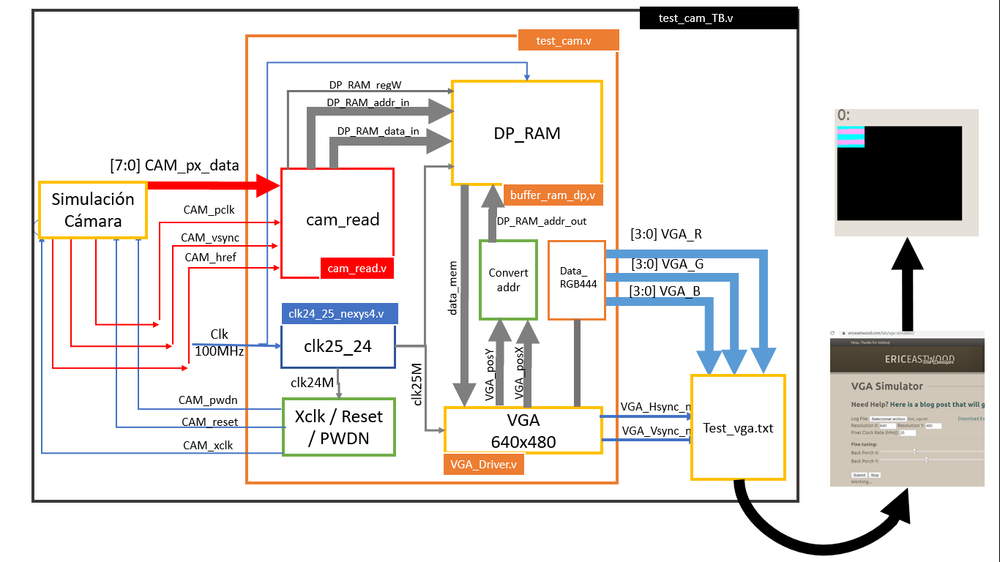

## ELECTRÓNICA DIGITAL 1 2020 -2 UNIVERSIDAD NACIONAL DE COLOMBIA
## TRABAJO 02- diseño y prueba del HDL para la cámara OV7670

## Integrantes 

Andrés Felipe Beltrán

Johan Leonardo Castellanos

Nikolai Alexander Caceres
 
Esteban Ladino Fajardo

<span style="color:red">Consideraciones</span>
- Recuerde, esta documentación debe ser tal que, cualquier compañero de futuros semestres comprenda sus anotaciones y la relación con los módulos diseñados.


*Figura 1.Esquema general*

V


### Tareas asignadas
#### 1. Módulo captura_datos_downsampler.v


*Figura 2.Módulo de captura de datos*

Se van a describir las entradas y salidas del bloque de la Figura 2.

* Href: Está sincronizado con PCLK ( Pixel  Clock Output)[1,pág 4] de tal manera que el t<sub>PHL</sub> (tiempo de propagación de alto a bajo) coincide con el instante justo antes de cambiar de su estado low tal como se muestra en la Figura 3. Además, pasados un definido número de tPCLK ( Pixel Clock Output)[1, pág 4] el cambio de su estado High ocurre en otro  tPHL del PCLK. Row data hace referencia datos de una fila según el formato elegido.


*Figura 3. Sincronización de PCLK, HREF, D[7:0] y distribución de pixeles.*

* Datos [7:0]: En la Figura 3 se muestra que cuando HREF está en HIGH se generan los datos de una fila de la matriz según el tamaño predefinido para la imagen. En el caso del formato RGB 444, cada pixel tiene 2 bytes donde cada uno está compuesto por un vector de D[7:0] y se generan por cada negedge del PCLK. Los cuatro bits menos significativos del primer byte pertenecen al color rojo, en el segundo byte los cuatro bits más significativos son del color verde y los restantes del color azul. Finalmente, se infiere de la Figura 4 que los datos D[i] ingresan de manera paralela y por tanto se deben declarar siete entradas.


*Figura 4. Diagrama de pines en la vista superior [1, pág 1].*

* Vsync: Vsync (Vertical sync output)[1, pág 4] cuando está en LOW permite capturar los datos hasta que todas las filas que conforman las fotos son llenadas y cada vez que pasa de estado LOW a HIGH se comienza a tomar una nueva foto como se observa en la Figura 5. En nuestro caso elegimos un formato 160x120, ya que dentro de las funcionalidades de la cámara, se permite hacer un escalamiento del formato CIF hasta 40x30 [1,pág 1].  


*Figura 5. VGA(640x480) Frame Timing [1, pág 7].*

Con el tamaño de Imagen de QQVGA (160x120, 160 columnas y 120 filas) HREF se comporta como se indica en la Figura 6. Entonces, por cada cuatro periodos de HREF VGA se genera un  periodo de HREF QQVGA, lo que produce una reducción en la cuarta parte del número de filas como se ilustra en la Figura 5, pasando así de 480 a 120 columnas. De la misma manera, si HREF solo está activo uno de cada cuatro periodos se reduce el número de columnas de 640 a 160 como se indica en la Figura 3, dando así el resultado esperado que es el formato 160x120.      


*Figura 6. QQVGA frame timing [1, pág 7].*


Analizando los tiempos que se presentan en la Figura Figura 5 se tiene:
  - tp=2*t<sub>PCLK</sub>(pixel clock output period) [1, pág 7]
  - t<sub>LINE</sub>  => 640 tp + 144 tp= 784 tp= 1 568 t<sub>PCLK</sub>
  - 480xt<sub>LINE</sub> = 62720 +12544= 752 640 t<sub>PCLK</sub>
  - 510xt<sub>LINE</sub> (Periodo de la VSYNC) =>  (3+17+480+10)xt<sub>LINE</sub>= 799 680 t<sub>PCLK</sub>  

* Addr: Dirección donde se va a guardar el pixel de AW (Address Width ) bits.

* datos: El pixel extraído de la cámara de DW (Data Width) bits.

* Write:  Habilita la escritura en el Buffer.


***RECUEDE: Es necesario documentar el módulo diseñado con los respectivos diagramas funcionales y estructurales y registrar la información en README.md***

#### 2. Revisar si el bloque PLL, `clk_100MHZ_to_25M_24M.v`

- Adaptar el bloque azul PLL para las frecuencias de 24 MHz y 25 MHz para la pantalla VGA y la cámara respectivamente según la FPGA a utilizar, que en nuestro caso tiene un reloj de 100 MHz. El archivo es clk_100MHZ_to_25M_24M.v y se encuentran en el interior de la carpeta hdl/scr/PLL.

Para este hito se recomienda generar un nuevo PLL con `Clocking Wizard`. en el IDE de ISE debe utilizar `tools -> Core Generator ...` y general el ip con Clocking Wizard. Una vez, generado el nuevo bloque de Clk:
* Copiar el archivo en la carpeta `hdl/scr/PLL`.
* Remplazar en el proyecto **test_cam.xise**, el archivo `clk_32MHZ_to_25M_24M.v` por el generado pro ustedes.
* Cambiar los datos necesarios en el archivo `test_cam.v` para instanciar el nuevo PLL.
* Documentar en README.md el proceso realizado.

Supongo que seguir los cuatro primeros pasos.


#### 3. Modificación del archivo test_cam.v para señales de entrada y salida de la cámara.

Las señales amarillas de la Figura 1, se sustituyen por las señales rojas de la Figura 7:


*Figura 7. Diagrama de simulación*

Durante la simulación fue necesario agregar las señales de salida para comprobar el correcto funcionamiento de los distintos módulos intanciados, estas son:

```verilog 
	output wire [11:0] data_mem,
	output wire [14:0]  DP_RAM_addr_in,
	output wire [11:0] DP_RAM_data_in,
	output reg [14:0] DP_RAM_addr_out,
``` 
* `data_mem` es el pixel de 12 bits que el módulo `buffer_ram_dp` le transfiere al módulo `VGA_Driver.v` en la ubicación `DP_RAM_addr_out`.
* Las señales `DP_RAM_data_in` y `DP_RAM_addr_in` son salidas del módulo `cam_read.v` que llevan los datos y las posiciones que utiliza el módulo `buffer_ram_dp.v` para almacenar temporalmente las capturas de datos.

Se sustituyó:
```verilog
	input CAM_PCLK,				// Sennal PCLK de la camara
	input CAM_HREF,				// Sennal HREF de la camara
	input CAM_VSYNC,				// Sennal VSYNC de la camara
``` 
Por:

```verilog
	input wire CAM_pclk,		// Sennal PCLK de la camara. 
	input wire CAM_href,		// Sennal HREF de la camara. 
	input wire CAM_vsync,		// Sennal VSYNC de la camara.
```

Para que fueran coherentes las entradas con la Figura 7.

Por otra parte, las entradas de los datos de la cámara,

```verilog
	input CAM_D0,					// Bit 0 de los datos del pixel
	input CAM_D1,					// Bit 1 de los datos del pixel
	input CAM_D2,					// Bit 2 de los datos del pixel
	input CAM_D3,					// Bit 3 de los datos del pixel
	input CAM_D4,					// Bit 4 de los datos del pixel
	input CAM_D5,					// Bit 5 de los datos del pixel
	input CAM_D6,					// Bit 6 de los datos del pixel
	input CAM_D7 					// Bit 7 de los datos del pixel
``` 

Fueron sustituidos por:

```verilog
input wire [7:0] CAM_px_data// Datos de entrada simulados
```
Ya que al simular se proporcionaba un bus de 8 bits.

#### 4. Instanciamiento módulo cam_read.v
Se instancea el módulo `cam_read.v` en el módulo `test_cam.v` como se indica a continuación:

```verilog
cam_read #(AW,DW) cam_read
(
	// Entradas 
		.CAM_px_data(CAM_px_data), // Bytes simulados de la cámara
		.CAM_pclk(CAM_pclk), // Reloj de captura de datos, con frecuencia de 25 MHz
		.CAM_vsync(CAM_vsync), // VSYNC que especifica la cámara
		.CAM_href(CAM_href), // HREF que especifica la cámara
		.rst(rst), // reset general

	//Salidas
		.DP_RAM_regW(DP_RAM_regW), // habilita la escritura de datos en el módulo buffer_ram_dp.v
		.DP_RAM_addr_in(DP_RAM_addr_in), // Dirrección a guardar la información en buffer_ram_dp.v
		.DP_RAM_data_in(DP_RAM_data_in) // Dato que se desea guardar en buffer_ram_dp.v en la dirección antes mencionada.
	);
```

#### 5. Implementación del proyecto

 Implementar el proyecto completo y documentar los resultados. Recuerde adicionar el nombre de las señales y módulos en la Figura 1 y registre el cambio en el archivo README.md

***Por favor, explicar por medio de la simulación los resultados***

##### Módulo `test_cam.v`


##### Módulo `clk24_25_nexys4.v` 

Se genero el modulo clk24_25_nexys4.v con ayuda de la ip clock wizard v6 disponible para vivado teniendo en cuenta los paramatros del proyecto, como apoyo se consulto la documentación del fabricante del Clock Wizard v6 [2]


Se asigna el valor del reloj primario de acuerdo a la FPGA que trabajaremos, en este caso 100 MHz. 

Luego se asignan los valores del reloj para cada unade las salidas 24 MHz y 25 MHz.


* Se cambió el módulo `clk_32MHZ_to_25M_24M.v` por `clk24_25_nexys4.v`, su la caja negra queda como:


En verilog se programa de la siguiente manera:

```verilog 
module clk24_25_nexys4
 (// Clock in ports
  input         CLK_IN1, // 100MHz
  // Clock out ports
  output        CLK_OUT1, // 25MHz
  output        CLK_OUT2, // 24MHz
  // Status and control signals
  input         RESET,
  output        LOCKED
 );
```

* Se instanción en el módulo `test_cam.v` como se muestra a continuación:

```verilog
clk24_25_nexys4 clk25_24(
  .CLK_IN1(clk),				//Reloj de la FPGA.
  .CLK_OUT1(clk25M),			//Reloj de la VGA.
  .CLK_OUT2(clk24M),			//Reloj de la cámara.
  .RESET(rst)					//Reset.
 );
```

Nótese que la salida *LOCKED* no fue instanceada.
##### Asignación de las señales de control 

Las señales de control son:
* CAM_xclk: Frecuencia de la cámara
* CAM_pwdn: Power down mode.
* CAM_reset: Retorno a un punto conocido por la cámara.


En el módulo TOP `test_cam.v` se instancea como:

```verilog
111 assign CAM_xclk = clk24M;	
112 assign CAM_pwdn = 0;			 
113 assign CAM_reset = 0;			
```

### Simulación

Con la modificación que se le hizo al módulo `test_cam_TB.v` y `VGA_Driver.v` solo es necesario simular aproximadamente 17 ms para generar una imagen. La siguiente fórmula explica el tiempo de simulación.


Comprobar la combinación de colores ingresando a [Link](https://htmlcolorcodes.com/es/)


#### Imagen 1. Verde 

#### Imagen 2. Verde y Rosado

#### Imagne 3. Color Azul

Las líneas de código que se utilizan en el`test_cam_TB.v` son:

```verilog
 reg cont=0;   
    initial forever  begin
		@(negedge pclk) begin
        if(cont==0) begin 
        CAM_px_data=8'h0;
        end
        else begin
        CAM_px_data=8'h0f;
        end
        cont=cont+1;
        end
	end
```
Al simular 17 ms y simular en [vga-simulator](https://ericeastwood.com/lab/vga-simulator/) se tiene:


La adquisición de datos del módulo `cam_read.v` se describe a continuación:

* En el estado **INIT**, se debe cumplir:

```verilog
            DP_RAM_data_in<=0;
            DP_RAM_addr_in<=0;
            DP_RAM_regW<=0;
```
Debe permanecer en este estado si `rst=0`y no se cumple `if(~CAM_vsync&CAM_href)`, lo que se verifica en la siguiente imagen de simulación:


De *0* a *52.04* us *rst* cambia de 1 a 0 y permanece en este último valor, *CAM_sync* habilita la adquisición de datos, pero *CAM_href* no (No ha llegado todavía al siguiente *posedge*), lo que implica que se continua en el estado **INIT**. Como se observa `DP_RAM_data_in`, `DP_RAM_addr_in` y `DP_RAM_regW` permanecen en 0.

* De **INIT** a estado **BYTE2**

En la siguiente Figura, se Ilustra el paso de estado **INIT** a estado **BYTE2** ya que `CAM_vsync=0` y `CAM_href=1` . EL registro `DP_RAM_regW` está en cero, ya que solo se tiene el color rojo del pixel. Dado que `CAM_px_data=8'h0`, la componete roja es `4'h0`. Además, `DP_RAM_data_in` y `DP_RAM_addr_in` permanecen en cero tal como se espera.   


* En estado **BYTE2**

`CAM_vsync=0` y `CAM_href=1` permiten pasar al estado **BYTE2** donde se completa el GB del pixel. `CAM_px_data=8'h0f`, lo que implica que `G=4'h0` y `B=4hf`. Esto, da como resultado que `DP_RAM_regW=1` indicando que el pixel ya está completo, que en la posición `DP_RAM_addr_in=0` se guarde el dato `DP_RAM_data_in=12'h00f` que corresponde a un pixel azul. En Figura que se muestra a continuación se aprecia lo descrito.


* Estado **BYTE1**


***

3. Una vez terminada la simulaciòn revisar dentro del directorio `HW` que contenga el fichero ***test_vga.txt***
4. ingresar a la web [vga-simulator](https://ericeastwood.com/lab/vga-simulator/)  y cargar el archivo ***test_vga.txt***, dejar los datos de configuraciòn tal cual como aparecen.
5. ejecutar `submit`.
6. Compruebe que el resultado en la web es la siguiente imagen


***Nota:*** Observe que en esta instancia usted no ha modificado el hardware del proyecto, por lo tanto, lo que observa en la pantalla VGA simulada, es la imagen almacenada en memoria por defecto.

7. Una vez tenga listo el anterior entorno de trabajo, debe proceder a  modificar el fichero  ***cam_read.v***. Solamnte en este módulo debe trabajar  y describir el funcionamiento de la adquiciòn de los datos de la cámara.


8. Al terminar de decribir la adquisión de la cámara repita los paso 2 a 6.  Si el resultado es el que se observa en la siguiente imagen, indica que el módulo cam_read es adecuado y por lo tanto, se dara por terminado este paquete de trabajo, de lo contrario  vuelva al punto 7.


la imagen muestra que se adquirió una foto de color rojo.

***RECUEDE: Es necesario documentar la simulación y registrar la información en README.md, lo puede hacer con ayuda de imágenes o videos***


### Implementación

Al culminar los hitos anteriores deben:

1. Crear el archivo UCF.
2. Realizar el test de la pantalla. Programar la FPGA con el bitstream del proyecto y no conectar la cámara. ¿Qué espera visualizar?, ¿Es correcto este resultado ?
3. Configure la cámara en test por medio del bus I2C con ayuda de Arduino. ¿Es correcto el resultado? ¿Cada cuánto se refresca el buffer de memoria ?
4. ¿Qué falta implementar para tener el control de la toma de fotos ?

***RECUEDE: Es necesario documentar la implementación y registrar la información en README.md, lo puede hacer con ayuda de imágenes o videos***


Referencias

[1] Recuperado de http://web.mit.edu/6.111/www/f2016/tools/OV7670_2006.pdf
[2] Recuperado de https://www.xilinx.com/support/documentation/ip_documentation/clk_wiz/v6_0/pg065-clk-wiz.pdf
