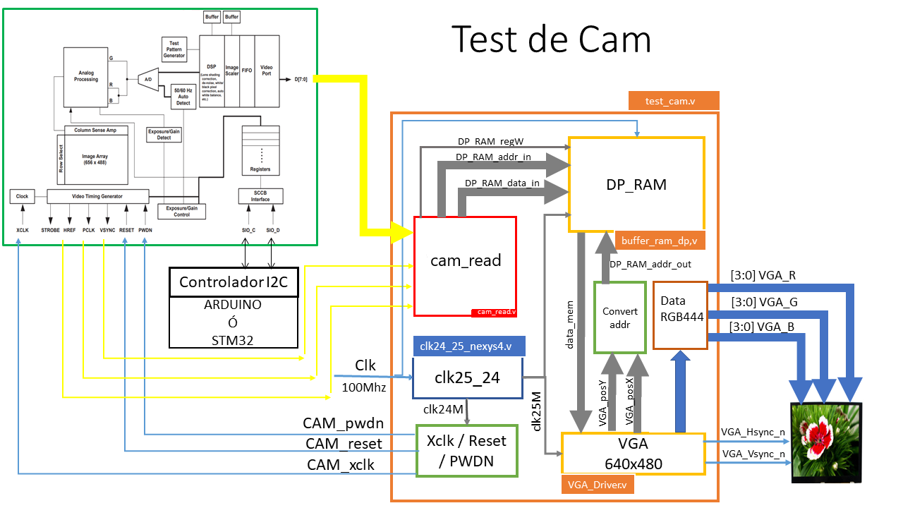
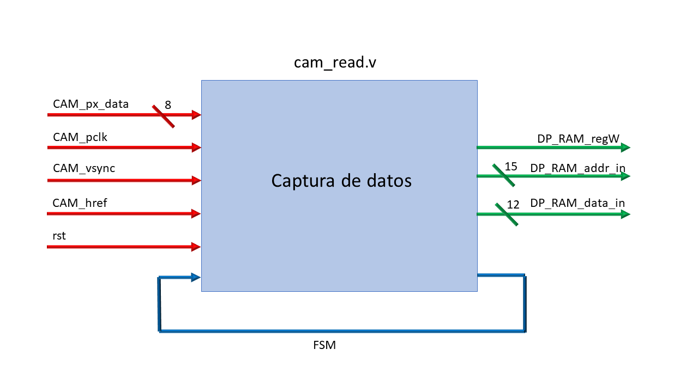
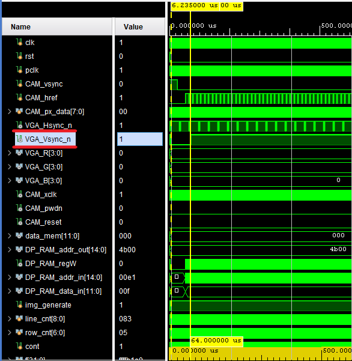

# ELECTRÓNICA DIGITAL 1 2020 -2 UNIVERSIDAD NACIONAL DE COLOMBIA
# TRABAJO 02- diseño y prueba del HDL para la cámara OV7670

## Integrantes 

Andrés Felipe Beltrán

Johan Leonardo Castellanos

Nikolái Alexander Cáceres
 
Esteban Ladino Fajardo

<span style="color:red">Consideraciones</span>
- Recuerde, esta documentación debe ser tal que, cualquier compañero de futuros semestres comprenda sus anotaciones y la relación con los módulos diseñados.

## Abstract

El presente trabajo describe el desarrollo de un sistema controlado por una matriz de puertas lógicas programable en campo​​ (FPGA) cuyas entradas son los datos proporcionados por la cámara digital (OV7670) y cuyas salidas son los diferentes datos requeridos por una pantalla estándar analógica de computadora (VGA) para la visualización de una imagen, sea esta producto de los estímulos captados por la cámara o del sistema mismo. En primer lugar, se desarrolla el módulo de captura de datos, por medio del cual, se adquiere la información enviada por la cámara OV7670. Se procede de la misma manera con los módulos PLL y XCLK. Posteriormente se muestra el proceso de diseño que se realiza  para  elaborar la memoria RAM y el módulo VGA para finalmente presentar el ensamble total del sistema en conjunto con sus respectivas simulaciones. La FPGA utilizada es la NEXYS 4 mientras que el lenguaje de descripción de hardware utilizado (HDL) es verilog, el cual es programado a través de la plataforma de Xilinx Vivado.

## Introducción

El sensor de una cámara digital está formado por celdas fotosensibles llamadas píxeles, los cuales, mediante un fotodiodo dependiendo de la cantidad de luz apreciada envían electricidad. Además, estos incluyen otros componentes electrónicos que permiten leer la información de cada píxel cada vez que se captura una foto.[1]


*Figura 1. Comportamiento sensor de cámara digital.*

Las celdas solo detectan la intensidad de la luz, es decir, número de fotones a lo largo de un determinado tiempo, mientras que unos filtros tipo Bayer descomponen la luz en tres componentes: rojo, verde y azul de forma que unas celdas reciben solo la luz correspondiente a la componente roja, otras solo la componente azul y otras solo la componente verde. En los sensores Foveon la distribución es diferente, pero el principio de funcionamiento es el mismo.

Cada fotodiodo (elemento fotosensible de la celda) funciona como un panel solar: recibe fotones que, al interactuar con los átomos del material, generan electrones. Es decir, convierten luz en electricidad.

El módulo de cámara OV7670 está basado en el sensor OV7670 de omnivision.[2] Es un dispositivo CMOS de baja tensión que proporciona imágenes de 8 bits y que cuenta, en primer lugar, con una matriz de imágenes capaz de operar a una velocidad de hasta 30 cuadros por segundo (fps) y, en segundo lugar, con diferentes circuitos destinados al procesamiento de la imagen capturada, como lo son el de control
de exposición automática (AEC), control del balance de blancos (AWB), cancelación de ruido, saturación, gamma, etc..[3] Existe también, la posibilidad de trabajar a distintas resoluciones (VGA, QVGA,
CIF, QCIF) y diferentes formatos de color (RGB555, RGB565 y YUV). Todos estos parámetros pueden configurarse a través del bus SCCB (Serial Camera Control Bus).[4]

Como se logra observar en el esquema general de la Figura 2, el diseño del sistema se aborda mediante la construcción de módulos mas pequeños con funcionalidades concretas, haciendo uso, de la programación estructural en que se basa el lenguaje de descripción de hardware (HDL) utilizado, Verilog. Una vez desarrollados estos por completo, se procede con la interconexión de los mismos para finalmente presentar los resultados mediante simulaciones.




*Figura 2. Esquema general*


## Módulos

### cam_read


*Figura 3.Módulo de captura de datos*

Se van a describir las entradas y salidas del módulo de la Figura 3.

* Href: Está sincronizado con PCLK ( Pixel  Clock Output)[5,pág 4] de tal manera que el t<sub>PHL</sub> (tiempo de propagación de alto a bajo) de PCLK coincide con el instante justo antes de que HREF cambie de su estado como lo muestra la Figura 4. Además, pasados un definido número de t<sub>PCLK</sub> ( Pixel Clock Output)[5, pág 4] el cambio de su estado High ocurre en otro  tPHL del PCLK. Row data hace referencia datos de una fila según el formato elegido.


*Figura 4. Sincronización de PCLK, HREF, D[7:0] y distribución de pixeles.*

* Datos [7:0]: En la Figura 4 se muestra que cuando HREF está en HIGH se generan los datos de una fila de la matriz según el tamaño predefinido para la imagen. En el caso del formato RGB 444, cada pixel tiene 2 bytes donde cada uno está compuesto por un vector de D[7:0] y son estables es cada posedge del PCLK. Los cuatro bits menos significativos del primer byte pertenecen al color rojo, en el segundo byte los cuatro bits más significativos son del color verde y los restantes del color azul. Finalmente, se infiere de la Figura 5 que los datos D[i] ingresan de manera paralela y por tanto se deben declarar ocho entradas en la implementación. 


*Figura 5. Diagrama de pines en la vista superior [1, pág 1].*

* Vsync: Vsync (Vertical sync output)[5, pág 4] cuando está en LOW permite capturar los datos hasta que todas las filas que conforman la imagen se han llenado y cada vez que pasa de estado LOW a HIGH  se comienza a tomar una nueva foto como se observa en la Figura 6. En nuestro caso elegimos un formato 160x120, ya que dentro de las funcionalidades de la cámara, se permite hacer un escalamiento del formato CIF hasta 40x30 [5,pág 1].  


*Figura 6. VGA(640x480) Frame Timing [1, pág 7].*

Con el tamaño de Imagen de QQVGA (160x120, 160 columnas y 120 filas) HREF se comporta como se indica en la Figura 7. Entonces, por cada cuatro periodos de HREF VGA se genera un  periodo de HREF QQVGA, lo que produce una reducción en la cuarta parte del número de filas que se ilustra en la Figura 6, pasando así de 480 a 120 filas. De la misma manera, si HREF solo está activo uno de cada cuatro periodos se reduce el número de columnas de 640 a 160 si se observa la Figura 4, dando así el resultado del formato 160x120.      


*Figura 7. QQVGA frame timing [5, pág 7].*


Analizando los tiempos que se presentan en la Figura 6 se tiene:
  - tp=2*t<sub>PCLK</sub> (pixel clock output period) [1, pág 7]
  - t<sub>LINE</sub>  => 640 tp + 144 tp= 784 tp= 1 568 t<sub>PCLK</sub>
  - 480xt<sub>LINE</sub> = 62720 +12544= 752 640 t<sub>PCLK</sub>
  - 510xt<sub>LINE</sub> (Periodo de la VSYNC) =>  (3+17+480+10)xt<sub>LINE</sub>= 799 680 t<sub>PCLK</sub>  

Finalmente, se presentan las señales de salida hacia el Buffer de Memoria.

* Addr: Dirección donde se va a guardar el pixel de tamaño AW bits.

* datos: El pixel extraído de la cámara de tamaño DW bits.

* Write:  Habilita la escritura en el Buffer.


#### Diagrama Funcional

*Figura 8. Diagrama funcional*

#### Máquina de estados 


*Figura 9. Máquina de estados finitos*


#### Diagrama estructural


*Figura 10. Diagrama estructural*


### Módulo `clk24_25_nexys4.v` y señales de control (`Xclk/Reset/PWDN`)


En principio se estaba utilizando el módulo `clk24_25_nexys4_0` proporcionado de manera generosa por el profesor Nestor de Laboratorio. Luego, se genero el modulo clk24_25_nexys4.v con ayuda de la ip clock wizard v6 disponible para vivado teniendo en cuenta los parámetros del proyecto, como apoyo se consulto la documentación del fabricante del Clock Wizard v6 [6] y el trabajo del grupo 5 del semestre anterior que está en este [link](https://github.com/unal-edigital1-2019-2/work04-proyectofinal-grupo-05-1/blob/master/docs/README.md).

 En la parte izquierda del flujo de navegación se elige *IP Catalog*


 
 Posteriormente, se busca *FPGA Features and Design>Clocking>Clocking Wizard*


Se asigna el valor del reloj primario de acuerdo a la FPGA que trabajaremos, en este caso 100 MHz y por preferencia se le pone el nombre de *clk100M* 


Se cambia en Source a *Global buffer*.


En la siguiente pestaña **Output Clocks**, se elige que una de las salidas tenga una frecuencia de 24 MHz con el nombre de *clk24M* y la otra tenga una frecuencia de 25 MHz con el nombre de *clk25M*


En port **Port Renaming** no se hace nada.


En *MMCM Setting* tampoco se modifica.


En Summary se deja Igual. 


Se guarda en la dirección que aparece en el recuadro.


Se genera.


Luego nos dirigimos a la dirección a donde se a ha guardado y los archivos *clk24_25_nexys4* y *clk24_25_nexys4_clk_wiz.v* son el PLL.


Se borra la carpeta donde se generaron esos archivos y se remueve del proyecto.


* La caja negra de `clk24_25_nexys4.v` queda como:


En verilog sus entradas y salidas se representan como:

```verilog 
module clk24_25_nexys4 
 (
  // Clock out ports
  output        clk24M,
  output        clk25M,
  // Status and control signals
  input         reset,
  output        locked,
 // Clock in ports
  input         clk100M
 );
 ```

Un aspecto interesante es el comportamiento que muestra clk25M en clk24_25_nexys4_0, este se ilustra en la siguiente Figura


clk25M dura en 0 por un tiempo de 475 ns, mientras que con el módulo clk24_25_nexys4 dura 1225 ns con esa misma característica.


Se cree que esto se puede dar porque ambos módulos presentan 'Jitters' y errores de fase distintos tal como lo indican las tablas que se proporcionan al generarlos con *Clocking Wizard* 

En el módulo  clk24_25_nexys4_0

```verilog

//----------------------------------------------------------------------------
// "Output    Output      Phase     Duty      Pk-to-Pk        Phase"
// "Clock    Freq (MHz) (degrees) Cycle (%) Jitter (ps)  Error (ps)"
//----------------------------------------------------------------------------
// CLK_OUT1____25.000______0.000______50.0______154.057_____87.180
// CLK_OUT2____24.000______0.000______50.0______155.487_____87.180
//
//----------------------------------------------------------------------------
// "Input Clock   Freq (MHz)    Input Jitter (UI)"
//----------------------------------------------------------------------------
// __primary_________100.000____________0.010

```
En el módulo clk24_25_nexys4 (El final del proyecto)

```verilog
//----------------------------------------------------------------------------
//  Output     Output      Phase    Duty Cycle   Pk-to-Pk     Phase
//   Clock     Freq (MHz)  (degrees)    (%)     Jitter (ps)  Error (ps)
//----------------------------------------------------------------------------
// __clk24M__24.00000______0.000______50.0______175.595_____99.281
// __clk25M__25.00000______0.000______50.0______174.188_____99.281
//
//----------------------------------------------------------------------------
// Input Clock   Freq (MHz)    Input Jitter (UI)
//----------------------------------------------------------------------------
// __primary_________100.000____________0.010
```


#### Asignación de las señales de control 

Las señales de control son:
* CAM_xclk: Frecuencia de la cámara 24 MHz.
* CAM_pwdn: Power down mode.
* CAM_reset: Retorno a un punto conocido por la cámara.


En el módulo TOP `test_cam.v` se instancia como:

```verilog
111 assign CAM_xclk = clk24M;   
112 assign CAM_pwdn = 0;             
113 assign CAM_reset = 0;           
```


### Módulo Buffer RAM (Tomado de **wp01-ram-grupo-03**)

Para poder almacenar la información adquirida por la cámara , y teniendo en cuanta que la cámara usada no tiene memoria FIFO, se debe diseñar e implementar una memoria RAM  de doble puerto tal y como se observa en la figura 13.


*Figura 13. Módulo Buffer*

El tamaño máximo de buffer de memoria que se puede crear esta limitado por la capacidad máxima de la FPGA a usar; entonces, se procede a analizar el datasheet de la FPGA Nexys 4 DDR del cual se obtienen las siguientes características:


*Figura 14. Espacio Nexys 4[1]*

Tal y como se puede apreciar, la FPGA Nexys 4 DDR tiene la capacidad de almacenamiento de 4 860 Kb lo que equivale a 607,5 KB. 

Vale la pena aclarar que, tal y como se nos indica por el profesor, se busca que tanto el formato como la resolución se ajuste de una mejor manera al 50% del tamaño de la memoria calculada en el inciso anterior, es decir, 2 488 320 bits. A continuación, se muestra la tabla de la Figura 15 que relaciona cada uno de los formatos y resoluciones con el porcentaje de la cantidad de memoria a usar que estos requieren.


*Figura 15. Memoría utilizada según las resoluciones y el formato*

Se elige en principio un formato RGB 444, ya que la pantalla a usar se encuentra configurada para este. Sucesivamente y teniendo en cuenta la tabla presentada anteriormente, lo que se hace es elegir el tamaño de imagen que menos memoria consume, es decir, el tamaño 160 x 120 pixeles.

Estos 160 x 120 pixeles, lo que equivale a 19200 pixeles, mediante una representacion binaria son representados por _2^n_ , donde _n_ corresponde al número de bit necesarios. Es posible hallar _n_ de la siguiente manera:

=n)

=%2014.22)

Entonces, se requiere de 15 bits como mínimo para representar con éxito la matriz de datos que provee la cámara, con los cuales es posible representar $2^n$ datos, lo que equivale a 32768 datos. En el programa diseñado con este _n_ hace referencia al parámetro AW (address width)  y representa la cantidad de bits de la dirección. Además, como cada uno de nuestros datos (píxeles) requiere 12 bits esto corresponde al parámetro DW (Data Width) utilizado en el código de programación. Por tanto, la memoria a diseñar debe tener la capacidad de almacenar _AW*DW_  bits (393 216 bits), lo que representa un _15.8%_ de la memoria que se permite usar en la FPGA.

En el momento de codificar lo dicho anteriormente, se parte por crear el modulo buffer_ram_dp con los siguientes parametros, entradas y salidas:

```verilog
module buffer_ram_dp#(
    parameter AW = 15,       // Cantidad de bits  de la direccion.
    parameter DW = 12,       // Cantidad de Bits de los datos.
    // Absolute address in Esteban's computer
    parameter imageFILE = "D:/UNAL/semester6/digitali/proyecto/wp2-simulacion-captura-grupo-03/src/sources/imagen.men")
    (
    input clk_w,             // Frecuencia de toma de datos de cada pixel.
    input [AW-1: 0] addr_in, // Direccion entrada dada por el capturador.
    input [DW-1: 0] data_in, // Datos que entran de la camara.
    input regwrite,          // Enable.

    input clk_r,                    // Reloj 25MHz VGA.
    input [AW-1: 0] addr_out,       // Direccion de salida dada por VGA.
    output reg [DW-1: 0] data_out   // Datos enviados a la VGA.

    //input reset                   // De momento no se esta usando.

    );
    // Calcular el numero de posiciones totales de memoria.
localparam NPOS = 2 ** AW;          // Memoria.
localparam imaSiz=160*120;
```
Sucesivamente, se crea el registro ram de la cantidad de bits usada por los datos * la cantidad direcciones. Ahora bien, teniendo en cuenta el flanco de subida del reloj clk_w y en un segundo caso cualquier cambio (*), se desarrollan las siguientes instrucciones:

```verilog
reg [DW-1: 0] ram [0: NPOS-1];
// Escritura  de la memoria port 1.
always @(posedge clk_w) begin
       if (regwrite == 1)
// Escribe los datos de entrada en la dirección que addr_in se lo indique.
             ram[addr_in] <= data_in;
end

// Lectura  de la memoria port 2.
always @(*) begin
// Se leen los datos de las direcciones addr_out y se sacan en data_out.
        data_out <= ram[addr_out];
end

initial begin
// Lee en hexadecimal (readmemb lee en binario) dentro de ram [1, pág 217].
    $readmemh(imageFILE, ram);
    // En la posición n+1 (160*120) se guarda el color negro
    ram[imaSiz] = 12'h0;
end
endmodule

/*
always @(posedge clk_w) begin
    if (reset) begin
        $readmemh(imageFILE, ram);
    end
end
*/
```

Se realiza una simulación para comprobar que la memoria RAM funcione correctamente, tal y como se muestra a continuacion:

* Simulación (TestBench):

En primer lugar se debe aclarar que el archivo **imagen.men** se encarga de suministrar los datos de entrada del archivo **buffer_ram_dp.v** (memoria Ram diseñada). Como se explica en el inciso 2 se sabe que, por un lado, para el formato RGB444 cada pixel (dato) requiere de 12 bits y que por otra parte, se deben representar 32 768 pixeles. Además, teniendo en cuenta que en el archivo **buffer_ram_dp.v** la lectura del archivo **image.men** se hace de manera hexadecimal (con la instrucción **$readmemh(imageFILE, ram)**, se modifica el archivo **imagen.men** de la siguiente manera:

Se agregan 32 768 lineas de datos, donde cada dato se representa por tres números hexadecimales consecutivos, cada uno de estos representando 4 bits. Por ejemplo, la primer linea del archivo contiene el siguiente dato: **f00** donde f representa que los cuatro bits del color "Red" estan en 1, es decir el número hexadecimal f en binario (1111); de la misma manera el 0 indica que los cuatro bits del color "Green" se encuentran en 0 y de manera similar con el color "Blue". Despues, se activa el Green (0f0) y todos los demás se desabilitan; finalmente se activa el Blue (00f). Se continua esta frecuencia por nueve filas y el resto se deja en _f00_.

El archivo **TB_ram** es modificado en primer lugar para que el flanco de subida del reloj (ckl) coincida con el flanco de subida del registro de escritura, de lectura y de asignación de direcciones lo que permite una sincronizacion adecuada para cada una de las operaciones a ejecutar. Esto se implemeta en el código de la Figura 16 y se puede evidenciar en la simulación.


*Figura 16. Parte 1 de la prueba del módulo Buffer.*

El registro de escritura **regwrite** es puesto en 1 luego de un delay de 10 ns, con esto se inicializan los registros y permite que se comience a escribir en el registro ram del archivo **buffer_ram_dp.v**. Lo sucede en paralelo  es que existe un delay de 2 seguntos para cada uno de los incrementos del ciclo for, en este además mediante el registro **cont** se están generando las direcciones de memoria de escritura, lo que corresponde a un delay de 20 ns que sumados a los 10 ns iniciales da como resultado 30 ns. Luego, el registro **regread** tarda 40 ns en cambiar su estado de 0 a 1 incluyendo el delay de la linea 78 de 10 ns razón por la cual _data_out_ se inicializa hasta ese valor. Esto se puede notar en la Figura 5. 


*Figura 17. Simulación del Buffer.*

En la simulacion de la Figura 17, una vez **regwrite** esta en 1 en **data_in** se van guardando los datos del archivo imagen.men,  en este caso solo se están escribiendo 10 datos comenzando por la dirreción 0 y se están cargador mediante la instrucción **$readmemh(file,inputData)** como se observa en la Figura 6. Pasados 20 ns, **regwrite** pasa a ser 0 y **regread** cambia su estado a 1 después de 10 ns, lo que da lugar a que se cargen las dirreciones de los datos de salida mediante representada por **addr_out** mediante el registro **cont** ubicado en el for de la linea 80 según el código de la Figura 4 y por consiguiente, se cargan los datos **data_out** ubicados en el módulo **buffer_ram_dp.v**. La instrucción **always #1 clk=~clk** genera el reloj.
 


*Figura 18. Parte 2 de la prueba del módulo Buffer.*

Los resustados en general fueron satisfactorios, lo que genera mas incertidumbre fue encontrar la dirección relativa para colocar el archivo **imagen.men** por lo que se opta por colocar la dirección absoluta.


### VGA_Driver
* Cambio 1

Las entradas y salidas de este módulo estaban declaradas como:

```verilog
module VGA_Driver640x480 (
    input rst,
    input clk,              // 25MHz  para 60 hz de 640x480
    input  [7:0] pixelIn,   // entrada del valor de color  pixel 
    
    output  [7:0] pixelOut, // salida del valor pixel a la VGA 
    output  Hsync_n,        // señal de sincronización en horizontal negada
    output  Vsync_n,        // señal de sincronización en vertical negada 
    output  [9:0] posX,     // posición en horizontal del pixel siguiente
    output  [8:0] posY      // posicion en vertical  del pixel siguiente
);
```

 Se modificó y así:

 ```verilog
 module VGA_Driver #(DW = 12) (
    input rst,
    input clk,                      // 25MHz  para 60 hz de 640x480
    input  [DW - 1 : 0] pixelIn,    // entrada del valor de color  pixel 
    
    output  [DW - 1 : 0] pixelOut, // salida del valor pixel a la VGA 
    output  Hsync_n,        // señal de sincronización en horizontal negada
    output  Vsync_n,        // señal de sincronización en vertical negada 
    output  [9:0] posX,     // posición en horizontal del pixel siguiente
    output  [9:0] posY      // posición en vertical  del pixel siguiente
);
 ```
Se parametrizó el tamaño de pixelIn y pixelOut, dejándolo por defecto como 12 bits. También, posY debe tener un tamaño tal que le permita llegar de 0 hasta TOTAL_SCREEN_X-1 (525-1), esto se logra con un registro de 10 bits en donde se puede almacenar de la posición 0 a la 1023.     

* Cambio 2

El registro `countY` estaba como: 

```verilog
reg  [8:0] countY;
```

Se cambió por:

```verilog
reg  [9:0] countY; // 10 bits
```
`countY` tiene un rango de [0,TOTAL_SCREEN_Y-1]=[0,525-1], el cual no se podía alcanzar con un registro de 9 bits ya que este permite almacenar únicamente de 0 hasta 2 potencia 9 menos 1 esto es de 0 a 511.

* Cambio 3

Se cambió,
```verilog
assign pixelOut = (countX<SCREEN_X) ? (pixelIn ) : (8'b00000000) ;
```
por,

```verilog
assign pixelOut = (countX<SCREEN_X) ? (pixelIn ) : (12'b0) ;
```

El tamaño del pixel que se requiere en nuestro caso es de 12 bits y es de color negro, por eso se coloca `12'b0`. A pixelOut se le asigna `12'b0` cada vez que countX, cuyo rango es [0,799] (de 0 hasta TOTAL_SCREEN_X-1), es igual o mayor a SCREEN_X (SCREEN_X=640).

* Cambio 4

Cuando reset estaba activo, `countX` y `countY` se establecían en cero, generando así que la señal que permite la sincronización se demora aproximadamente:

(SCREEN_YtFRONT_PORCH_Yt1)}}{clk}=\frac{(800)(480t10t1)}{25MHz}\approx15.71ms)

Esto se deduce a partír de:

```verilog
assign Hsync_n = ~((countX>=SCREEN_X+FRONT_PORCH_X) && (countX<SCREEN_X+SYNC_PULSE_X+FRONT_PORCH_X)); 
assign Vsync_n = ~((countY>=SCREEN_Y+FRONT_PORCH_Y) && (countY<SCREEN_Y+FRONT_PORCH_Y+SYNC_PULSE_Y));
```

Cuando la sincronización vertical (`VGA_Vsync_n`) pasa de 1 a 0 y de 0 a 1, al igual que la sincronización horizontal (`VGA_Hsync_n`) en la última fila de la matriz , permite saber que el próximo pixel que se transmita se ubica en la posición 1 de la matriz que forma la imagen en de tamaño  TOTAL_SCREEN_XxTOTAL_SCREEN_Y=800x525. Ahora bién, `VGA_Vsync_n` (que es la más demorada), empieza a generar la sincronización cuando `countY>=SCREEN_Y+FRONT_PORCH_Y` y esto se empieza a cumplir cuando `countX` es mayor o igual que `(TOTAL_SCREEN_X-1)` un número `SCREEN_Y+FRONT_PORCH_Y` de veces, según se muestra en condicional que continua:

```verilog

if (countX >= (TOTAL_SCREEN_X-1)) begin
            countX <= 0;
            if (countY >= (TOTAL_SCREEN_Y-1)) begin
                countY <= 0;
            end 
            else begin
                countY <= countY + 1;
            end
        end 
```

Dado que se inicia a contar desde cero, hay que sumarle uno a cada cantidad antes mencionada y multiplicar el producto de ambas por el periodo del VGA_Driver para saber el tiempo total que se demora. Los cálculos descritos fueron realizados en el cálculo de tiempo de de sincronización de las señales.

A raiz de la explicación realizada, se dedició inicializar `countX` y `countY` al estar activado `rst` tal como se indica a continuación: 

```verilog
if (rst) begin
        countX <= (SCREEN_X+FRONT_PORCH_X-1);
        countY <= (SCREEN_Y+FRONT_PORCH_Y-1);
    end
```
Sin embargo, se hubiera podido optimizar aun más la simulación si `contX` iniciara en `TOTAL_SCREEN_X-1`. Se elegió que countY tomara ese valor en `rst=1` para que al inicio de la simulación se pudiera observar el cambio de 1 a 0 y de 0 a 1 de `VGA_Vsync_n`. Esto se ilustra en la Figura que continua:


En la siguiente Figura se sobresalta `VGA_Vsync_n` para observar los efectos explicados:


Las señal de sincronización `VGA_Vsync_n`  del `VGA_Driver` se puede asimilar a la Figura que continua en *Vertical timing*. Además, la señal de sincronización `VGA_Hsync_n` de las simulaciones mostradas, podría verse como la señal *Horizontal timing*, que está en la Figura que continua, repitiendose cada fila que compone la matriz de la imagen. 


*Tomado de [7].* 

## Implementación de los módulos

## Implementación de los módulos

La implementacion de todos los modulos desarrollados previamente (cam_read.v, clk24_25_nexys4.v, buffer_ram_dp.v y VGA_Driver.v que a su vez incluye el Módulo de convert addr) y, por consiguiente, del sistema en su totalidad se lleva a cabo con el desarrollo del modulo test_cam.v.

### Análisis de Módulo `test_cam.v`

<<<<<<< HEAD
Las señales amarillas de la Figura 2, se sustituyen por las señales rojas de la Figura 19. Este esquema de simulación nos permite evaluar que todos los módulos funcionen adecuadamente una vez se logre implementar todo el proyecto. 


*Figura 19. Diagrama de simulación*

Dado que el modulo test_cam.v es proporcionado por el docente, a continuacion se  presentan todos los cambios que se desarrollan en el mismo con la finalidad de desarrollar el sistema del presente trabajo con exito. 

#### Señales de de entrada y salida

Las señales de entrada y salida de este módulo son las conexiones de los modulos internos (conjunto de modulos que componen el modulo `test_cam.v`) y las conexiones externas ya sean las simulaciones de la cámara y la pantalla VGA o los componentes en fisico (la cámara y la pantalla). 

##### Señales de entrada 

Se sustituye:

```verilog
    input CAM_PCLK,             // Sennal PCLK de la camara
    input CAM_HREF,             // Sennal HREF de la camara
    input CAM_VSYNC,                // Sennal VSYNC de la camara
``` 
Por:

```verilog
    input wire CAM_pclk,        // Sennal PCLK de la camara. 
    input wire CAM_href,        // Sennal HREF de la camara. 
    input wire CAM_vsync,       // Sennal VSYNC de la camara.
```
Cambios desarrollados con el fin de ser coherentes con la Figura 19.

Por otra parte, las entradas de los datos de la cámara,

```verilog
    input CAM_D0,                   // Bit 0 de los datos del pixel
    input CAM_D1,                   // Bit 1 de los datos del pixel
    input CAM_D2,                   // Bit 2 de los datos del pixel
    input CAM_D3,                   // Bit 3 de los datos del pixel
    input CAM_D4,                   // Bit 4 de los datos del pixel
    input CAM_D5,                   // Bit 5 de los datos del pixel
    input CAM_D6,                   // Bit 6 de los datos del pixel
    input CAM_D7                    // Bit 7 de los datos del pixel
``` 

Son sustituidos por:

```verilog
input wire [7:0] CAM_px_data// Datos de entrada simulados
```
Esto debido a que la simulacion a desarrollar proporciona un bus de 8 bits.

##### Señales de salida

Se agregan las siguientes señales de salida para comprobar el correcto funcionamiento de los distintos módulos intanciados en la etapa de simulación:

```verilog 
    output wire clk25M, // 25MHz de la VGA
    output wire [14:0]  DP_RAM_addr_in,
    output wire [11:0] DP_RAM_data_in,
    output wire DP_RAM_regW, // Indica cuando un pixel esta completo.
    output wire [11:0] data_mem,    
    output reg [14:0] DP_RAM_addr_out,
``` 
* `clk25M` es un reloj de 25 MHz usado por la VGA_Driver.

* Las señales `DP_RAM_data_in` y `DP_RAM_addr_in` son salidas del módulo `cam_read.v` que llevan los datos y las posiciones que utiliza el módulo `buffer_ram_dp.v` para almacenar temporalmente las capturas. `DP_RAM_data_in` puede ser escrito en `buffer_ram_dp.v` solo cuando `DP_RAM_regW` se lo permita, esto es cuando está en 1. 

* `data_mem` es el pixel de 12 bits que el módulo `buffer_ram_dp` le transfiere al módulo `VGA_Driver.v` en la ubicación `DP_RAM_addr_out`.

##### Conexiones internas, señales de control y registros

Diferencias con la version original del módulo:

Este fragmento de codigo fue agregado a las señales presentes en el modulo.
```verilog
    output wire [11:0] data_mem,        //Conexión de buffer_ram_dp.v a VGA_Driver.v
    output reg  [14:0] DP_RAM_addr_out, //Registro con las direcciones de los datos asociados a un pixel(valor del color RGB444)
```

* Conexiones de salida del módulo cam_read.v a buffer_ram_dp.v

Diferencias con la version original del módulo:

Este fragmento es agregado al codigo (dado a que el cam_read.v debe de ser 
diseñado/creado estas conexiones/señales no estan presentes el en original)

```verilog
    
    output wire [14:0] DP_RAM_addr_in,     //Señal que envia los datos de la dirección donde se encuentra el pixel RGB444
    output wire [11:0] DP_RAM_data_in,  //Señal con el valor de color del pixel RGB444 en la dirección de memoria   
    output wire DP_RAM_regW,    //Señal de control la cual indica cuando un pixel esta completo.
```
* Entradas y Salidas de la camara (ya sea física o del módulo de simulación de la cámara)

Diferencias con la versión original del módulo:

Ninguna al codigo.


Se agregaron comentarios a algunas señales que no los tenían.
```verilog
    output wire CAM_xclk,       // System  clock input de la camara.
    output wire CAM_pwdn,       // Power down mode.
    output wire CAM_reset,      // Clear all registers of cam.
    input wire CAM_pclk,        // Señal PCLK de la camara. 
    input wire CAM_href,        // Señal HREF de la camara. 
    input wire CAM_vsync,       // Señal VSYNC de la camara.
    input wire [7:0] CAM_px_data    // Datos de salida de la camara (ya sean simulados o valores enviados por la captura de imagen de la camara.
    );
```
Finalmente, las entradas y salidas de módulo **test_cam** quedan de la siguiente manera:

```verilog
//Entradas del test cam
    input wire clk,             // Board clock: 100 MHz Nexys4DDR.
    input wire rst,     // Reset button. Externo

    // Salida
    output wire VGA_Hsync_n,  // Horizontal sync output.
    output wire VGA_Vsync_n,  // Vertical sync output.
    output wire [3:0] VGA_R,  // 4-bit VGA red output.
    output wire [3:0] VGA_G,  // 4-bit VGA green output.
    output wire [3:0] VGA_B,  // 4-bit VGA blue output.

     // Conexiones *****************************************
    
    //  Algunas conexiones de Driver_VGA.
    output wire clk25M, // 25MHz de la VGA
    output wire [11:0] data_mem,           //Cable de DP_RAM a VGA 640X480
    output reg  [14:0] DP_RAM_addr_out, //Registro Captura de datos a DP_RAM Dirección en memoria 
    
    // Salidas de cam_read.v
    
    output wire [14:0] DP_RAM_addr_in,     //Cable Captura de datos a DP_RAM Dirección de memoria lectura 
    output wire [11:0] DP_RAM_data_in,  //Cable Captura de datos a DP_RAM Datos a guardar en la dirección de memoria    
    output wire DP_RAM_regW, // Indica cuando un pixel esta completo.

    //CAMARA input/output conexiones de la camara al modulo principal ********************************

    output wire CAM_xclk,       // System  clock input de la c�mara.
    output wire CAM_pwdn,       // Power down mode.
    output wire CAM_reset,      // Clear all registers of cam.
    input wire CAM_pclk,        // Sennal PCLK de la camara. 
    input wire CAM_href,        // Sennal HREF de la camara. 
    input wire CAM_vsync,       // Sennal VSYNC de la camara.
    input wire [7:0] CAM_px_data// Datos de entrada simulados 
```

##### Registros y señales internas del Módulo `test_cam.v`

Diferencias con la version original del módulo:

Se cambiaron algunos nombres de algunas conexiones y se eliminaron los parametros locales relacionados al color RGB332 presentes en el modulo original.

Se agregaron comentarios a algunas señales,registros y asignaciones que no los tenian.
```verilog
//Tamaño de la imagen seleccionado por su bajo requisito de memoria 
parameter CAM_SCREEN_X = 160;       // 640 / 4. 
parameter CAM_SCREEN_Y = 120;       // 480 / 4.

localparam AW=15; //Se determina de acuerdo al tamaño de la resolución Log(2)(160*120)=15
localparam DW=12; //Se determina de acuerdo al tamaño del dato del formato de color RGB444 = 12 bites.

```
En esta seccion del codigo se eliminaron los parametros locales del color RGB332 porque en se opto por usar la configuracion de color RGB444.
```verilog
localparam RED_VGA =   8'b11100000;//eliminado
localparam GREEN_VGA = 8'b00011100;//eliminado
localparam BLUE_VGA =  8'b00000011;//eliminado
```
Aqui se modificaron los nombre de:

El nombre del reloj clk32M a clk100M (dado a que el reloj de la nexys 4 usado es de 100Mhz).

El nombre de la conexion data_RGB332 a data_RGB444(dado a que se opto por la configuracion en la camara de RGB444).

Se agrego el parameto local imaSiz (que representa la posicion n+1 de la imagen)
```verilog
// conexiondes del clk24_25_nexys4.v
wire clk100M;           // Reloj de un puerto de la Nexys 4 DDR entrada.
wire clk25M;// Para guardar el dato del reloj de la Pantalla (VGA 680X240 y DP_RAM).
wire clk24M;        // Para guardar el dato del reloj de la camara.
// Conexion dual por ram
localparam imaSiz= CAM_SCREEN_X*CAM_SCREEN_Y;// Posición n+1 del tamaño del arreglo de pixeles de acuerdo al formato.
wire [AW-1: 0] DP_RAM_addr_in;      // Conexión  Direccion entrada.
wire [DW-1: 0] DP_RAM_data_in;          // Conexion Dato entrada.
wire DP_RAM_regW;           // Enable escritura de dato en memoria .
reg  [AW-1: 0] DP_RAM_addr_out;     //Registro de la dirección de memoria.

// Conexion VGA Driver
wire [DW-1:0] data_mem;             // Salida de dp_ram al driver VGA
wire [DW-1:0] data_RGB444;          // salida del driver VGA a la pantalla
wire [9:0] VGA_posX;            // Determinar la posición en X del pixel en la pantalla 
wire [9:0] VGA_posY;            // Determinar la posición de Y del pixel en la pantalla
```
Aqui tambien se modificó el nombre de la conexion data_RGB332 a data_RGB444.
```verilog
/* ****************************************************************************
Asignación de la información de la salida del driver a la pantalla
del regisro data_RGB444
**************************************************************************** */
assign VGA_R = data_RGB444[11:8];   //los 4 bites más significativos corresponden al color ROJO (RED) 
assign VGA_G = data_RGB444[7:4];    //los 4 bites siguientes son del color VERDE (GREEN)
assign VGA_B = data_RGB444[3:0];    //los 4 bites menos significativos son del color AZUL(BLUE)
/* ****************************************************************************
Asignacion de las seales de control xclk pwdn y reset de la camara
**************************************************************************** */
assign CAM_xclk = clk24M;       // Asignación reloj cámara.
assign CAM_pwdn = 0;            // Power down mode.
assign CAM_reset = 0;           // Reset cámara.
```
##### Instanciamiento de modulos 

###### Módulo cam_read.v

Este bloque es modificado completamente con respecto al de la version original dada la forma en la que se diseña del modulo cam_read.v:

```verilog
/* ****************************************************************************
Modulo de captura de datos /captura_de_datos_downsampler = cam_read
**************************************************************************** */
cam_read #(AW,DW) cam_read
(
    // Entradas 
        .CAM_px_data(CAM_px_data), // Bytes simulados de la cámara
        .CAM_pclk(CAM_pclk), // Reloj de captura de datos, con frecuencia de 25 MHz
        .CAM_vsync(CAM_vsync), // VSYNC que especifica la cámara
        .CAM_href(CAM_href), // HREF que especifica la cámara
        .rst(rst), // reset general

    //Salidas
        .DP_RAM_regW(DP_RAM_regW), // habilita la escritura de datos en el módulo buffer_ram_dp.v
        .DP_RAM_addr_in(DP_RAM_addr_in), // Dirrección a guardar la información en buffer_ram_dp.v
        .DP_RAM_data_in(DP_RAM_data_in) // Dato que se desea guardar en buffer_ram_dp.v en la dirección antes mencionada.
    );
```
###### Módulo buffer_ram_dp.v

En este solo se agregaron comentarios a cada señal.

```verilog
/* ****************************************************************************
buffer_ram_dp buffer memoria dual port y reloj de lectura y escritura separados
Se debe configurar AW  segn los calculos realizados en el Wp01
**************************************************************************** */
buffer_ram_dp DP_RAM(
        // Entradas.
    .clk_w(CAM_pclk),   //Frecuencia de toma de datos de cada pixel.
    .addr_in(DP_RAM_addr_in),// Direccion entrada dada por el capturador.
    .data_in(DP_RAM_data_in),       // Datos que entran de la cámara.
    .regwrite(DP_RAM_regW),         // Enable.
    .clk_r(clk25M),                 // Reloj VGA.
    .addr_out(DP_RAM_addr_out),// Direccion salida dada por VGA.
        // Salida.
    .data_out(data_mem)         // Datos enviados a la VGA.
    //.reset(rst)                   //(Sin usar)
);
/* ****************************************************************************
```

###### Módulo buffer_ram_dp.v

Se instancia de la siguiente manera:

```verilog
VGA_Driver640x480
**************************************************************************** */
VGA_Driver VGA_640x480
(
    .rst(rst),
    .clk(clk25M),               // 25MHz  para 60 hz de 160x120
    .pixelIn(data_mem), // Entrada del valor de color  pixel RGB 444.
    .pixelOut(data_RGB444),     // Salida del datos a la VGA. (Pixeles). 
    .Hsync_n(VGA_Hsync_n),  // Sennal de sincronizacion en horizontal negada para la VGA.
    .Vsync_n(VGA_Vsync_n),  // Sennal de sincronizacion en vertical negada  para la VGA.
    .posX(VGA_posX), // Posicion en horizontal del pixel siguiente.
    .posY(VGA_posY)             // posicinn en vertical  del pixel siguiente.
);
```
##### Actualizacion del pixel

Esta es la parte final del modulo test_cam.v y es supremamente importante pues es en esta donde, ante cualquier cambio de VGA_posX o VGA_posY, se envia la imagen captada de la camara en conjunto con pixeles negros que son los encargados de rellenar la matriz 640 * 480 correspondiente al tamano de la pantalla VGA. 

A diferencia de la version original del módulo, se modifica la igualdad del DP_RAM_addr_out dentro del la condicion if,de
DP_RAM_addr_out=15'b111111111111111; a DP_RAM_addr_out = imaSiz;.

```verilog
/* ****************************************************************************
Logica para actualizar el pixel acorde con la buffer de memoria y el pixel de
VGA si la imagen de la camara es menor que el display VGA, los pixeles
adicionales seran iguales al color del ultimo pixel de memoria
**************************************************************************** */
always @ (VGA_posX, VGA_posY) begin
        if ((VGA_posX>CAM_SCREEN_X-1)|(VGA_posY>CAM_SCREEN_Y-1))
    //Posición n+1(160*120), en buffer_ram_dp.v se le asignó el color negro.
            DP_RAM_addr_out = imaSiz;
        else
            DP_RAM_addr_out = VGA_posX + VGA_posY * CAM_SCREEN_X;// Calcula posicion.
end
endmodule
```


## Simulación (Con el módulo clk24_25_nexys4_0)

Con la modificación que se le hizo al módulo `test_cam_TB.v` y `VGA_Driver.v` solo es necesario simular aproximadamente 17 ms para generar una imagen. La siguiente fórmula explica el tiempo de simulación.


### Imagen 1. Color verde 

Líneas de código usadas para simular en el Módulo `test_cam_TB.v`:
```verilog
 //registros de simulacion del color
        reg cont=0;
        parameter[3:0]R=4'b0000; //rojo del pixel RRRR
        parameter[3:0]G=4'b1111; //verde del pixel GGGG
        parameter[3:0]B=4'b0000; //azul del pixel BBBB
        reg [11:0]colorRGB444= {R[3:0],G[3:0],B[3:0]}; //color RRRR GGGG BBBB,first byte= XXXX RRRR, second byte= GGGG BBBB
    //asignacion del color
    always @(posedge pclk) begin
    cont=cont+1;
    if (cont ==0)begin//first Byte
    CAM_px_data[3:0]=colorRGB444[11:8];
    end
    if(cont == 1)begin//second Byte
    CAM_px_data = colorRGB444[7:0];
    end
    end
```
Duración de la simulación 17ms y resultado en [vga-simulator](https://ericeastwood.com/lab/vga-simulator/):


### Imagen 2. Verde y Rosado
Líneas de código para intercalar el color según la línea en donde se encuentre el pixel
```verilog
//(seccion de codigo para generar las lineas intercaladas)
 always @(posedge pclk) begin
    if (row_cnt<15)begin //para tener media seccion al principio se cuentan 15 posiciones verticales
    colorRGB444=12'b111100001111; //color rosa
    end
    else if (row_cnt<45)begin //cuando se superan las 15 lineas pero esta por debajo de las 45 (una seccion de 30 depues de la media de 15)
    colorRGB444=12'b000011110000;//color verde
    end
    else if (row_cnt<75)begin//cuando se superan las 45 lineas pero esta por debajo de las 75
    colorRGB444=12'b111100001111;//color rosa
    end
    else if (row_cnt<105)begin//cuando se superan las 75 lineas pero esta por debajo de las 105 
    colorRGB444=12'b000011110000;//color verde
    end
    else if (row_cnt<120)begin//cuando se superan las 105 lineas pero esta por debajo de las 120 (media seccion de 15 depues de las 105 lineas)
    colorRGB444=12'b111100001111;//color rosa
    end
    end
```

Líneas de código usadas para simular en el Módulo `test_cam_TB.v`:
```verilog
 //registros de simulacion del color
        reg cont=0;
    //dado que la seccion de codigo para generar las lineas intercaladas modifica el registro del color(colorRGB444)
    //el color generado en los parametros R,G,B; se pierde(se sobreescribe)
        parameter[3:0]R=4'b0000; //rojo del pixel RRRR
        parameter[3:0]G=4'b1111; //verde del pixel GGGG
        parameter[3:0]B=4'b0000; //azul del pixel BBBB
        reg [11:0]colorRGB444= {R[3:0],G[3:0],B[3:0]}; //color RRRR GGGG BBBB,first byte= XXXX RRRR, second byte= GGGG BBBB 
    //asignacion del color
    always @(posedge pclk) begin
    cont=cont+1;
    if (cont ==0)begin//first Byte
    CAM_px_data[3:0]=colorRGB444[11:8];
    end
    if(cont == 1)begin//second Byte
    CAM_px_data = colorRGB444[7:0];
    end
    end
```

Duración de la simulación 17ms y resultado en [vga-simulator](https://ericeastwood.com/lab/vga-simulator/).


Para verificar que la combinación de `R=4'hf` y `B=4'hf` fuera una especie de rosado se recurre a este [link](https://htmlcolorcodes.com/es/).


### Imagen 3. Azul y verde cada dos pixeles.
En el módulo test_cam_TB se programa de la siguiente manera:

```verilog
// Azul y verde cada dos pixeles.
	reg [2:0]cont=0;   

    initial forever  begin
		@(negedge pclk) begin
            if(~CAM_href) cont=0;
            
            if(cont==0|cont==2) begin 
                CAM_px_data<=8'h0;
            end
            else if(cont==1|cont==3) begin
                CAM_px_data<=8'h0f;
            end
            else if(cont==4|cont==6) begin
                CAM_px_data<=8'h00;
            end
            else if(cont==5|cont==7) begin
                CAM_px_data<=8'hf0;
            end
			cont=cont+1;
         end
	end
```

El resultado en la en el [simulador](https://ericeastwood.com/lab/vga-simulator/) es:


### Imagen 4. Color Azul

Las líneas de código que se utilizan en el`test_cam_TB.v` son:

```verilog
 reg cont=0;   
    initial forever  begin
        @(negedge pclk) begin
        if(cont==0) begin 
        CAM_px_data=8'h0;
        end
        else begin
        CAM_px_data=8'h0f;
        end
        cont=cont+1;
        end
    end
```
Al simular 17 ms y usar [vga-simulator](https://ericeastwood.com/lab/vga-simulator/) se tiene:


#### Análisis en el módulo `cam_read.v`


* De Reset activo `rst=1` a `INIT`

Cuando reset es desactivado, se pasa al funcionamiento de la máquina de estados. El cursor de la siguiente Figura lo ilustra.


|Estado actual|Estado siguiente|
|:--|:--|
|INIT|INIT|

* En el estado **INIT**, se debe cumplir:

```verilog
            DP_RAM_data_in<=0;
            DP_RAM_addr_in<=0;
            DP_RAM_regW<=0;
```
Debe permanecer en este estado si `rst=0` y no se cumple `if(~CAM_vsync&CAM_href)`, lo que se verifica en la siguiente Figura de simulación:


A los *52.04* us `CAM_href` cambia de 0 a 1, esto significa que el estado actual es **INIT** y el estado siguiente es también es **INIT**. Como se observa `DP_RAM_data_in`, `DP_RAM_addr_in` y `DP_RAM_regW` permanecen en 0.

* De **INIT** a estado **BYTE2**

En la siguiente Figura, se Ilustra el paso de estado **INIT** a estado **BYTE2** ya que `CAM_vsync=0` y `CAM_href=1` en un posedge de *pclk*. EL registro `DP_RAM_regW` está en cero, ya que solo se tiene el color rojo del pixel. Dado que `CAM_px_data=8'h0`, la componete roja es `4'h0`. Además, `DP_RAM_data_in` y `DP_RAM_addr_in` permanecen en cero tal como se espera.    


|Estado actual| Estado Siguiente|
|:----|:----|
|INIT|BYTE2|

* En estado **BYTE2**

`CAM_vsync=0` y `CAM_href=1` permiten pasar al estado **BYTE2** donde se completa el GB del pixel. `CAM_px_data=8'h0f`, lo que implica que `G=4'h0` y `B=4'hf`. Esto, da como resultado que `DP_RAM_regW=1` indicando que el pixel ya está completo y que en la posición `DP_RAM_addr_in=0` se guarde el dato `DP_RAM_data_in=12'h00f` que corresponde a un pixel azul. En Figura que se muestra a continuación se aprecia lo descrito.


|Estado actual| Estado Siguiente|
|:----|:----|
|BYTE2|BYTE1|


Para capturar un dato de `CAM_px_data` se nos recomendo realizarlo en cada posedge de `pclk` ya que en un negedge no se sabía si el dato que se iba a registrar era el anterior o el siguiente, según se observa en el datasheet de la cámara Figura 4. En el cambio de `DP_RAM_data_in=0` a `DP_RAM_data_in=8'h00f` se espera que cuando se escriba en `buffer_ram_dp.v` no se tenga la misma ambiguedad de `CAM_px_data`. Además, no se observa de qué manera se pude hacer para que `CAM_px_data=0f` se pueda asignar antes del posedge.   

* Estado **BYTE1**

En el estado `BYTE1` se eligen los 4 bits menos significativos de `CAM_px_data` correspondientes al color rojo, que en este caso es *4'h0*. Además, con `DP_RAM_regW=0` se inabilita la escritura en `buffer_ram_dp.v`. También, se optó por aumentar `DP_RAM_addr_in` en este estado para que en el estado `BYTE2` se disminuya la probabilidad de asignar `DP_RAM_data_in` en la dirección anterior. Justo antes de esta simulación, se aumentaba la dirección en el estado `BYTE2`, sin embargo, se observo que cuando se habilitaba la escritura en el `buffer_ram_dp.v`, el aumento de dirección estaba en un punto intermedio. La simulación mostraba que `DP_RAM_data_in` alcanzaba a aumentar cuando estaba en la mitad del valor anterior y el valor siguiente, este último era el que se necesitaba, en este caso se corregió una posible falla de implementación a diferencia de `DP_RAM_addr_in`.


|Estado actual| Estado Siguiente|
|:----|:----|
|BYTE1|BYTE2|


* Estado **BYTE2** por segunda vez

 En el posedge de `pclk` ubicado en el cursor de la Figura que continúa, se toma el valor de `CAM_px_data=8'h0f` y se habilita la escritura en `buffer_ram_dp.v`. El valor que toma `DP_ram_addr_in` es 1 (una dirección más que en el caso anterior donde estuvo en este mismo estado) y `DP_RAM_data_in` toma el valor de `12'h00f`. En los siguientes posedges de pclk permanece entre los estados `BYTE1` y `BYTE2` realizando las operaciones descritas con anterioridad, hasta que `CAM_href=0`. 


|Estado actual| Estado Siguiente|
|:----|:----|
|BYTE2|BYTE1|


* Estado **NOTHING**

En la posición del cursor se nota:

|Estado actual| Estado Siguiente|
|:----|:----|
|BYTE1|NOTHING|

Según la Figura que continúa.


El estado `NOTHING` comprende el intervalo que se encuentra comprendido entre los cursores amarillos. Se resalta que la posición `DP_RAM_addr_in` permanece en 159 antes que el estado siguiente sea `BYTE2`, esta es la última posición de la primera fila de la matriz 160X120 (160 columnas y 120 filas). Dado que las direcciones se empiezan a  asignar desde 0, cuando se llega a 159 hay 160 posiciones (número de posiciones=final-inicio+1). 


Nótese que cuando `pclk` está en el posedge donde `href` vuelve a ser 1, el estado actual es `NOTHING` y el siguiente es `BYTE2`. En este cambio de estado `DP_RAM_regW` es 0, `DP_RAM_addr_in` aumenta pasando a la primera posición de la segunda fila vertical (`DP_RAM_addr_in=160`) y a  `DP_RAM_data_in` se le asignan los cuatro bits menos significativos de CAM_px_data. En el estado `BYTE2`, vuelve al estado `BYTE1` y continua en estos dos estados hasta que `CAM_href=0`. 

* De estado **NOTHING** a **INIT**

El estado actual que muestra el cursor de la Figura que continua es **NOTHING** y dado que `CAM_vsync` es 1, el estado siguiente es **INIT**. Se nota que `DP_RAM_regW=0`, `DP_RAM_addr_in` llega hasta la posición *19199* que sería la ultíma posición de una matriz de 160*120 si empezamos a asignar direcciones desde la posición cero y `DP_RAM_data_in=8'h00f`, pero no está habilitado para ser escrito en `buffer_ram_dp`.


* Estado **INIT**

En este  `pclk` el estado actual y siguiente es **INIT** y se observa que:

```verilog
CAM_vsync=1;
CAM_href=0;
DP_RAM_redW=0;
DP_RAM_addr_in=0; // se reinicializa
DP_RAM_data_in=0; // se reinicializa

```

Tal como se nota en la siguiente Figura.


A continuación, se muestra una Figura de la duración de estado **INIT**. Se verifica en la simulación que `DP_RAM_regW`, `DP_RAM_addr_in` y `DP_RAM_data_in`permanecen en cero.


* De **INIT** a **BYTE2**

El estado actual es **INIT** y el estado siguente es **BYTE2**. En la siguiente Figura se observa:


* Comentarios 

Se verificó en cada estado que el valor que tomaran las señales de salida fueran las indicadas. Además, sirvió para asesorarnos del correcto funcionamiente de la máquina de estados y mejorar el aumento de la dirección `DP_RAM_addr_in` colocándolo en el estado `BYTE1`.

#### Análisis en el módulo VGA_Driver

Al simular 18.4 ms aproximadamente, se puede notar que la imagen azul en el formato VGA más los píxeles negros adicionales, se generan entre los intérvalo amarillos que muestran la Figura. La resta de los tiempos extremos es de 16.8 ms (17.926235-1.126235 [ms]), lo que coincide con los cálculos realizados.  


Con el módulo final *clk24_25_nexys4* la imagen se genera en los mismos 16.8 ms, pero se empieza 750 us después.


Nótese que `CAM_vsync` ha cambiado 11 veces de 0 a 1 y de 1 a 0, lo que indica que `cam_read` ha registrado 10 imágenes en formato QQVGA, pero VGA_Driver solo forma una imagen. 
 
 Las señales `VGA_Hsync_n` y `VGA_Vsync_n` permiten que halla la sincronización en la VGA. Después que `VGA_Vsync_n` cambia de 1 a 0 y de 0 a 1, al igual que `VGA_Hsync_n` en la última fila, se indica que el siguiente pixel que va a ocupar la posición 1 de la matriz VGA (640x480) más sus adiciones (800x525). La trasnsición de 1 a 0 y de 0 a 1 de `VGA_Hsync_n` se muestra en la Figura que continua 




Se procece con el  análisis  más detallado de la interacción de `VGA_Driver` con `buffer_ram_dp`. A partir de una dirrección que el módulo `VGA_Driver` envía a `buffer_ram_dp` representada por la señal `DP_RAM_addr_out`, este último módulo debe enviar por medio de `data_mem` el pixel almacenado en dicha dirrección. El módulo `cam_read`, es el encargado de almacenar en el `buffer_ram_dp` los datos capturados por la cámara. Entonces, las señales de salida del módulo `cam_read` de dirrección y de datos ( `DP_RAM_addr_in` y `DP_RAM_data_in`) deben coincidir con las señales de dirección y datos de VGA_Driver (`DP_RAM_addr_out` y `data_mem`) en simulación. Esto se nota en la siguiente Figura.


En la posición 0 `cam_read` había escrito `00f` en `buffer_ram_dp` y en esa misma posición `VGA_Driver` lee el mismo dato. Además, `VGA_R=4'h0`, `VGA_G=4'h0` y `VGA_B=4'hf` indicando que el color capturado es el azul. 

Dado que la imagen que se guarda tiene un tamaño QQVGA(160x120), se necesita enviar información de tal modo que se complete el tamaño VGA más sus adiciones. Esto se logra haciendo que cada vez que se llega hasta el final de una linea vertical del formato QQVGA se asignen los restantes píxeles con un color predefinido en una dirrección específica. En este caso, se guardó en el módulo `buffer_ram_dp` el color negro en la posición 160x120=19200. La siguiente Figura muestra los casos donde esto se presenta.

  

Por ejemplo, en la posición 159 que la última de la primera fila se toma el dato `12'h00f`, en el siguiente posedge de clk25M se pasa a la posición 19200 donde está el dato `12'h000`. Esto se observa en la Figura de simulación: 


Después de terminar la primera línea vertical del tamaño 800x525, se regresa a la dirección 160. Este valor de `DP_RAM_addr_out` corresponde primera posición de la segunda fila almacenada del formato QQVGA por el módulo `cam_read`. Dicha dirección contiene el dato `12'h00f` que es expresado por medio de `data_mem`, como se nota en la Figura que continua.


Cuando `DP_RAM_addr_out` llega hasta la posición 19199 que corresponde a última que se ha almacenado en el formato QQVGA, en el siguiente posedge de `clk25M` toma el valor de 19200 que contiene el color negro. Luego, se asigna el color negro a `data_mem` hasta completar el tamaño 800x525.


Para tomarse una nueva imagen, `DP_RAM_addr_out` toma el valor de 0 y se realiza el mismo proceso que se ha venido describiendo.


***


3. Una vez terminada la simulaciòn revisar dentro del directorio `HW` que contenga el fichero ***test_vga.txt***
4. ingresar a la web [vga-simulator](https://ericeastwood.com/lab/vga-simulator/)  y cargar el archivo ***test_vga.txt***, dejar los datos de configuraciòn tal cual como aparecen.
5. ejecutar `submit`.
6. Compruebe que el resultado en la web es la siguiente imagen


***Nota:*** Observe que en esta instancia usted no ha modificado el hardware del proyecto, por lo tanto, lo que observa en la pantalla VGA simulada, es la imagen almacenada en memoria por defecto.

7. Una vez tenga listo el anterior entorno de trabajo, debe proceder a  modificar el fichero  ***cam_read.v***. Solamnte en este módulo debe trabajar  y describir el funcionamiento de la adquiciòn de los datos de la cámara.


8. Al terminar de decribir la adquisión de la cámara repita los paso 2 a 6.  Si el resultado es el que se observa en la siguiente imagen, indica que el módulo cam_read es adecuado y por lo tanto, se dara por terminado este paquete de trabajo, de lo contrario  vuelva al punto 7.


la imagen muestra que se adquirió una foto de color rojo.

***RECUEDE: Es necesario documentar la simulación y registrar la información en README.md, lo puede hacer con ayuda de imágenes o videos***


### Implementación

Al culminar los hitos anteriores deben:

1. Crear el archivo UCF.
2. Realizar el test de la pantalla. Programar la FPGA con el bitstream del proyecto y no conectar la cámara. ¿Qué espera visualizar?, ¿Es correcto este resultado ?
3. Configure la cámara en test por medio del bus I2C con ayuda de Arduino. ¿Es correcto el resultado? ¿Cada cuánto se refresca el buffer de memoria ?
4. ¿Qué falta implementar para tener el control de la toma de fotos ?

***RECUEDE: Es necesario documentar la implementación y registrar la información en README.md, lo puede hacer con ayuda de imágenes o videos***


## Referencias

[1]Dischner. Z. Cómo funciona el sensor de una cámara digital. Available [Online] https://quecamarareflex.com/como-funciona-el-sensor-de-una-camara-digital/

[2] GeekFactory. Cámara OV7670. Available [Online] https://www.geekfactory.mx/tienda/sensores/camara-ov7670/

[3] OmniVision. OV7670/OV7171 CMOS VGA. Available [Online] https://datasheetspdf.com/pdf-file/555220/OmniVisionTechnologies/OV7670/1

[4] Carrasco. S. Sistema hardware de adquisición de vídeo basado en el
sensor de imagen OV7670. Available [Online] https://repositorio.upct.es/bitstream/handle/10317/4371/tfg413.pdf?sequence=1

[5] Recuperado de http://web.mit.edu/6.111/www/f2016/tools/OV7670_2006.pdf

[6] Recuperado de https://www.xilinx.com/support/documentation/ip_documentation/clk_wiz/v6_0/pg065-clk-wiz.pdf

[7] Recuperado de https://www.avrfreaks.net/forum/vga-hsync-vsync

